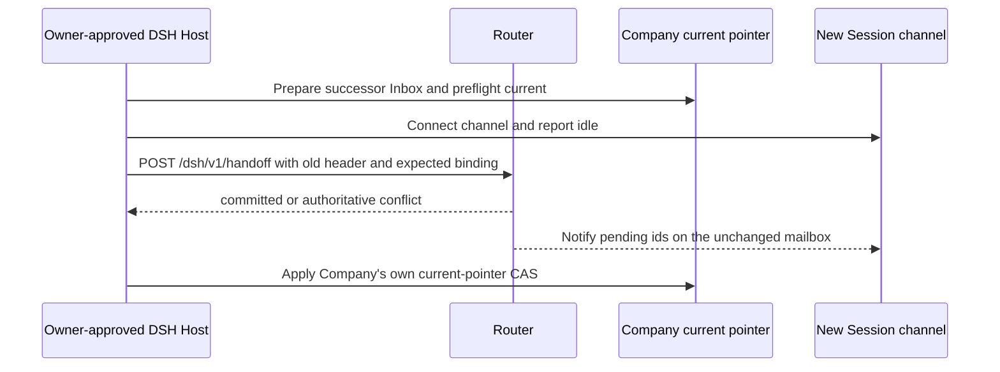
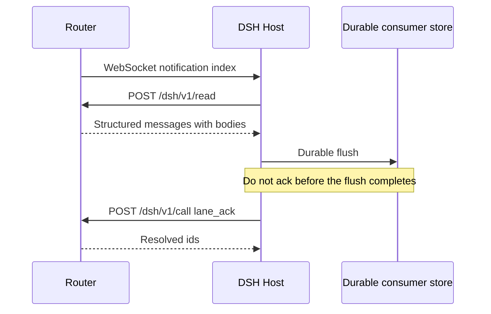

# DSH Host API v1

## Terms

| Term | Meaning |
|---|---|
| DSH Host | The trusted local process that owns a DSH Session id and consumes Router messages. |
| Session id | Stable identity supplied by the authenticated DSH Host, not by a model or tool call. |
| notification | An at-least-once message index; it never contains a message body. |

## Address and authentication

The Router serves the API only on its configured loopback listener. Read the base URL from `<data-root>/discovery.json`. The v1 resources are `GET /dsh/v1/health`, `POST /dsh/v1/call`, `POST /dsh/v1/read`, Host-only `POST /dsh/v1/handoff`, and WebSocket `/dsh/v1/channel`.

Every request and WebSocket upgrade requires `Authorization: Bearer <token>`. The Router creates a random token at `<data-root>/dsh-host.token` and reuses it across Router restarts. POSIX systems enforce mode `0600`. Windows removes inherited grants, grants full control to the current owner, verifies the final ACL has exactly that one non-inherited allow rule, and fails startup if it cannot establish or verify that state. The token is not returned by `/health` or the DSH health resource. The DSH Host must not log or place it in a URL.

Except for health, requests and WebSocket upgrades require `X-DSH-Session-Id`. The authenticated Host is the authority for this value. JSON bodies cannot supply `backend`, `generation`, `conversationId`, or `sessionId`; the Router fixes `backend` to `dsh` and derives identity from the header. Possession of the token grants the ability to speak for local DSH Sessions, so the trust model is one trusted Host under the same local account, not mutually distrusting local clients.

Every JSON response contains `protocolVersion: 1`.

## HTTP resources

### Health

`GET /dsh/v1/health` returns:

```json
{"protocolVersion":1,"status":"ok"}
```

### Call

`POST /dsh/v1/call` accepts the existing Router tool schemas:

```json
{"requestKey":"host-durable-request-id","method":"lane_send","params":{"target":"project/lane","body":"text","kind":"normal"}}
```

The only accepted methods are `lane_directory`, `lane_attach_current`, `lane_send`, and `lane_ack`. `lane_restore_project` is not exposed. `requestKey` is required and retains the existing send retry semantics. A DSH attach is idempotent when the same Session is already attached to the same lane. It fails closed when a different conversation owns the lane; DSH cannot silently take over that binding. The original Claude and Codex tool paths retain their existing takeover behavior.

A successful call returns `{"protocolVersion":1,"result":...}`. For `lane_send`, `notificationState: "sent"` means only that the notification frame left the Router. It does not mean the consumer read, durably stored, or processed the message.

### Controlled same-lane handoff

Only the trusted DSH Host invokes `POST /dsh/v1/handoff`, after the real Owner manually approves this specific successor. Source-code permission is not that approval. This endpoint is not a method of `/dsh/v1/call`, not a model/MCP tool, and does not change ordinary DSH attach's refusal to take over another Session. The existing Bearer authenticates the Host; `X-DSH-Session-Id` must identify the lane's **current old DSH binding**, except when confirming the exact result of an already committed handoff. Local clients possessing the Host token are not mutually isolated: the Host must keep the token private and supply the header from its own Session authority, never from model-provided input.

```json
{"address":"project/lane","expectedBindingId":"old-binding-id","expectedGeneration":1,"successorSessionId":"exact-new-session-id"}
```

The JSON accepts exactly those four fields; no role, model, backend, arbitrary confirmation flag, or new mailbox can be supplied. The old binding id and generation must match the current DSH owner, and the successor must be a different, unbound DSH Session with a connected channel that has reported `idle`. A connected but unconfirmed or busy channel is insufficient. The old channel may be disconnected, but an open channel must not be busy or awaiting delivery completion. The Host should finish or explicitly transfer any outstanding consumer work before asking the Owner to approve the switch. The Router never acknowledges messages on behalf of either Session.

A successful response is `{"protocolVersion":1,"result":{"status":"committed","address":"project/lane","laneId":"same-lane-id","bindingId":"new-binding-id","generation":2,"successorSessionId":"exact-new-session-id"}}`. If the HTTP response is lost, retry the **identical** four fields with the same old Session header: `status:"already_committed"` is returned only while the original old binding is inactive and the authoritative current binding is that successor on the same lane with exactly the next generation. This confirmation makes no new binding and sends no notification. A different successor or later generation is `BINDING_CHANGED`, not permission to retry a mutation with guessed fields.

Successful handoff atomically replaces only the binding via the Router's existing compare-and-update transaction. The lane id, address, role description, model declaration, mailbox paths, history, pending and resolved messages, and request-key/ack semantics do not change. The new Session receives its own binding generation and must use its own HTTP header for all subsequent send/read/ack requests; the old header becomes `NOT_ATTACHED`. The Router attempts to notify the new channel of the original mailbox's pending ids after commit; notification frames can repeat or fail without making the committed binding disappear. A disconnected new channel can be reconnected to retry pending notifications through existing attention/startup handling; do not infer durable processing from a frame or auto-ack it.

Failures leave the binding unchanged: missing Bearer → HTTP 401 `UNAUTHORIZED`; missing header or invalid/extra JSON fields → 400 `SESSION_ID_REQUIRED` / `INVALID_REQUEST`; missing lane/binding → 409 `LANE_NOT_BOUND`; non-owner → 409 `NOT_BINDING_OWNER`; stale id/generation or concurrent change → 409 `BINDING_CHANGED`; identical old/new Session → 409 `SAME_SESSION`; unbound or non-idle successor channel → 409 `SUCCESSOR_NOT_READY`; a successor already bound to another lane → 409 `SUCCESSOR_ALREADY_BOUND`; an old channel with in-flight work → 409 `CURRENT_BUSY`. A database uniqueness race rolls back the entire binding transaction. A notification error **after** commit does not roll back the new binding: verify its authoritative identity rather than assuming the old owner still has access.



The Router binding and DSH Company current pointer belong to separate stores; this endpoint does not promise distributed atomicity or operate the Company pointer. Before Company CAS, the Host can compare the Router's current `(bindingId,generation)` with its preflight snapshot; after a lost response or process restart, it can retry the same handoff tuple or inspect the authoritative current binding for the expected successor and generation. Prepare the new Company Inbox before Company CAS, dispose the old Lead only under Company's own rules, and stop for explicit reconciliation if Company has changed current while Router still reports old or a different binding. Never silently revert to the old HTTP header. No Router restart, binding of a real Session, or Company migration is part of implementing this endpoint.

### Read

`POST /dsh/v1/read` accepts:

```json
{"messageIds":["message-id"]}
```

The Router first verifies that every unique id is pending and belongs to the lane currently bound to the DSH Session. If any id fails, the whole request fails before any mailbox body is read. On success it returns:

```json
{"protocolVersion":1,"messages":[{"id":"message-id","sender":"project/source","target":"project/lane","kind":"normal","replyTo":null,"createdAt":1780000000000,"body":"message text"}]}
```

`replyTo` is an opaque correlation id. It does not grant ownership, imply ordering, or authorize reading another message.

### Errors

Errors use `{"protocolVersion":1,"error":{"code":"STABLE_CODE","message":"description"}}`. Authentication failures use HTTP 401, malformed or forbidden input uses 400, ownership and Router precondition failures use 409, and unknown resources use 404.

`lane_ack` is intentionally non-idempotent. A repeated ack fails because the message is no longer pending. Before changing any row, a batch ack verifies that every pending mailbox file, or its already-moved resolved destination, exists; a predictable missing-file failure leaves the whole batch pending. Consumers must treat their own durable record as the retry authority rather than retrying ack as though it were a read.

## WebSocket channel

Open `/dsh/v1/channel` with the Bearer token and Session header. A newer connection for the same Session replaces the older socket. Reconnect preserves a previously reported busy state and does not release binding-replacement waiters; the replacement socket must report `idle` before that Session becomes replaceable. Sending a pending notification also blocks replacement independently of HTTP/WebSocket arrival order. A successful `lane_ack` retains that block until the channel reports a later `idle`, so takeover cannot split durable flush, ack, and final delivery completion across two owners. The Host may send lifecycle observations:

```json
{"protocolVersion":1,"type":"lifecycle","state":"busy"}
```

The other state is `idle`. Before the first lifecycle frame, reach is `unconfirmed`; an open socket alone is not reported as live. Disconnecting changes reach to `no_channel` and does not resolve mailbox messages.

Both normal and correction notifications use:

```json
{"protocolVersion":1,"type":"notification","notification":{"kind":"correction","messageIds":["message-id"],"messages":[{"id":"message-id","sender":"project/source"}]}}
```

Notifications are indexes, can be repeated, and contain no body or mailbox path. The consumer must not parse Markdown mailbox files.

## Consumer sequence



If the channel disconnects at any point, pending mailbox rows and files remain pending. A later notification may repeat the same ids; the consumer reads, deduplicates against its durable store, and acks only after the durable flush succeeds.
