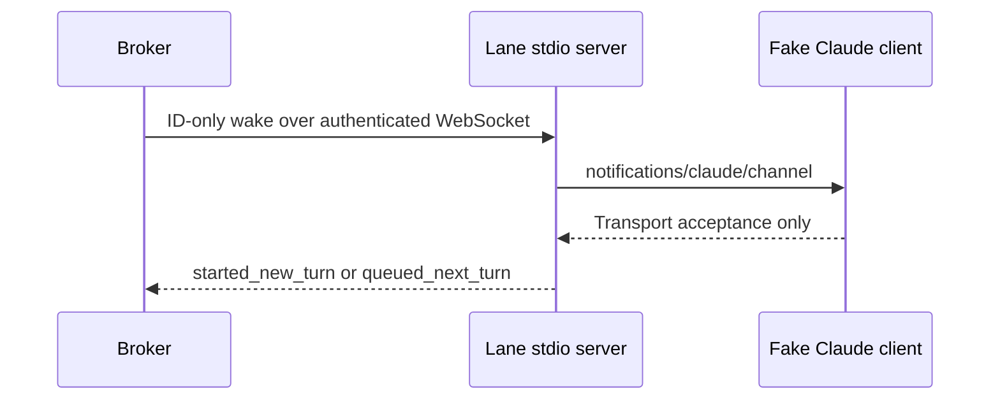

# Manual integration tests

These cases verify the installed Codex App Server and Claude Channel boundaries that deterministic tests cannot cover. They use disposable state and record identifiers only; prompt bodies, hook input, model responses, credentials, and authentication-file contents must not be captured.

## TC-CODEX-001: Installed capability gate

**Goal**: Verify that the installed executable exposes the exact experimental protocol consumed by Lane Router before a managed server starts.

**Fixture**: `tests/fixtures/codex/fake-app-server.mjs` for negative startup-gate coverage; installed Codex for the real schema probe.

**Setup**: Codex executable at `C:\Users\KrabsXD\AppData\Local\Programs\OpenAI\Codex\bin\codex.exe`.

**Steps**:

1. Run `codex --version`.
2. Generate the schema into a new temporary directory with `codex app-server generate-json-schema --experimental --out <temporary-directory>`.
3. Run the capability-gate test with `npm test -- --run tests/adapters/codex/app-server-client.test.ts`.
4. Confirm the incompatible fake schema raises `CODEX_CAPABILITY_INCOMPATIBLE` before the injected spawn seam is called.

**Expected**: The real schema includes `initialize`, `thread/start`, `thread/resume`, `thread/read`, `turn/start`, `turn/steer`, `dynamicTools`, and `item/tool/call`. The response schemas retain the nested thread status and turn discriminators consumed by Lane Router, including `inProgress`, and the dynamic-tool response retains its boolean success and text-output shape. The dynamic call requires `threadId`, `turnId`, `callId`, `tool`, and `arguments`. A changed executable, version, or schema produces a different fingerprint and is revalidated. The bounded traversal accepts the current 349-file corpus and rejects a synthetic 513-file corpus while retaining the 16 MiB, depth, symlink, and cycle guards.

**Last verified**: 2026-08-07 on Codex CLI 0.146.1 and production-runtime commit `b43b4971a857ad97c9d27cca0f29a2bd7c504d59`. The 36-test fake gate passed. Two consecutive installed-executable probes produced executable/version/schema fingerprint `b7f88342af6127bdc994b88ccd8f88d4013493d8a13df82f03010d0fad0d966d`; the first was a cache miss and the second was a cache hit. Canonical schema fingerprint: `8aac2cf925bc06a6ac4b71095115e201691aa629aa965eab39ecb219acd44b17`.

## TC-CODEX-002: Disposable real App Server turn and resume

**Goal**: Verify a broker-style controller can create a disposable thread, receive and answer a dynamic Lane Router tool call using authoritative App Server identifiers, detach, and recover history on a new connection without a TUI.

**Fixture**: `tests/fixtures/codex/real-app-server-smoke.mjs`.

**Setup**: Set `CODEX_EXE` to the installed executable and `CODEX_AUTH_FILE` to an existing authentication file. The fixture copies the file without reading or logging its contents.

**Steps**:

1. Run `npm run build` so the fixture imports the committed production modules from `dist`.
2. Run `$env:CODEX_EXE='C:\Users\KrabsXD\AppData\Local\Programs\OpenAI\Codex\bin\codex.exe'`.
3. Run `$env:CODEX_AUTH_FILE='C:\Users\KrabsXD\.codex\auth.json'`, `$env:CODEX_VERSION='0.146.1'`, and `$env:EXPECTED_RUNTIME_SHA='<full-40-character-commit-sha>'`.
4. Run `node tests/fixtures/codex/real-app-server-smoke.mjs` exactly once for the committed production runtime under test.
5. Confirm the JSON result contains only the sanitized stage, version, production-runtime commit, anonymous IDs, counts, and `tuiAttached` flag.
6. Confirm no Codex App Server child remains and no fixture temporary directory remains.

**Expected**: The production runtime initializes over `127.0.0.1`, starts a thread containing all eight strict Lane Router tools, and the production scheduler sends a wake containing ordered IDs but no message body. The model fetches the message through `lane_message_get`, identifies itself through `lane_whoami`, and performs one `lane_send`; the real broker database contains exactly one expected effect. After the first runtime stops, a fresh production runtime resumes the same thread with at least one persisted turn. The fixture removes its SQLite database, temporary `CODEX_HOME`, copied authentication file, workspace, thread data, child processes, and ports.

**Last verified**: 2026-08-07 on Codex CLI 0.146.1, production-runtime commit `b43b4971a857ad97c9d27cca0f29a2bd7c504d59`, and fixture commit `b43b4971a857ad97c9d27cca0f29a2bd7c504d59`.

**Evidence**: A pre-fix run of commit `b0f5e7a4b6f8d080044c54e9858a83d32f5b6993` failed closed after 8.4 seconds at `thread_start` with `CODEX_APP_SERVER_TIMEOUT`; it demonstrated that the 5-second readiness deadline had incorrectly been reused as the normal RPC deadline. That run left no fixture temporary directory or child process. After separating the production defaults to a 5-second readiness deadline and a 30-second RPC deadline, the changed-code validation completed in 163.6 seconds. Thread `019fdb7c-6072-7a43-8302-ae92839a883e`; turn `019fdb7c-60d4-7702-ba89-b9e685b43bdb`; dynamic calls `exec-cf6f43a1-2f6e-440d-8f71-7bc83f56b1f5`, `exec-ec478604-ce44-40fc-ba02-f2b23d6cba74`, and `exec-08219aed-1cc1-467b-9ffb-9274bbf9e9a2`; advertised tool count `8`; observed tool count `3`; verified broker effect count `1`; resumed turn count `1`; TUI attached `false`. The model-turn completion remained independently bounded by the fixture's single 300-second deadline.

**Optional observer**: A remote Codex TUI subscription remains unverified; it was not automated and no TUI was attached during the broker-driven turn. Controller ownership of `item/tool/call` responses is enforced by the production runtime's single dispatcher and deterministic duplicate-call operation key.

## TC-CLAUDE-001: Fixed-identity stdio and Channel transport

**Goal**: Verify that the production stdio MCP server exposes all eight lane tools under one server-issued binding identity, proves scheduling capability, reports authenticated lifecycle state, and forwards body-free Channel wakes through the broker bridge.

**Fixture**: `tests/fixtures/claude/fake-channel-client.mjs` and `tests/mcp/lane-mcp-stdio.test.ts`.

**Steps**:

1. Run `npm run build`.
2. Run `npm test -- --run tests/mcp/lane-mcp-stdio.test.ts tests/mcp/lane-mcp-server.test.ts tests/adapters/claude`.
3. Confirm the child joins with its binding credential and connection epoch, the readiness wake requires `lane_whoami`, and only an authenticated current-epoch `Stop` hook makes the lane idle.
4. Confirm the server rejects caller-supplied identity fields and stale epochs, and every delivery notification contains only ordered delivery and message IDs plus lane, sequence, and kind.
5. Confirm duplicate IDs are suppressed, including concurrent overlap and overlap between a completed notification and a later batch.

**Expected**: The MCP server advertises `claude/channel` and exactly eight strict tools. A transport-only connection remains degraded; readiness begins busy; `Stop` reports idle; wake marks busy before transport acceptance. The broker revalidates binding generation and connection epoch, duplicate current connections fail, stale credentials fail, and disconnects return `stored_pending`. Notification bodies and lifecycle reports never contain mailbox or prompt text.

**Last verified**: 2026-08-07. The deterministic process fixture, focused adapter/MCP tests, TypeScript check, and build passed on the Milestone 5 working tree.

## TC-CLAUDE-002: Disposable installed Claude Channel session

**Goal**: Verify automatic model turns for idle wake, busy next-turn delivery, disconnect, and reconnect against an installed Claude CLI using the home Kimi settings without account interaction.

**Fixture**: `tests/fixtures/claude/real-channel-smoke.mjs` and `tests/fixtures/claude/pty-host.py`.

**Steps**:

1. From a clean committed revision, set `EXPECTED_RUNTIME_SHA`, `CLAUDE_EXE`, `CLAUDE_VERSION`, `CLAUDE_SETTINGS_FILE`, `CLAUDE_APPROVAL_STATE_FILE`, and `CLAUDE_APPROVED_PROJECT` for the installed home harness and pre-approved disposable project.
2. Run `npm run build` and then `node tests/fixtures/claude/real-channel-smoke.mjs`.
3. Accept only a sanitized `stage: complete` result. A preview confirmation, organization-policy block, missing Channel capability, missing model acknowledgment, or cleanup error is a failed run.

**Expected**: The first wake reports `started_new_turn`; a correction accepted while the session is busy reports `queued_next_turn` and is observed on the next model turn; a disconnected wake reports `stored_pending`; reconnect clears suppression and all three deliveries become acknowledged.

**Last attempted**: 2026-08-07 against exact runtime commit `a8f2be72d2be7361527b1a89b8a160d18060c90e`. One diagnostic run exposed and fixed a fixture failure-reporting TDZ. The single final ConPTY run then failed closed after 38.9 seconds with `stage_timeout` during `first_channel_readiness` and diagnostic `none`: the authenticated Channel never reached Stop-confirmed idle, so no delivery or model acknowledgment was attempted. No credential, prompt, hook input, message body, or model text was captured, and no Claude or fixture child remained running. Each of two exact temporary directories retained one `claude-config/telemetry/*.json` telemetry file; filenames were enumerated for cleanup, but contents were not read: `C:\Users\KrabsXD\AppData\Local\Temp\lane-router-claude-channel-DIILSZ` and `C:\Users\KrabsXD\AppData\Local\Temp\lane-router-claude-channel-R6uXn1`. Automatic real-model wake, disconnect, and reconnect remain unverified; the deterministic suite is the current gate.
