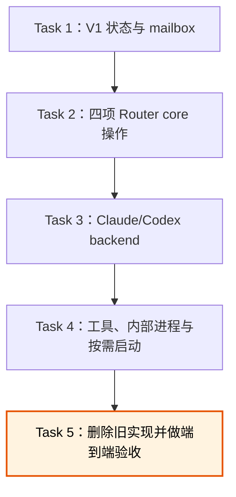

# Lane Router V1 收缩实现计划

> **For agentic workers:** REQUIRED SUB-SKILL: Use `superpowers:executing-plans` to implement this plan task-by-task. Steps use checkbox (`- [ ]`) syntax for tracking. 本计划默认由当前对话内联执行，不派发 subagent。

**Goal:** 把当前旧设计实现收缩为可信同机、agent-only 的 Lane Router V1，只保留四项对话操作、文件 mailbox、最小 SQLite 状态和 Claude/Codex platform backend。

**Architecture:** 新实现先在 `src/router/` 建立小型 core 与持久化边界，再让现有 Claude/Codex 协议层接入统一 backend，最后切换 MCP/内部进程入口并删除旧模型。Router process 是 mailbox 的唯一写入者；消息正文只进入文件，SQLite 只记录 lane、binding、message 状态和最小通知信息。

**Tech Stack:** TypeScript、Node.js 22、Vitest、better-sqlite3、MCP SDK、Zod、WebSocket

---

## 术语与范围锁

- Lane Router：整个工具。
- Router process：共享后台进程。代码和文档不再使用 `broker` 或 `service` 指代它。
- platform backend：Claude Channel 或 Codex App Server 的平台实现。
- mailbox：`~/.lane-router/mailboxes/<project>/<lane>/{pending,resolved}`。

本计划没有兼容已发布数据库的要求。当前分支尚未发布，因此切换时直接建立 V1 schema，不保留旧 project/workspace/claim 数据迁移。批准本计划即批准删除这些旧表、旧接口和只验证旧行为的测试；除已批准的单用途 Codex launcher 外，不得扩展为管理 CLI、Windows 服务、远程认证、运维控制台或通用安全框架。

实施开始前先保存当前未提交 diff。现有 `tests/adapters/claude/channel-transport.test.ts` 改动属于用户工作，若与 backend 收缩重叠就逐段保留并说明；未跟踪的 `README.md` 不纳入本计划，也不得被最终 commit 顺带加入。

实现期间发现下列情况必须停止并通知用户：

- 真实 Claude/Codex 平台无法提供 attach 或通知所需身份；
- 必须新增公开接口、依赖、进程、协议或安全边界才能继续；
- 同一任务累计三次失败或三轮审查仍未通过。

## 最终文件边界

```text
src/
├── router/
│   ├── address.ts          # 解析并规范化 project/lane 地址
│   ├── types.ts            # lane、binding、message 和调用方上下文
│   ├── database.ts         # 打开 V1 SQLite、事务和 schema 初始化
│   ├── schema.ts           # 只创建 V1 三类状态表
│   ├── state-store.ts      # V1 SQLite 查询和事务
│   ├── mailbox-store.ts    # 消息文件原子写入、移动和启动对账
│   ├── backend.ts          # platform backend 统一契约和 registry
│   ├── notification-pump.ts # 在启动、重连和 turn 结束时提醒 pending mailbox
│   └── router-core.ts      # directory、attach、send、ack 四项业务操作
├── backends/
│   ├── claude-backend.ts   # Claude Channel 通知与安全接替
│   └── codex-backend.ts    # App Server 状态、turn/start 和 turn/steer
├── process/
│   ├── runtime-lock.ts     # 可信同机范围内的单实例锁
│   ├── local-server.ts     # 最小 loopback 内部 RPC 与 Claude Channel 接点
│   ├── local-client.ts     # 接入进程使用的内部客户端
│   ├── ensure-router.ts    # 读取 discovery、按需后台启动、等待 ready
│   ├── codex-launcher.ts   # Codex-only 冷启动并打开 remote TUI
│   └── main.ts             # Router process 内部入口
├── adapters/               # 保留已验证的底层 Claude/Codex 协议与进程代码
├── mcp/                    # Claude MCP/Channel 接入
└── tools/                  # 四项统一工具 schema 与分发
```

`src/adapters/` 只保留平台协议、WebSocket 和 App Server 进程管理等底层能力；业务动作选择移入 `src/backends/`。若实现证明无需移动某个短文件，可以保留原路径，但不得保留 `DeliveryAdapter`、claim 或 admin 语义。

## 执行顺序



## Task 1：建立 V1 状态与文件 mailbox

**Files:**

- Create: `src/router/address.ts`
- Create: `src/router/types.ts`
- Create: `src/router/database.ts`
- Create: `src/router/schema.ts`
- Create: `src/router/state-store.ts`
- Create: `src/router/mailbox-store.ts`
- Test: `tests/router/address.test.ts`
- Test: `tests/router/state-store.test.ts`
- Test: `tests/router/mailbox-store.test.ts`

- [ ] **Step 1: 写地址和 schema 红测**

  覆盖合法二段地址、空段/多段拒绝、同 project 查询、lane role、binding history/generation，以及 SQLite `message` 表不存在正文列。运行：

  ```powershell
  npm test -- tests/router/address.test.ts tests/router/state-store.test.ts
  ```

  预期：FAIL，原因是 V1 store 尚不存在。

- [ ] **Step 2: 实现最小 V1 schema 和 store**

  schema 只包含：

  ```sql
  lane(address PRIMARY KEY, project, role_description, created_at, updated_at)
  binding(id PRIMARY KEY, lane_address, backend, conversation_id, generation,
          startup_json, active_at, inactive_at)
  message(id PRIMARY KEY, sender_lane, target_lane, kind, reply_to,
          relative_path, content_sha256, state, created_at,
          resolved_at, ack_lane, ack_generation, notification_state,
          request_key)
  ```

  `request_key` 由接入层提供，不进入对话工具参数；它只用于避免同一次平台 tool call 重复写消息。

  两个 partial unique index 同时约束 active binding：一条 lane 最多有一个 active binding；一个 `(backend, conversation_id)` 最多绑定一条 active lane。当前 conversation 已绑定另一条 lane 时，`lane_attach_current` 明确拒绝，不隐式解绑或改变其角色。

- [ ] **Step 3: 写 mailbox 红测**

  覆盖临时文件加原子 rename、固定消息头、正文不可覆盖、pending 到 resolved 移动，以及三类启动对账。固定消息头除正式设计要求的字段外还保存内部 `request_key`，保证文件先落盘、SQLite 尚未写入时仍能恢复同一次 tool call 的幂等身份。运行：

  ```powershell
  npm test -- tests/router/mailbox-store.test.ts
  ```

  预期：FAIL，原因是 `MailboxStore` 尚不存在。

- [ ] **Step 4: 实现 `MailboxStore` 并跑绿测**

  只允许 Router process 调用写入方法。文件头包含 message ID、sender、target、kind、可选 `reply_to`、创建时间和内部 `request_key`。对账从文件头恢复完整 message metadata；同一 `request_key` 重试返回已经恢复或已经存在的 message，不创建第二个文件。除此之外不增加 quarantine、重试控制台或文件版本协议。

  ```powershell
  npm test -- tests/router/address.test.ts tests/router/state-store.test.ts tests/router/mailbox-store.test.ts
  npm test
  npm run typecheck
  ```

  预期：全部 PASS。

- [ ] **Step 5: Commit**

  ```powershell
  git add src/router tests/router
  git commit -m "feat: establish v1 lane and mailbox storage"
  ```

## Task 2：实现四项 Router core 操作

**Files:**

- Create: `src/router/backend.ts`
- Create: `src/router/notification-pump.ts`
- Create: `src/router/router-core.ts`
- Test: `tests/router/router-core.test.ts`
- Test: `tests/router/notification-pump.test.ts`

- [ ] **Step 1: 写 `lane_directory` 与 `lane_attach_current` 红测**

  覆盖未绑定调用方查询目录、新 lane 必须有角色说明、同一对话幂等 attach、同一 conversation 不能同时绑定不同 lane、接替时等待 backend、generation 加一、旧 generation 失效、并发接替的条件更新，以及 bootstrap 返回角色说明、同 project 目录和 pending 路径。已有 lane 未提供 `role_description` 时保留原说明；明确提供不同值时才更新。

  ```powershell
  npm test -- tests/router/router-core.test.ts
  ```

  预期：FAIL，原因是 `RouterCore` 尚不存在。

- [ ] **Step 2: 实现 caller context 和原子 attach**

  内部调用上下文固定为：

  ```ts
  interface CallerContext {
    backend: "claude" | "codex";
    conversationId: string;
    requestKey: string;
  }
  ```

  对话参数不得携带 conversation/thread ID。等待旧对话结束发生在 transaction 之前，并由 backend 原子检查平台状态。进入 Router transaction 后，关闭旧 binding 必须以刚检查过的 binding ID 和 generation 做条件更新；若 current binding 已变化，返回 `BINDING_CHANGED`，不得关闭另一个请求刚创建的新 binding，也不得自动重试接替。条件更新成功后才递增 generation 并创建新 binding。

- [ ] **Step 3: 写 `lane_send` 与 `lane_ack` 红测**

  覆盖目标 lane 不存在、旧 generation 拒绝、正文只进文件、`correction + reply_to`、一次 send 只生成一个 message，以及批量 ack 的归属检查和 pure resolve。

- [ ] **Step 4: 实现 send/ack 和最小通知状态**

  send 的顺序固定为：写完整文件、写 SQLite pending、提交后通知 backend。ack 的顺序固定为：SQLite resolved、移动文件；重启时由 Task 1 对账补完中断步骤。

- [ ] **Step 5: 实现 pending notification pump**

  pump 只在四类事件运行：新消息完成持久化、Router 启动、backend 重连、目标 turn 结束。它按 lane 合并 normal 提醒；correction 单独交给 backend，以便 Codex 在 busy turn 上 steer。离线或 Codex busy + normal 只保持 pending，等下一次事件重试；不做轮询、失败计数、deadline 或 park。

- [ ] **Step 6: 跑 core 回归并提交**

  ```powershell
  npm test -- tests/router
  npm test
  npm run typecheck
  git add src/router tests/router
  git commit -m "feat: add v1 router operations"
  ```

  预期：全部 PASS。

## Task 3：接入 Claude 与 Codex platform backend

**Files:**

- Create: `src/backends/claude-backend.ts`
- Create: `src/backends/codex-backend.ts`
- Modify: `src/adapters/claude/channel-bridge.ts`
- Modify: `src/adapters/claude/lifecycle-hook.ts`
- Delete: `src/adapters/claude/claude-adapter.ts`（行为迁入 backend）
- Delete: `src/adapters/codex/codex-adapter.ts`（行为迁入 backend）
- Modify: `src/adapters/codex/codex-runtime.ts`
- Modify: `src/adapters/codex/dynamic-tools.ts`
- Test: `tests/backends/claude-backend.test.ts`
- Test: `tests/backends/codex-backend.test.ts`
- Delete: `tests/adapters/claude/claude-adapter.test.ts`
- Delete: `tests/adapters/codex/codex-adapter.test.ts`

- [ ] **Step 1: 写统一 backend 契约红测**

  契约只提供普通通知、correction 通知、`waitUntilReplaceable(binding)` 和 attention-opportunity 事件。事件只表示“现在值得让 notification pump 再试一次”，由连接建立或 turn 结束触发；它不暴露持久 busy/idle 状态，也不包含 claim/deadline/park/failure 计数。

- [ ] **Step 2: 收缩 Codex backend**

  复用现有 App Server client/protocol：idle 使用 `turn/start`；busy + correction 使用 `turn/steer`；busy + normal 只保留 pending。App Server 的 turn 完成事件触发 attention-opportunity，由 pump 再提醒。`thread/read` 同时用于安全接替，missing 视为可接替。

- [ ] **Step 3: 收缩 Claude backend**

  复用 Channel notification：idle 唤醒、busy 排入下一 turn。correction 不伪装 steer。Channel 重连和 lifecycle turn 结束触发 attention-opportunity；lifecycle 信息只用于安全接替和触发提醒，不写入统一 busy/idle 产品模型。

- [ ] **Step 4: 验证真实协议语义没有回退**

  ```powershell
  npm test -- tests/backends tests/adapters/codex tests/adapters/claude
  npm test
  npm run typecheck
  ```

  预期：fake backend、Codex 协议、Claude Channel 测试全部 PASS。真实 fixture 本 Task 只改写，不在无人监督时触发外部模型调用。

- [ ] **Step 5: Commit**

  ```powershell
  git add src/backends src/adapters tests/backends tests/adapters
  git commit -m "feat: connect v1 platform backends"
  ```

## Task 4：切换四项工具和按需 Router process

**Files:**

- Modify: `src/tools/tool-contract.ts`
- Modify: `src/tools/tool-schema.ts`
- Modify: `src/tools/tool-service.ts`
- Modify: `src/mcp/tool-schemas.ts`
- Modify: `src/mcp/lane-mcp-server.ts`
- Create: `src/process/runtime-lock.ts`
- Create: `src/process/local-server.ts`
- Create: `src/process/local-client.ts`
- Create: `src/process/ensure-router.ts`
- Create: `src/process/codex-launcher.ts`
- Create: `src/process/main.ts`
- Modify: `package.json`
- Test: `tests/tools/tool-service.test.ts`
- Test: `tests/mcp/lane-mcp-server.test.ts`
- Test: `tests/process/ensure-router.test.ts`
- Test: `tests/process/codex-launcher.test.ts`
- Test: `tests/process/local-transport.test.ts`

- [ ] **Step 1: 把工具红测改为唯一四项操作**

  `tools/list` 必须只返回：

  ```text
  lane_directory
  lane_attach_current
  lane_send
  lane_ack
  ```

  schema 不接受 conversation ID、binding ID、generation、credential、operation ID、admin 或“已确认”布尔字段。Claude MCP 和 Codex dynamic tool 从各自连接注入 `CallerContext`。

  `lane_attach_current` 的 tool description 和 MCP/Codex instructions 必须明确：创建、接替、轮换和修改已有 `role_description` 前，agent 先在普通对话中取得用户明确确认；查询目录不需要确认。测试断言两端发布的是同一说明，避免只在文档写规则而工具提示遗漏。Router 将“已有 lane 上显式提供不同 `role_description`”视为调用方确实要更新；省略参数时绝不覆盖。

- [ ] **Step 2: 实现最小本机内部 transport**

  只绑定 loopback。agent-facing RPC 只服务四项 lane 操作；另外保留 Claude Channel 连接、健康探测，以及只供 `lane-router-codex` 使用的 `codex.thread.create` / `codex.thread.resume` 内部端点。后两项只创建或恢复带四项 dynamic tools 的 Router-owned thread，不执行任何 lane 操作，也不形成通用管理 API。discovery 文件只保存当前 PID、Router port、Codex App Server endpoint 和 instance ID；不生成 bearer token、admin session 或 HMAC credential。

- [ ] **Step 3: 实现按需启动**

  `ensureRouter` 先连接现有 discovery；连接失败时竞争单实例锁，获胜者以隐藏后台进程启动 `dist/process/main.js`，其他调用方等待同一 discovery ready。discovery 同时返回 Router control endpoint 和共享 Codex App Server endpoint。没有 Windows service 注册。

- [ ] **Step 4: 验证未绑定 Claude/Codex 调用路径**

  Claude MCP server 启动时先确保 Router 存在，并以本次 MCP/Channel 连接作为当前 conversation 身份；不再要求预先绑定环境变量。

  Router process 持有一个共享 Codex App Server。`lane-router-codex` 无参数启动时调用 Router 内部接口创建一个带四项 dynamic tools 的未绑定 thread，然后执行 `codex --remote <endpoint> resume <thread-id>` 打开 TUI；`lane-router-codex resume <thread-id>` 恢复 Router-owned thread。tool call 继续使用 App Server 提供的权威 `threadId`。

  `package.json` 只注册一个 `lane-router-codex` bin。launcher 使用当前目录作为新 thread 的 cwd；它是唯一命令行例外，只负责 Codex conversation 冷启动和 TUI attach，不提供 lane 注册、目录、状态或管理命令。所有 lane 操作仍在对话中完成。

- [ ] **Step 5: 跑接口和启动回归，继续完成切换**

  ```powershell
  npm test -- tests/tools tests/mcp tests/process
  npm run typecheck
  ```

  预期：聚焦测试全部 PASS，并发两个 `ensureRouter` 只得到一个 Router process；Codex-only 冷启动能创建带四项 dynamic tools 的 thread 并以正确 endpoint/thread ID 启动 TUI。此时旧 server/broker 测试可能仍引用已切换的工具接口，因此不创建中间 commit，直接进入 Task 5 删除旧路径并恢复全量绿色。

## Task 5：删除旧实现并完成端到端验收

**Files:**

- Delete: `src/broker/`
- Delete: `src/client/`
- Delete: `src/core/`（仍需要的类型和小 helper 已在前四个 Task 迁入新职责文件）
- Delete: `src/server/`
- Delete: `src/storage/`（V1 database、schema 和 store 已在 Task 1 建立）
- Delete: 仅验证上述旧接口的 `tests/broker/`、`tests/client/`、`tests/core/`、`tests/server/` 和 `tests/storage/`
- Modify: `package.json`
- Modify: `docs/manual-tests.md`
- Modify: `tests/fixtures/claude/real-channel-smoke.mjs`
- Modify: `tests/fixtures/codex/real-app-server-smoke.mjs`
- Test: `tests/e2e/router-v1.test.ts`

- [ ] **Step 1: 建立端到端红测**

  用 fake Claude/Codex backend 覆盖：directory、attach、跨 lane send、直接读 pending 文件、一次 batch ack、correction 历史、旧 generation 拒绝、Router 重启后再次提醒。

- [ ] **Step 2: 删除旧模块和旧测试**

  删除不等于逐项移植。只把仍验证正式设计验收标准的测试改写到新模块；claim、park、workspace、manifest、admin auth、events、dispatch fence 等测试直接删除。

- [ ] **Step 3: 删除无用依赖和旧术语**

  删除 `smol-toml`。运行：

  ```powershell
  rg -n "Broker|broker|workspace|manifest|relink|claim|park|dispatch.fence|admin.session|HMAC|lane_status|lane_receive" src tests docs
  ```

  预期：只允许历史设计说明或明确否定这些功能的文档命中；生产代码无命中。

- [ ] **Step 4: 完成自动验证**

  ```powershell
  npm run build
  npm test
  npm run typecheck
  git diff --check
  ```

  预期：全部 PASS；SQLite schema 无正文列和旧表；tools/list 只有四项操作。

- [ ] **Step 5: 更新并运行有权限的真实 fixture**

  更新 manual test，只验证批准后的平台语义和文件 mailbox。Codex fixture 同时覆盖共享 App Server、在线 TUI wake、TUI 退出后的离线 turn，以及用 `codex --remote <endpoint> resume <thread-id>` 恢复完整历史。真实 Claude/Kimi 或 Codex 调用若需要外部模型、账户或人工窗口，只在已有授权和环境就绪时运行；否则记录为未运行，不用 fake 结果冒充真实验证。

- [ ] **Step 6: 最终范围审查**

  只检查九条验收标准、已批准删除项和当前 diff。任何“未来可能需要”的 CLI、安全、可配置恢复或运维建议归档但不实现。

- [ ] **Step 7: Commit and push**

  ```powershell
  git add -A -- src tests package.json package-lock.json docs/manual-tests.md docs/superpowers/specs docs/superpowers/plans
  git commit -m "refactor: remove legacy lane router scope"
  git push origin feat/lane-router-v1
  ```

  push 使用用户此前明确提供并授权的远端；只有全部自动验证通过、真实 fixture 状态如实记录后执行。

## 完成定义

以下条件必须同时满足：

1. 正式设计的九条验收标准全部有自动测试或明确的真实 fixture 证据。
2. 工具层只有四项操作，消息正文只存在 mailbox 文件。
3. 生产代码不存在旧 project/workspace、claim/park、管理面和 credential 安全模型。
4. Claude/Codex backend 保留已经验证的平台差异，不用统一状态机掩盖差异。
5. 全量 build、test、typecheck 和 diff check 通过。
6. 没有把审查建议升级成未经批准的新需求。
