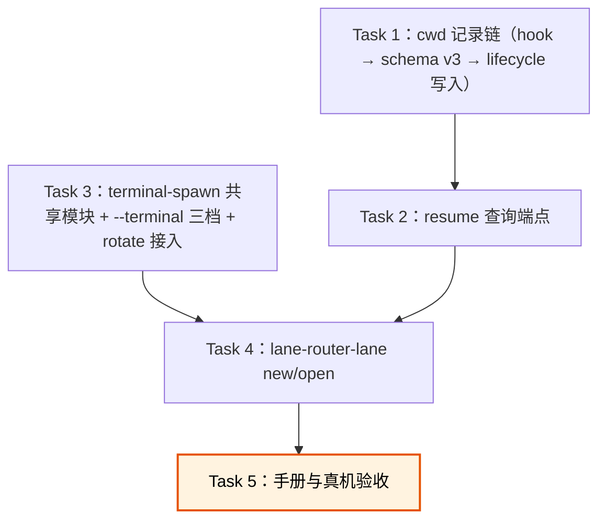

# 打开 / 新建 lane CLI 实现计划

> **For agentic workers:** REQUIRED SUB-SKILL: Use `superpowers:executing-plans` to implement this plan task-by-task. Steps use checkbox (`- [ ]`) syntax for tracking. 本计划由当前对话内联执行，走 supervised workflow：每个 Task 完成后停在 Gate 3 等用户确认。

**Goal:** 交付 `lane-router-lane new/open` 统一 CLI 及其前置的 conversation cwd 记录链，并给三条开窗命令统一 `--terminal` 选项。

**Architecture:** 先补 Router 的 cwd 记录（hook 转发 → schema v3 → lifecycle 写入），再加 loopback resume 查询端点；然后把 rotation 的 terminal spawn 机械件抽成共享模块并实现 `--terminal` 三档；最后在其上实现 `lane-router-lane` 两个子命令。设计见 `docs/superpowers/specs/2026-08-18-lane-open-new-cli.md`。

**Tech Stack:** TypeScript、Node.js 22、Vitest、better-sqlite3、PowerShell `Start-Process`。

---

## 范围锁与停止条件

- 范围以设计稿第七节审计表为准：不加 MCP 工具、不加配置文件、不做 codex 分支（报"暂不支持"）、`open` 不自动升级接替。
- 实施期间发现下列情况立即停止并通知用户：
  - Claude Code hook payload 实测**不含** `cwd` 字段（设计假设 1 破产）；
  - `--resume` 实测**不保留**原 session id（设计假设 3 破产，`open` 需回炉）;
  - 必须新增设计稿之外的公开接口、进程、协议或持久状态才能继续；
  - 同一 Task 累计三次失败或三轮审查未过。

## 文件边界

```text
新建：
  src/process/terminal-spawn.ts        # 共享 spawn 机械件 + --terminal 三档脚本生成
  src/process/terminal-child.ts        # 泛化的 terminal child（prompt / resume 两种模式）
  src/process/lane-launcher.ts         # lane-router-lane 入口（new / open）
  tests/process/terminal-spawn.test.ts
  tests/process/lane-launcher.test.ts
修改：
  src/adapters/claude/lifecycle-hook.ts   # 转发 cwd
  src/router/schema.ts                    # v3：binding 加 cwd 列
  src/router/types.ts                     # BindingRecord.cwd
  src/router/state-store.ts               # 写入/读出 cwd
  src/router/router-core.ts               # resumeInfo(address)
  src/process/local-server.ts             # lifecycle 收 cwd；GET /lanes/resume-info
  src/process/main.ts                     # 接线
  src/process/rotation-launcher.ts        # 改用共享模块 + --terminal
  src/process/rotation-terminal-child.ts  # 改为薄转发或删除（并入 terminal-child）
  package.json                            # bin: lane-router-lane
  docs/manual-tests.md                    # 新增手工用例
对应既有测试按需扩展：
  tests/adapters/claude/lifecycle-hook.test.ts
  tests/router/{schema-migration,state-store,router-core}.test.ts
  tests/process/{local-transport,rotation-launcher}.test.ts
```

## 执行顺序



Task 1/2 与 Task 3 无依赖，仍按序执行以保持单线 Gate 3 review。

## Task 1：cwd 记录链

**Files:** `src/adapters/claude/lifecycle-hook.ts`、`src/router/schema.ts`、`src/router/types.ts`、`src/router/state-store.ts`、`src/process/local-server.ts`、`src/process/main.ts`；测试 `tests/adapters/claude/lifecycle-hook.test.ts`、`tests/router/schema-migration.test.ts`、`tests/router/state-store.test.ts`、`tests/process/local-transport.test.ts`。

- [ ] **Step 0: 核销设计假设 1**。查 Claude Code hooks 官方文档确认 hook 输入含 `cwd`；在本机任一带 lane hook 的会话里抓一份真实 payload（临时把 stdin tee 到文件）双重确认。不含则停止上报。
- [ ] **Step 1: 红测**。(a) `schema-migration.test.ts`：v2 库迁 v3 后 binding 有 `cwd` 列且旧行为 NULL、v0 直建含列；(b) `state-store.test.ts`：`updateBindingCwd("claude", conversationId, cwd)` 只更新 active binding，无 active binding 时静默忽略，`BindingRecord.cwd` 读回；(c) `lifecycle-hook.test.ts`：payload 含 `cwd` 时转发、缺失时照常不带；(d) `local-transport.test.ts`：`/claude/lifecycle` 带 cwd 时调用注入的 `recordCwd` 回调。运行 `npm test -- <上述文件>`，预期 FAIL。
- [ ] **Step 2: 实现**。schema v3（`ALTER TABLE binding ADD COLUMN cwd TEXT`，仿 v1→v2 迁移结构但纯加列）；state-store 读写；hook 转发（仅非空字符串）；local-server 选项加 `recordCwd?: (conversationId, cwd) => void`；main.ts 接 `state.updateBindingCwd("claude", …)`。
- [ ] **Step 3: 绿测 + 全量回归** `npm test`，`npm run typecheck`。
- [ ] **Step 4: Commit** `feat: record each Claude conversation's cwd on its binding`。

**完成判据：** 全测绿；真实 payload 证据在案。

## Task 2：resume 查询端点

**Files:** `src/router/router-core.ts`、`src/process/local-server.ts`、`src/process/main.ts`；测试 `tests/router/router-core.test.ts`、`tests/process/local-transport.test.ts`。

- [ ] **Step 1: 红测**。(a) `router-core.test.ts`：`resumeInfo(address)` 四分支——lane 不存在 / 无 active binding（两者返回可区分的错误码）/ 有 binding 返回 `{ backend, conversationId, cwd, generation, reach }`；(b) `local-transport.test.ts`：`GET /lanes/resume-info?address=<a>/<b>` 走通、非法地址 400。预期 FAIL。
- [ ] **Step 2: 实现**。core 方法只报事实不做拒绝策略（在线与否由 CLI 判断）；server 加 GET 路由，经 main.ts 注入 `resumeInfo` 回调；仍只绑 loopback，不进 MCP 工具面。
- [ ] **Step 3: 绿测 + 回归 + typecheck。**
- [ ] **Step 4: Commit** `feat: let the Router answer what a lane needs to be resumed`。

**完成判据：** 全测绿；`LANE_TOOL_NAMES` 未变（工具面无扩张）。

## Task 3：terminal-spawn 共享模块 + `--terminal` 三档

**Files:** 新建 `src/process/terminal-spawn.ts`、`src/process/terminal-child.ts`、`tests/process/terminal-spawn.test.ts`；修改 `src/process/rotation-launcher.ts`、`src/process/rotation-terminal-child.ts`、`tests/process/rotation-launcher.test.ts`。

- [ ] **Step 1: 红测**。`terminal-spawn.test.ts`：(a) `terminalLaunchScript(choice)` 纯函数——`wt` 生成强制 wt 脚本（缺 wt 时以特征退出码失败）、默认档保留"wt 存在用 wt、否则 powershell"回退、`powershell`/`cmd` 生成对应 `Start-Process`，cmd 档的 child 启动命令用 cmd 语法（`"%VAR%"`）且不含 `;`（Windows Terminal 分隔符坑，见 rotation-launcher 现注释）；(b) child 环境构建沿用 `withoutVendorSessionIdentity` / `CLAUDE_EXE` 语义；(c) terminal child 参数构建两模式——prompt 模式（codex → `codex-launcher --prompt`；claude → `--dangerously-load-development-channels server:lane -- <prompt>`）、resume 模式（claude → `--resume <id> --dangerously-load-development-channels server:lane`，无 prompt）。预期 FAIL。
- [ ] **Step 2: 实现**。从 rotation-launcher 抽出 spawn / status 等待 / 环境 / 标题机械件；rotation-launcher 加 `--terminal` 可选 flag（默认行为不变）；`rotation-terminal-child.ts` 并入 `terminal-child.ts`（旧文件删除，`package.json` 无引用，需同步 rotation 的 env 变量名）。
- [ ] **Step 3: 绿测 + 回归**。rotation 既有测试全部保持绿（行为不变的证据）。
- [ ] **Step 4: Commit** `refactor: share the terminal spawn machinery and add --terminal`。

**完成判据：** 全测绿；rotation 语义除新 flag 外零变化。

## Task 4：`lane-router-lane` CLI

**Files:** 新建 `src/process/lane-launcher.ts`、`tests/process/lane-launcher.test.ts`；修改 `package.json`。

- [ ] **Step 1: 红测**（依赖注入 fake spawn / fake Router 应答，仿 `rotation-launcher.test.ts` 形态）：
  - 参数：非法地址、`new` 缺 `--role`、未知 `--terminal`、`--backend codex` 报"暂不支持"，全部不 spawn；
  - `new`：地址已存在 → 报错提示 `open`；成功路径 bootstrap prompt 含地址、role、attach 指令与 24 000 上限；cwd 默认 `process.cwd()`；
  - `open`：lane 不存在 → 提示 `new`；无 binding → 提示 new/轮换；reach 非 `no_channel`（`live`/`unconfirmed`）→ 拒绝"已在线"；binding 是 codex → 暂不支持；无记录 cwd 且未传 `--cwd` → 要求显式 `--cwd`；成功路径 spawn 请求为 resume 模式并带记录 cwd；
  - 两个子命令都在 child status 非 "ok" / 超时时退出非零。
- [ ] **Step 2: 实现**。`new` 经 `/rpc lane_directory` 查占用（context 仿 `terminalTitle` 的只读调用方式）；`open` 经 `GET /lanes/resume-info`；spawn 走 Task 3 模块；`package.json` 加 bin `lane-router-lane`。
- [ ] **Step 3: 绿测 + 回归 + typecheck；`npm run build` 后 `node dist/process/lane-launcher.js --help` 冒烟。**
- [ ] **Step 4: Commit** `feat: add lane-router-lane to open or create a lane in one command`。

**完成判据：** 全测绿；`npm link` 后 `lane-router-lane` 可执行。

## Task 5：手册与真机验收

**Files:** `docs/manual-tests.md`；另一 repo 的 `agent_coding_guidelines/techniques/lane-router.md`（使用手册，单独 commit 在该 repo）。

- [ ] **Step 1: 补手工用例到 `docs/manual-tests.md`**：三档 `--terminal` 各真开一窗；`new` 全流程（窗口 → attach → 目录可见）；`open` 全流程（关窗 → open → resume → 发消息验证通知达）；在线拒绝；核销设计假设 2/3/4（`--resume` 与 channel flag 组合、session id 保留、pending 重发）。
- [ ] **Step 2: 真机执行以上用例**（需要用户看窗口、在新窗口里确认），逐条记录证据；假设 3 破产则按停止条件上报。
- [ ] **Step 3: 更新 `techniques/lane-router.md`** 加 `lane-router-lane` 用法与故障排查行（该 repo 单独 `docs:` commit）。
- [ ] **Step 4: Commit**（本 repo）`docs: record the lane open/new manual verification`。

**完成判据：** 手工用例全部有真机证据；两个 repo 文档同步。
