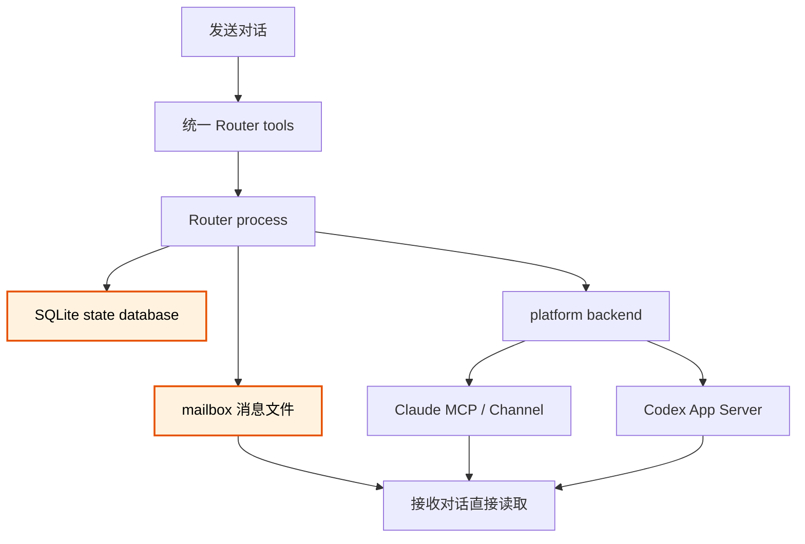
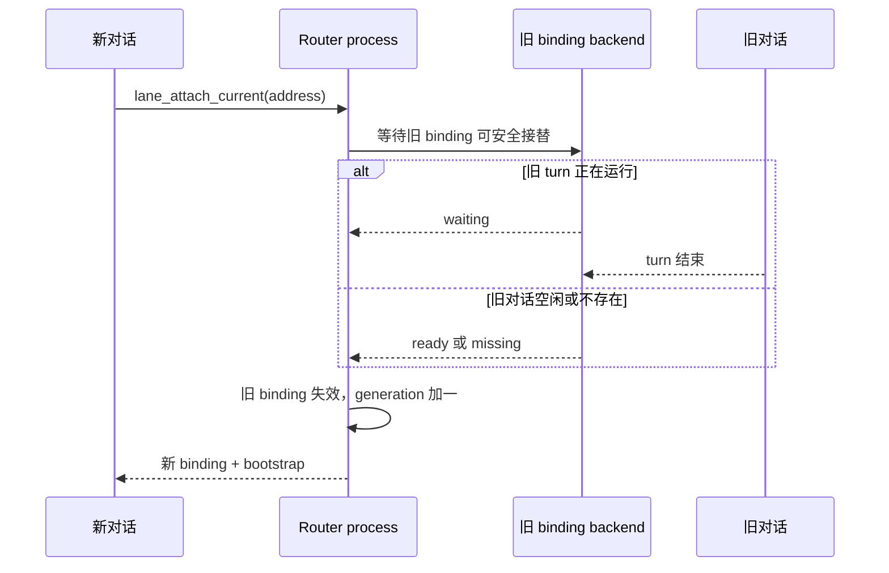
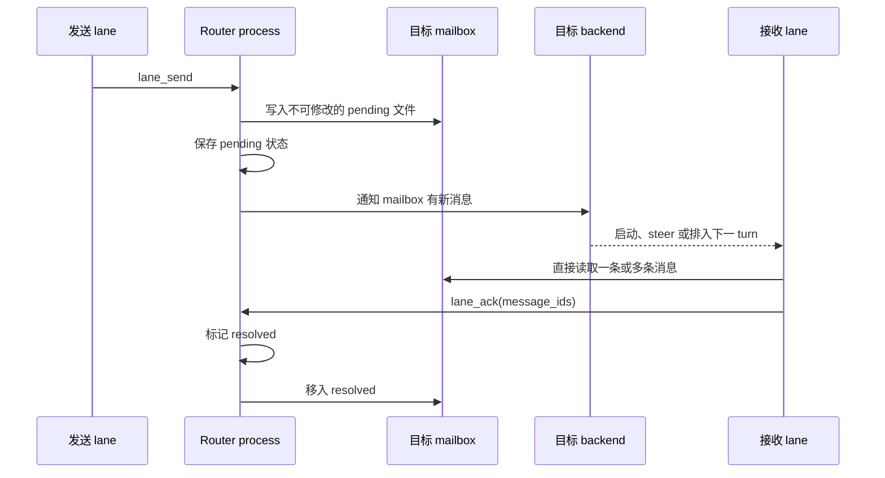

# Lane Router V1 设计

**状态：** 2026-08-07 经用户确认的收缩版设计。本文取代此前同名设计；旧实施计划不再作为实现依据。

## 术语表

| 术语 | 含义 |
|---|---|
| Lane Router | 整个工具。它保存 lane 地址和 binding，持久传递消息，并通知目标对话。 |
| Router process | Lane Router 的单一后台进程。接入进程按需启动它；这里不使用 `broker` 或 `service` 指代它。 |
| lane | 一个长期存在的逻辑角色和消息地址，例如 `project-a/design`。 |
| project | lane 地址的第一段，只用于把相关 lane 归入同一命名空间；它没有独立注册和生命周期。 |
| binding | lane 当前对应的 Claude conversation 或 Codex thread。 |
| generation | binding 每次接替时递增的版本号；旧 generation 不能继续操作当前 lane。 |
| mailbox | 每条 lane 的持久消息文件目录，分为 `pending` 和 `resolved`。 |
| state database | Router process 内部使用的 SQLite 数据库，只保存路由元数据和状态，不保存消息正文。 |
| platform backend | 把统一的通知、状态检查和安全接替语义转换成 Claude Channel 或 Codex App Server 操作的实现。 |
| Codex launcher | Codex-only 冷启动入口。它确保 Router process 和共享 App Server 已启动，再把 Codex 自带的 TUI 连接到本地 adapter；新 thread 仍由 TUI 创建。 |
| correction | 对既有消息的修改、撤销或紧急勘误；它是消息语义，不保证所有平台都能 steer 当前 turn。 |
| ack | 当前 lane 已经理解并处理消息；Router 可以将消息从 `pending` 移到 `resolved`，不再提醒。 |
| 功能闭环 | 一条主要用户流程从真实入口走到可观察结果，经过决定可行性的真实平台边界，并在当前不可逆边界上满足最低失败语义。 |
| 架构雏形 | 按当前流程拆出的模块、分层、数据归属和依赖方向；它不包含尚无需求支撑的完整机制。 |
| 生长空间 | 某个步骤或分层以后可以在自身边界内扩展，而不要求当前提前实现扩展接口或通用框架。 |
| 可信的变化方向 | 已有下一里程碑或消费者，或者晚改会产生迁移、兼容或明显重构成本的变化；没有这些证据的设想只是未来方向。 |

## 目标与边界

Lane Router V1 只做三件事：

1. 保存稳定的 lane 地址、角色说明和当前 binding。
2. 在 lane 之间可靠保存和传递消息。
3. 通过 platform backend 通知或唤醒目标对话。

V1 的运行范围是同一台可信机器上的个人开发环境。它不管理项目目录、Git、worktree、任务执行或人类运维，也不为跨机器或恶意本地进程设计协议。

## 闭环优先的增量设计原则

新软件或新功能的第一阶段先完成一条真实功能闭环，再补与当前流程相称的架构雏形。第一阶段不是最终版本，也不是一次性把所有安全性、完整性、通用性和运维能力设计齐全。

### 功能闭环经过真实风险边界

主要流程必须从真实入口走到可观察结果。决定方案能否成立的平台边界不能只用 fake backend 代替；内部自动测试可以证明确定性逻辑，但不能替真实 CLI、TUI、Channel 或 App Server 证明集成假设。

Lane Router 的 Codex 路径说明了这条原则：内部模型曾假设可以预创建空 thread，再由 TUI resume。真实 Codex 环境证明首个 turn 前没有可恢复 rollout，这个核心假设失效。只有让 stock TUI 自己执行 `thread/start`，再由本地 adapter 注入四项 dynamic tools，闭环才真正成立。

### 架构雏形只建立当前边界

当前流程的步骤应分模块，不同范围应分层，并明确数据归属和依赖方向。每个模块都应当能够在需求出现后独立长成更完整的功能模块。

“允许以后生长”是边界属性，不是当前功能。只要职责、调用方向和数据归属清楚，就不需要为证明可扩展而提前加入插件系统、通用协议、配置面、版本迁移、多级重试、管理接口或没有第二个消费者的抽象。

### 扩张由证据触发

安全、完整性、通用性和运维机制只有在下列情况出现时才进入当前范围：

- 当前功能闭环缺少它就无法成立；
- 真实失败已经证明现有行为不足；
- 已批准需求明确要求它；
- 第二个真实用例证明现有边界需要推广。

“未来可能需要”本身不构成实现理由。新增 transport、protocol、persistent state、public interface、安全边界或生命周期机制时，仍需单独说明它服务的当前流程，并取得用户确认。

### 已确认的演进尺度

#### 功能闭环包含最低失败语义

第一阶段必须先让主要成功路径在真实环境中端到端跑通。流程跨越当前已有的外部或不可逆边界时，还必须验证至少一种代表性失败能够被如实呈现，不能伪装成功、静默破坏已经承诺的持久状态、无条件重放非幂等副作用，或者在安全控制失败时继续放行。

这些是当前流程的最低不变量，不等于第一阶段要完成生产级加固。当前只实现满足这些不变量的最简单策略；自动重试、恢复编排、完整错误分类、监控和可配置策略等能力，等真实失败、已批准的服务目标或明确运维消费者出现后再加入。

#### 潜在需求只影响有证据的内部边界

当前职责、数据归属和真实调用决定最小结构。可信的变化方向可以影响内部模块边界、依赖方向和策略集中位置，但不能单独授权新增可调用方法、schema 字段、配置项、hook、transport 或其他公开 surface。

变化方向只有在下列至少一种证据存在时才影响当前设计：已有确认的下一里程碑和消费者；当前正在作出晚改代价很高的不可逆决定；延后会引入数据迁移、外部兼容或明显重构成本；当前已经存在所有权、依赖方向或副作用隔离收益。纯 roadmap 设想只记录方向，不进入实现。

接口不以“必须已有多个实现”为机械前提。第二个真实实现或消费者、当前替换需求、外部副作用隔离、已有的高层策略与底层细节依赖、数据所有权或者测试与故障注入，都可能提供当前收益。即使因此建立接口，它也只暴露当前调用方正在使用的操作，不预先定义没有调用方的方法。

### 已记录但暂缓：临时对话的双向通信

真实使用已经证明，一次性调研或突发问题会需要在独立对话中处理，并与持久 coordinator lane 进行可靠的双向异步通信。当前 `lane_send` 要求发送者已有 lane binding，因而临时 task 只能伪装成持久 role；任务结束后地址仍留在目录中，长期会造成 lane 数量膨胀。

该需求已由 `environment-validation` 的实际使用验证，但解法尚未批准。后续设计必须先区分：未绑定对话的一次投递、需要可靠回复的短期双向会话，以及持久 lane 解除当前 binding。当前不预设 guest sender、临时 lane、reply endpoint、detach、retire、TTL 或 delete，也不修改 lane lifecycle、持久状态或公开工具。

## 总体结构



Router process 是消息文件的唯一写入者。对话通过统一工具发送和确认消息，但直接使用自身的文件读取能力查看 mailbox 正文。

## Lane 地址与目录

lane 地址是规范化的二段字符串：

```text
<project>/<lane>
```

例如：

```text
lane-router/design
lane-router/implementation
another-project/design
```

`project` 只是地址前缀。V1 不建立 project 表，不提交 project manifest，也不识别 clone、worktree 或目录移动。同一 project 字符串下的 lane 在查询时自然归为一组；如果两个 worktree 需要独立通信边界，就使用不同的 project 前缀。

每条 lane 只保存以下长期信息：

- 完整地址；
- 自由文本 `role_description`；
- 当前及历史 binding；
- 当前 generation；
- mailbox 消息记录。

Router 不解析 role file、项目文档或 Git 元数据。项目需要读取哪些文档由项目自身的 agent instructions 和 `role_description` 说明。

## 对话工具

V1 只有四项面向对话的逻辑操作。Claude 通过 MCP tools 调用，Codex 通过带权威 `threadId` 的 dynamic tools 调用；两端行为一致。

| 操作 | 用途 |
|---|---|
| `lane_directory(project)` | 返回同一 project 下 lane 的地址、角色说明和当前绑定状态。未绑定对话也可以调用。 |
| `lane_attach_current(address, role_description?)` | 将当前 conversation/thread 创建或接替为指定 lane。创建新 lane 时必须提供角色说明。 |
| `lane_send(target, body, kind, reply_to?)` | 从当前 binding 向目标 lane 发送 `normal` 或 `correction` 消息。 |
| `lane_ack(message_ids)` | 将当前 lane 已处理的一条或多条消息从 `pending` resolve。 |

对话不得提供任意 conversation/thread ID；backend 从当前工具调用取得权威身份。`lane_send` 和 `lane_ack` 只允许当前 binding generation 调用。

### 创建 lane 前的确认

一个尚未绑定的对话可以先调用 `lane_directory`，比较已有 `role_description`，并向用户建议：

- 复用已有 lane；
- 接替未绑定或旧的 lane；
- 创建职责不同的新 lane。

创建、接替或轮换是持久拓扑变化。对话必须先向用户说明建议并取得明确确认，才可调用 `lane_attach_current`。查询和评估不需要确认。

该确认由 agent 在普通对话中取得，不增加容易被机械填写的 `confirmed=true` 参数。Claude MCP 与 Codex dynamic tool 的操作说明必须包含这条约束。

### 统一 attach 语义

`lane_attach_current` 隐藏内部状态差异：

- 地址不存在：创建 lane、保存角色说明并绑定当前对话；
- lane 没有当前 binding：直接绑定；
- 旧对话不存在：创建下一 generation 并重建；
- 旧对话空闲：创建下一 generation 并接替；
- 旧对话有运行中的 turn：等待它结束后接替；
- 当前对话已经是这条 lane：幂等返回现有 binding；
- 当前对话已经 active 绑定另一条 lane：拒绝 attach，不隐式改变它的角色；
- 已有 lane 只在用户明确要求时更新 `role_description`。

一条 lane 最多有一个 active binding；同一个 backend conversation/thread 也最多 active 绑定一条 lane。旧 binding 失效后，它对应的对话才可以 attach 到别的 lane。

安全等待结束后，Router 只允许按刚检查的旧 binding ID 和 generation 做条件替换。若 current binding 已被另一个请求改变，本次 attach 失败并要求重新评估，不得越过新 binding 自动接替。



bootstrap 至少包含当前 lane 地址、角色说明、generation、同 project lane 目录和当前 pending mailbox 位置。它不注入旧对话全文。

## Mailbox 与状态数据库

### 消息文件

消息正文只存在于 mailbox 文件。固定目录形状如下；`project` 和 `lane` 在目录名中的安全编码属于实现细节：

```text
~/.lane-router/mailboxes/<project>/<lane>/
├── pending/
│   └── <message-id>.md
└── resolved/
    └── <message-id>.md
```

文件包含固定消息头和完整正文。消息头至少有：

- message ID；
- sender 和 target lane；
- `normal` 或 `correction`；
- 可选 `reply_to`；
- 创建时间；
- 接入层生成的内部 request key，用于在文件已落盘但 SQLite 尚未写入时恢复同一次 tool call 的幂等身份。

消息文件创建后不可修改。修改、撤销和勘误必须写成新的 `correction`，并用 `reply_to` 指向原消息。这样即使接收方已读取但尚未 ack，历史也不会被静默改写。

### SQLite 状态

SQLite 只保存：

- lane 地址和角色说明；
- 当前及历史 binding、platform backend、conversation/thread ID、generation，以及该 backend 实际需要的最小启动信息；
- message ID、sender、target、kind、`reply_to`、相对文件路径和内容摘要；
- `pending` 或 `resolved` 状态；
- ack lane、generation 和时间；
- 最小的通知状态及幂等写入标识。

SQLite 不保存消息正文，不建立 project、workspace、manifest 或 relink 模型。

### 文件与状态的一致性

发送时，Router 先完整写入临时文件并原子重命名，再把消息状态写入 SQLite；只有两者成功后才通知目标 lane。ack 时，Router 先在 SQLite 标记 resolved，再把文件移入 `resolved`。

进程若在两步之间退出，下次启动时执行最小对账：

- 完整消息文件存在但没有状态记录：从固定文件头恢复记录；
- SQLite 已 resolved 但文件仍在 `pending`：完成移动；
- SQLite 有记录但消息文件缺失：报告存储损坏，不伪装成功。

## 消息处理

agent 不调用 `lane_receive`。被通知后，它直接列出并读取自己的 `pending` 目录，可以在一个 turn 中综合多条相关消息。

`lane_ack` 只表示消息在通信层已经处理完成。它不保存 `replied`、`recorded`、`rejected` 等结构化任务结果。需要回复时调用 `lane_send` 并填写 `reply_to`；任务计划和长期结果继续写入项目自己的文档。

每条消息都会确保目标 lane 获得处理机会，但不强制一条消息创建一个独立 turn。目标真正运行前积累的多个 normal 消息可以合并到一次处理。



## Platform backend

Router core 依赖统一语义，不依赖 Claude 或 Codex API。backend 至少覆盖以下能力；具体函数名由实施计划确定：

- 通知普通消息；
- 通知 correction；
- 检查 conversation/thread 是否在线及是否有运行中的 turn；
- 等待旧 binding 可以安全接替。

backend 自己完成状态检查与动作选择，避免 Router core 先检查状态、随后执行时发生竞态。它向 core 如实报告启动新 turn、steer 当前 turn、排入下一 turn或离线等结果。

### Claude backend

- 通过 MCP/Channel 连接目标 Claude session。
- Channel notification 在空闲时唤醒 turn；忙碌时由 Claude 排入下一 turn。
- Claude 没有与 Codex `turn/steer` 等价的 Channel 原语，因此 correction 不能伪装成已经修改当前 turn。
- 只有安全接替确实需要时，才使用最小 lifecycle 信息判断旧 turn 是否结束；不建立跨平台的持久 busy/idle 子系统。

### Codex backend

- 通过 App Server 取得权威 thread/turn 状态。
- 空闲时使用 `turn/start`。
- correction 到达运行中的 turn 时使用 `turn/steer`。
- normal 消息不 steer；当前 turn 结束后再处理 mailbox。
- dynamic tool 调用携带的 `threadId` 是当前对话身份来源。

## 启动与恢复

Claude/Codex 接入进程连接时先确保 Router process 存在；若不存在则在后台按需启动。并发启动由单实例锁收敛为一个进程。Router 启动后常驻到进程被显式终止或系统关闭。

用户不需要单独启动或管理 Router process。Claude MCP 接入会直接确保它存在；Codex 使用单用途 `lane-router-codex` launcher 完成同一件事。launcher 将 Codex 自带 TUI 连接到 Router 的本地 App Server adapter；新对话仍由 TUI 正常调用 `thread/start`，adapter 只向该请求注入四项 dynamic tools 和 Router instructions，并从响应取得权威 `threadId`。这样避免在首个真实 turn 前恢复尚未落盘的 thread。恢复已有 Router-owned thread 时，adapter 校验所有权后转发 TUI 的 `thread/resume`。该 adapter 不执行 lane 注册或管理。

这是 V1 唯一的命令行例外。它没有 lane 注册、查询、状态、诊断或管理子命令，也不改变“lane 操作全部由对话工具完成”的边界。V1 不注册 Windows 服务，也不暴露运行时重试和 deadline 调参项。

消息在目标离线时保持 pending。目标重新连接、Router 重启或未 ack 的处理被中断后，pending 消息再次获得处理机会。通知可以合并；系统承诺至少一次提醒，不宣称 exactly-once。V1 不设置失败计数、自动 poison park 或人工 retry 控制台。

## 信任边界

V1 是可信同机工具。当前 conversation/thread 身份由 MCP 连接或 App Server dynamic tool 提供，generation 防止旧 binding 继续操作新消息。

V1 不增加 lane takeover credential、HMAC actor session、远程账户、TLS、恶意本地进程防护或通用网络服务安全模型。内部本机通信只实现平台连接所必需的最小边界。

## 非目标与删除项

以下内容明确不属于 V1，也不为未来预留复杂接口：

- project registry/table 和 `.lane-router/project.toml`；
- workspace、clone/worktree 检测和 relink；
- 面向用户的 Lane Router 管理 CLI、`doctor`、`events` 或图形控制台；Codex 单用途 launcher 除外；
- `lane_receive`、独立 claim/renew/park 工具；
- 结构化 ack outcome；
- 高、中、低消息优先级；
- 消息编辑和完整对话归档；
- dispatch fence、复杂失败计数和自动 poison park；
- 可配置的 retry/deadline 参数面；
- Windows 服务、跨机器路由、远程认证、广播和独立 Kimi backend。

Claude CLI 即使使用 Kimi 模型，仍属于 Claude backend 的客户端，不构成独立 Kimi 协议。

## 验收标准

V1 完成必须证明：

1. 新对话可以查询同 project lane 目录，并在用户确认后创建或安全接替 lane。
2. 新 binding 获得角色说明、同 project lane 目录和 pending mailbox；旧 generation 被拒绝。
3. Claude 与 Codex lane 都能发送消息，正文只写入目标 mailbox 文件，SQLite 不保存正文。
4. 接收 lane 可以直接批量读取 pending 文件并用一次 `lane_ack` resolve 一条或多条消息。
5. 消息文件不可修改；correction 通过新文件和 `reply_to` 保留历史。
6. normal 消息不会打断繁忙 turn；Codex correction 能 steer，Claude correction 如实排入下一 turn。
7. lane 离线、Router 重启或处理未 ack 时，pending 消息不会丢失，并会再次获得处理机会。
8. Claude MCP 或 Codex launcher 都可以按需启动 Router process；Codex remote TUI 通过本地 adapter 创建带四项 dynamic tools 的 thread，不需要预创建后 resume。用户不需要 Lane Router 管理 CLI 或 Windows 服务。
9. 数据模型和公开接口中不存在本设计明确删除的 project/workspace、管理面和安全扩展。

## 实施前置条件

当前功能分支依据旧设计实现了大量 project/workspace、管理 RPC、安全和 delivery 状态机制，不能从原 Milestone 继续向前。实施前必须先对当前分支做“保留、简化、删除、缺失”审计，再编写新的小型实施计划。旧六 Milestone 计划作废；任何代码修改都需要新计划获得用户批准。
