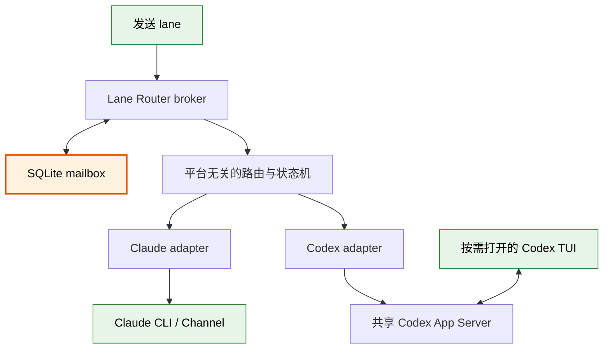
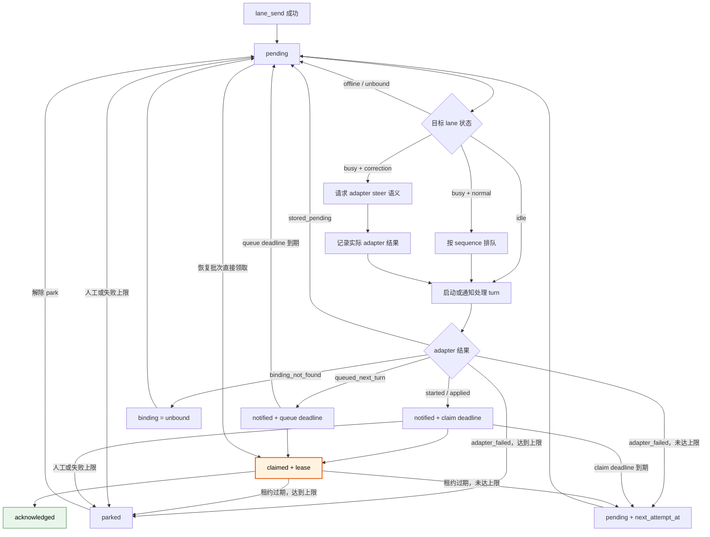
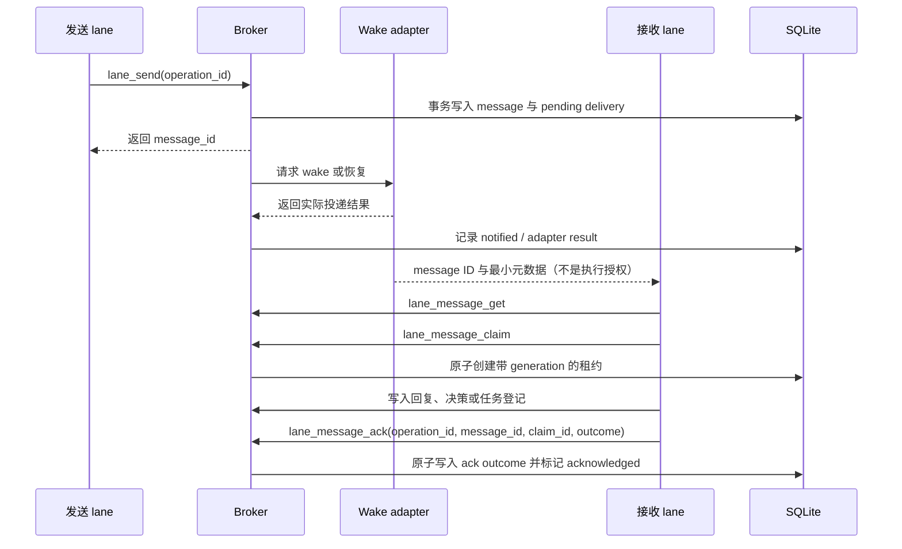

# Lane Router 第一版设计规格

状态：已完成对话评审，等待书面规格复核

日期：2026-08-07

范围：同一台 Windows 机器上的长期 Claude Code / Codex role-lane 通信

## 结论

Lane Router 第一版采用“薄 broker + 平台 adapter”结构。每台机器只运行一个 broker：它以 SQLite mailbox 为事实来源，维护稳定 lane 身份、对话绑定、消息状态和恢复调度；Claude 与 Codex 的差异收敛在各自 adapter 内。broker 不理解任务内容、不替 lane 决策，也不备份完整模型上下文。

所有成功入箱的消息都会产生 wake intent。消息分类只描述用途，不授予执行权限。普通消息不会打断正在运行的 turn；纠错消息可以请求统一的 steer 语义，但 adapter 必须报告平台实际做到的是当前 turn steer、下一 turn 排队，还是仅持久化等待。

第一版只支持同机运行，不包含跨机器同步、远程认证、图形控制台或专用 Kimi adapter。

## 术语表

| 术语 | 含义 |
|---|---|
| lane | 一个长期存在的逻辑角色和上下文边界；它不是某个具体对话。 |
| binding | lane 在当前 generation 下绑定的 Claude conversation 或 Codex thread。 |
| generation | binding 每次轮换或重建时递增的版本号，用来拒绝旧对话的迟到操作。 |
| broker | 本机消息中转进程，负责可靠存储、寻址、状态转换和调度。 |
| mailbox | broker 持久保存的消息及其投递状态；它是消息事实来源。 |
| adapter | 把统一调度语义转换成 Claude Channel 或 Codex App Server 操作的平台适配层。 |
| wake intent | 某条消息成功入箱后产生的处理请求；它不保证每条消息各自创建一个 turn。 |
| claim | 某一有效 lane generation 在有限租约内接手处理消息。 |
| ack | lane 已理解消息并产生持久处理结果；不表示消息要求的长期任务已经完成。 |
| park | 暂停自动投递某条消息，使其不再阻塞后续消息。 |

## 目标与非目标

### 目标

第一版需要做到：

- 为多个项目中的长期 lane 提供稳定地址，例如 `project-a/communication`。
- 在 lane 在线、繁忙、离线、轮换或对话丢失时可靠保存并恢复消息。
- 让 Claude 与 Codex 使用同一套 mailbox、claim、ack 和 generation 语义。
- 在线时尽可能自动唤醒；无法唤醒时如实保留 pending 状态。
- 允许用户只在需要观察或交互时打开 CLI，而不是长期保留十几个可见窗口。
- 通过只读 CLI 观察 lane、binding、pending、parked、失败和 adapter 健康状态。

### 非目标

第一版不负责：

- 跨机器消息、云端同步、TLS 或远程身份系统。
- 判断任务应该如何完成，或替 lane 修改代码。
- 把消息分类当作模型自主执行授权。
- 保存、压缩或恢复完整 conversation/thread 上下文。
- 图形控制台、专用 Kimi adapter 或通用多 agent 调度框架。
- 保证 exactly-once；系统提供至少一次投递，接收方按 `message_id` 去重。

Claude CLI 即使使用 Kimi 模型，仍可作为 Claude adapter 的客户端；这不等于提供独立的 Kimi 协议适配层。

## 可行性证据

设计讨论期间完成了仓库外的临时探针，未创建 production code。

| 能力 | 结果 | 设计含义 |
|---|---|---|
| Claude CLI 接收 Channel notification | 本机 Claude CLI + Kimi K3 harness 成功被两条外部通知自动唤醒 | Channel 可以作为 wake adapter，但公司 Claude 环境仍需单独验证版本和组织策略。 |
| Claude 忙碌时的 Channel 行为 | 官方语义是通知排入下一 turn；没有与 Codex `turn/steer` 等价的 Channel 原语 | 统一接口必须允许 `queued_next_turn`，不能伪装为当前 turn steer。 |
| 独立 App Server 操作 VS Code 自有 thread | 外部 turn 与 VS Code turn 写入同一 rollout，但 UI 不更新，并发生历史交错 | 禁止让独立 App Server 操作由 VS Code 插件自己拥有的 thread。 |
| 共享 Codex App Server + CLI remote | 已验证控制客户端和 TUI 可同时连接同一服务端 | Codex lane 应由 broker 持有共享 App Server，TUI 用 `--remote` 连接。 |
| Codex 在线 TUI wake | 外部 `turn/start` 的输入和回复实时出现在已打开 TUI | broker 可以驱动用户可见的同一 thread。 |
| Codex 离线恢复 | TUI 退出后外部 turn 正常完成；随后 `resume <thread-id> --remote ...` 显示完整历史 | Codex TUI 可以按需打开，不必为每条 lane 常驻窗口。 |

Codex 探针中曾出现模型上游 WebSocket 断开并回退 HTTPS 的警告，但本地 TUI、App Server 和控制客户端仍保持正确同步。该警告属于模型传输降级，不改变本设计的本地连接结论。

## 系统结构



### Broker 核心

broker 每台机器只运行一个实例，所有项目共用。核心模块负责：

- project 与 lane 寻址。
- binding 和 generation 的原子变更。
- message、delivery、claim、ack、park 和重试状态机。
- 每个 lane 的顺序调度和恢复批次。
- adapter 健康状态、事件记录和只读查询。

核心模块不引用 Claude 或 Codex 的协议类型。它只调用 adapter contract，并保存 adapter 返回的实际结果。

### Claude adapter

Claude adapter 提供 Channel MCP 入口。已打开并连接的 Claude CLI 可以接收最小 wake event；未连接时 delivery 保持 pending。wake event 只包含 message ID、有序位置、发送方、目标、分类和必要摘要，不包含完整需求正文。lane 被唤醒后通过 MCP 工具读取正文。

Claude Channel 没有当前 turn steer 原语。纠错消息到达繁忙 Claude lane 时，adapter 必须返回 `queued_next_turn`；不能返回 `applied_current_turn`。公司环境是否开放 Channels 是部署验收项，不阻塞核心设计。

### Codex adapter

broker 管理一个共享 `codex app-server --listen ws://127.0.0.1:<port>` 子进程。Codex adapter 通过同一个服务端执行 `thread/resume`、`turn/start`、`turn/steer` 和状态查询。用户需要观察或交互时，使用 `codex resume <thread-id> --remote <endpoint>` 打开 TUI。

broker 不得用另一套 App Server 操作由 VS Code 插件自有 App Server 管理的 thread。长期 Codex lane 必须绑定到 broker 所有的共享 App Server；VS Code 插件可以继续用于不受 Lane Router 管理的临时对话。

## 仓库 manifest 与本机状态

每个受管理项目提交 `.lane-router/project.toml`。建议的第一版结构如下：

```toml
schema_version = 1
project_id = "018f7e2a-7e7d-7c36-a856-9bb9d7123456"
project_key = "project-a"
display_name = "Project A"

[[lanes]]
name = "communication"
role_file = "docs/lanes/communication.md"
communication_entry = true
```

`project_id` 是不随目录或显示名称变化的稳定身份；`project_key` 是本机 broker 内唯一的人类可读地址前缀。lane 地址由 `project_key` 和 lane name 组成。

manifest 只保存可提交的声明信息：schema version、项目身份、lane 名称、角色说明引用和 communication 入口。它不得包含 conversation/thread ID、generation、本机绝对路径、token、端口、在线状态或消息历史。

broker 首次发现仓库或 worktree 时，在本机 SQLite 中创建带本机 UUID 的 workspace 记录。一个 `project_id` 可以对应多个本机 workspace；binding 明确引用其中一个 workspace，角色说明和项目相对路径也以该 workspace 为根解析。多个 workspace 的 manifest 如果对同一 lane 给出冲突声明，broker 拒绝同步并要求用户修正。

broker 不猜测一个新路径是新增 clone/worktree，还是旧 workspace 被移动。发现同一 project ID 的新路径时，默认创建新的 workspace；移动目录必须由用户执行显式 `workspace relink <workspace-id> <new-path>`。relink 要求旧路径当前不可用、目标路径的 project ID 匹配，并在更新前列出受影响 binding。

## 持久数据模型

| 实体 | 关键字段 | 约束 |
|---|---|---|
| `project` | project ID、project key、显示名称 | project ID 稳定；project key 在本机唯一。 |
| `workspace` | 本机 workspace ID、project ID、绝对路径、manifest hash、可用状态 | 同一 project 可有多个 clone/worktree；路径在本机唯一。 |
| `lane` | project ID、lane name、role file、是否 communication 入口 | `(project_id, lane_name)` 唯一。 |
| `binding` | lane ID、workspace ID、generation、adapter、conversation ID、状态、时间 | 每条 lane 同时最多一个有效 binding。 |
| `message` | message ID、sender、target、分类、正文、结构化元数据、`reply_to`、创建时间 | 正文和元数据不可变；发送方由连接 binding 推导。第一版不传输附件。 |
| `delivery` | message ID、target lane、sequence、状态、失败次数、notify deadline、next attempt、最近错误 | 每条目标 lane 的 sequence 单调递增；失败次数达到上限后自动 park。 |
| `claim` | delivery ID、generation、claim ID、lease deadline | ack 必须提交当前 claim ID；过期后可重投。 |
| `ack` | delivery ID、claim ID、generation、outcome kind、outcome payload、确认时间 | 与 delivery 转为 acknowledged 在同一事务中创建。 |
| `operation` | operation ID、调用方身份、方法、请求摘要、原始结果 | operation ID 在整个 broker 内唯一，为所有变更请求提供幂等重试。 |
| `connection` | binding、adapter、连接时间、运行状态 | 易失状态，不作为消息完成依据。 |
| `event` | 类型、关联实体、时间、结构化详情 | 支持 `status`、`doctor` 和最近失败查询。 |

第一版消息分类至少包含 `normal` 和 `correction`。分类不授予代码修改或其他副作用权限；Router 只改变调度方式。回复关系使用 `reply_to` 表达，不额外引入自主度等级。

## 消息和 delivery 状态



一次标准处理按以下顺序进行：



notification 写出成功、消息被显示、正文被读取或模型开始响应，都不等于 ack。`started_new_turn` 和 `applied_current_turn` 产生的 notified 带 claim deadline；deadline 到期仍未 claim，或 adapter 报告 turn 在 claim 前结束，delivery 增加一次失败尝试并回到带 `next_attempt_at` 的 pending。

`queued_next_turn` 使用独立 queue deadline，因为合法的当前 turn 可能运行很久。queue deadline 到期后 delivery 回到 pending，但不增加失败尝试，也不会仅因持续 busy 而最终 park。重复 Channel notification 仍由 message ID 去重。`stored_pending` 保持 pending 且不增加尝试次数。`binding_not_found` 在同一事务中把 lane binding 转为 unbound，并让 delivery 保持 pending，等待显式 rebuild。只有 `adapter_failed`、claim deadline 到期或已启动 turn 在 claim 前失败才增加尝试次数；达到 broker 配置的上限后进入 parked。

ack 表示消息已经被理解，并形成持久结果。`lane_message_ack` 必须提交以下 outcome 之一，并把 outcome 与 acknowledged 状态原子写入 broker：

- `replied`：必须引用一条已存在、`reply_to` 指向原消息的 reply message ID。
- `recorded`：必须包含结果摘要，可以附带项目相对文档路径或外部任务 ID。
- `rejected`：必须包含明确原因。

消息要求的长期任务拥有独立生命周期，不与 delivery 状态绑定。ack outcome 只记录接单、登记或拒绝的持久证据，不伪装成长期任务已经完成。

首次 claim 为 delivery 创建新的 claim ID 和 lease deadline。复用同一个 operation ID 只表示网络重试，返回原始 claim 结果和原始 deadline，不续租。续租必须使用新的 operation ID 并提交当前 claim ID；只有尚未过期、generation 匹配的当前 claim 才能续租，续租保留 claim ID 并产生新的 deadline。

claim 过期表示接收 turn 已经接手但没有完成处理，因此关闭旧 claim 并增加一次 delivery 失败。未达上限时，delivery 按退避策略返回 pending，下一次成功 claim 必须创建新的 claim ID；达到上限时自动进入 parked，解除严格 FIFO 阻塞。正常的长 turn 必须在 deadline 前主动续租。其他 generation、已关闭或已过期 claim ID 不能续租或 ack。broker 重启后扫描未完成 delivery；过期 notified/claim 按上述规则恢复，已 ack 消息不重放。

所有变更请求都必须携带调用方生成、在 broker 范围内全局唯一的 `operation_id`。broker 以 operation ID 为主键保存已认证调用方身份、方法、请求摘要和原始结果。完全相同且调用方相同的重试返回原始结果，不再产生副作用；相同 operation ID 来自不同调用方，或搭配不同方法/payload 时返回冲突错误。

对话工具的调用方身份是不可变 binding ID，并额外校验请求 generation；binding 失效后仍保留历史身份，以便网络迟到的原请求取得原结果而不是再次执行。管理 CLI 在首次连接 broker 时取得本机 admin client ID；初次 bind、manifest 同步、rotate、rebuild 和 workspace relink 都使用这个身份并自动生成 operation ID。rotate/rebuild 即使改变 generation，原 operation 的精确重试仍返回首次执行结果。这样 `lane_send` 或管理操作即使在提交成功后丢失响应，也可以安全重试。

## 调度、顺序与并发

- 每个目标 lane 由 broker 分配单调 sequence。普通消息采用严格 FIFO：最早一条尚未 acknowledged 或 parked 的普通 delivery 是唯一可 claim 的普通消息，后续普通消息不能越过它。
- 同一 lane 同时最多有一个由 Router 启动的处理 turn；不同 lane 可以并行。
- 每条消息都会触发调度，但不保证各自创建一个 turn。繁忙或离线积压时，恢复 turn 携带有序 message ID 列表，lane 再逐条读取、claim 和 ack。
- 普通消息不打断当前 turn。
- correction 可以越过普通队列，请求 steer，但仍保留 message ID、delivery 和审计事件。多条 correction 之间仍按各自 sequence 处理。当前 turn 可以在持有普通消息 claim 时额外 claim 被 steer 进来的 correction；correction acknowledged 或 parked 后，普通队列继续从原先最早的未完成项推进。
- adapter/通知失败或 claim 租约过期累计达到配置上限后自动进入 parked；parked 消息不阻塞后续消息。
- 解除 park 后，消息重新进入 pending，并保留原始 sequence 和尝试历史。

统一 adapter 结果至少包含：

| 结果 | 含义 |
|---|---|
| `started_new_turn` | adapter 已为 idle lane 启动新 turn。 |
| `applied_current_turn` | correction 已加入当前 turn；Codex `turn/steer` 可以产生此结果。 |
| `queued_next_turn` | 平台无法 steer 当前 turn，消息将在下一 turn 处理；Claude busy Channel 属于此情况。使用 queue deadline，超时重排但不累计失败。 |
| `stored_pending` | 当前没有可用连接或 binding，只完成持久化。 |
| `binding_not_found` | 平台报告 conversation/thread 不存在；broker 原子转为 unbound，delivery 保持 pending 且不累计失败。 |
| `adapter_failed` | adapter 操作失败，delivery 按退避策略重试或最终 park。 |

## Binding、轮换与重建

lane 是持久角色，conversation/thread 只是当前承载容器。binding 状态至少包含 `bound` 和 `unbound`；在线、繁忙和 adapter 健康度属于运行状态，不与 binding 状态混合。

正常轮换必须等待旧 conversation 的当前 turn 完成，然后在一个 broker 事务中使旧 binding 失效、generation 加一并绑定新 conversation。第一版不提供强制抢占繁忙 turn。

如果 adapter 返回 `binding_not_found`，broker 把 lane 标记为 unbound，但保留 lane 身份、binding 历史、消息记录和 pending delivery。用户显式执行 rebuild 后，新 conversation 取得下一 generation，无需等待已不存在的旧 turn。

新 conversation 获得 bootstrap envelope，其中包含：

- lane 稳定地址和当前 generation。
- 角色说明文件与需要读取的项目文档引用。
- 有序 pending message ID 和最小元数据。
- 上一次 binding 和轮换原因等审计信息。

broker 不把旧对话全文注入新对话，也不声称能够恢复所有隐含上下文。需要跨轮换保留的领域信息必须写入项目持久文档。

第一版处于同机可信环境，不增加独立 lane takeover credential。bind、rotate、unbind 和 rebuild 仍是显式管理操作。所有 claim、ack 和连接握手都校验 generation，因此旧 conversation 即使重新出现也不能操作新消息。

## 对话工具与管理 CLI

对话通过 MCP 使用以下工具：

| 工具 | 用途 |
|---|---|
| `lane_whoami` | 返回当前连接绑定的 lane、generation 和 adapter。 |
| `lane_status` | 查询当前 lane 或可见目标 lane 的路由状态。 |
| `lane_send` | 使用 operation ID 向稳定 lane 地址发送消息；发送方由当前 binding 推导。 |
| `lane_inbox_list` | 按状态和 sequence 列出当前 lane 的 delivery。 |
| `lane_message_get` | 按 message ID 获取完整正文和结构化元数据。 |
| `lane_message_claim` | 原子领取或续租消息，返回 claim ID 和 lease deadline。 |
| `lane_message_ack` | 使用 operation ID 和当前 claim ID，原子记录 outcome 并确认消息。 |
| `lane_message_park` | 暂停自动处理并记录原因。 |

任意对话不能通过 MCP 自行注册或接管 lane。低频管理操作放在本机 CLI，包括：

- 启动和检查 broker。
- 同步或校验 project manifest。
- 查看 lane、binding、delivery、parked、失败和 adapter 健康状态。
- bind、rotate、unbind 和 rebuild。
- 重试或解除 park。
- 运行 Claude Channel、Codex App Server 和本地连接 capability/health 检查。

CLI 的精确命令与参数名在实施计划中确定，但不得改变上述权限边界。

除纯读取操作外，MCP 和 CLI 的每个变更请求都必须遵守 operation ID 幂等契约。wake envelope 明确声明“消息分类不是执行授权”；lane 是否执行代码修改或其他副作用，继续受原对话指令和用户授权约束。

## 运行、安全与故障恢复

- broker 是本机单实例后台进程。第一版提供前台 `serve` 命令；稳定后可以配置为用户登录时自动启动。
- broker 是 SQLite 状态的唯一写入者。CLI 和 adapter 通过 broker 接口操作，不直接改库。
- SQLite 使用事务保证 message 与初始 delivery 同时创建；具体 journal 和备份策略在实施计划中验证。
- Codex App Server 是 broker 管理的子进程。意外退出时自动重启，并使用持久 thread ID 恢复。
- Claude CLI 由用户或 Claude 自身后台机制管理。Channel 断开后 lane 进入 offline 运行状态，mailbox 继续接收消息。
- adapter 健康状态为 `healthy`、`degraded` 或 `offline`。失败使用带抖动的有上限退避，不执行无限快速循环。
- delivery 失败次数只在 `adapter_failed`、claim deadline 到期、已启动 turn 在 claim 前失败或 claim lease 过期时增加。queue deadline、stored pending、offline 和 unbound 等待不增加失败次数；默认上限、两类通知 deadline、claim lease 和退避时长由 broker 配置，并在实施计划中通过时间可控的测试确定。
- 本机服务只监听 loopback。broker 使用随机 discovery token 防止其他本机程序误调用；该 token 是服务访问保护，不是 lane takeover credential。
- 事件日志记录 binding 变更、wake 结果、claim/ack、重试、park 和恢复，正文不重复写入事件详情。

## 技术栈与模块边界

第一版使用 TypeScript 和 Node.js 22。选择理由是 Claude Channel 已由 TypeScript MCP SDK 探针验证，Codex App Server 使用 WebSocket JSON-RPC，并能从 CLI 生成当前版本的协议 schema。

代码库至少分成以下逻辑模块：

- `core`：实体、状态机、调度规则和 adapter contract。
- `storage`：SQLite schema、事务和恢复查询。
- `broker`：单实例生命周期、本机接口、调度循环和事件记录。
- `adapters/claude`：Channel MCP 连接和 Claude wake 结果映射。
- `adapters/codex`：App Server 子进程、JSON-RPC client 和 thread 状态映射。
- `mcp`：对话工具面和连接身份解析。
- `cli`：管理与只读诊断命令。

core 不依赖具体 adapter；storage 不执行调度；CLI 不绕过 broker 写库。第一阶段从仓库直接运行，核心语义稳定后再决定 npm 发布或独立程序打包。

## 测试与验收

### 自动化测试

- 状态机单元测试覆盖所有合法与非法 delivery、claim、ack、park 转换，包括反复 claim 过期后自动 park 并解除 FIFO 阻塞。
- generation 测试证明旧 binding 不能 claim、续租或 ack。
- 调度测试覆盖 idle、busy、offline、unbound、correction 越序和 poison message park。
- 存储测试覆盖 message + delivery 原子创建、claim/queue 两类 deadline、broker 重启恢复，以及对话与管理操作的全局 operation ID 幂等和冲突检测。
- adapter contract 测试使用 fake Claude/Codex transport，验证所有标准结果映射。
- Codex 集成测试启动临时 App Server，验证创建 turn、在线订阅、TUI 断开后的继续处理和按 thread ID 恢复。
- MCP 工具测试证明发送方不能伪造 lane 身份，旧 generation 请求被拒绝。
- FIFO 测试证明后序普通消息不能越过未完成前序消息，correction 可以越序且完成后恢复原普通顺序。

### 手工与环境验收

- 在公司环境运行 Claude capability smoke test，检查 Claude Code 版本、Channel 参数、组织策略、idle wake、busy queue 和重连行为。
- 验证十条以上 lane 注册时，用户无需保持十个可见 TUI；Codex TUI 可按需恢复，Claude 不可用时 pending 状态可见。
- 杀死并重启 broker 和 Codex App Server，确认未 ack delivery 可恢复，已 ack delivery 不重放。
- 轮换一个繁忙 lane，确认操作等待当前 turn 完成；删除一个旧 conversation，确认 rebuild 取得新 generation。

### 第一版完成条件

以下条件全部满足才算第一版完成：

- manifest、binding、消息、恢复和 CLI 可观测性按本规格工作。
- Codex 在线实时同步和离线恢复的自动化或可重复 fixture 通过。
- Claude adapter 在至少一个允许 Channels 的环境通过完整 smoke test；公司环境不允许时，系统明确显示降级状态并保留 pending。
- 所有消息均可追溯到 message ID、delivery 状态和最近 adapter 结果。
- 没有把通知写出、消息读取或模型开始响应错误地记为 ack。

## 已知限制和后续候选

- Codex App Server 的 WebSocket transport 仍属于实验接口。adapter 必须锁定并检查兼容 schema，升级 CLI 时重新运行探针。
- Claude Channel 能力受 CLI 版本、启动参数和组织策略影响，不能假设所有环境可用。
- Claude CLI 是否适合通过其 background agents 功能长期托管多条 Channel lane，仍可作为独立运维探针；它不阻塞第一版 mailbox 和按需连接设计。
- 图形控制台、跨机器通信、远程认证、广播消息和完整对话归档都推迟到后续设计，不在第一版预留复杂协议。

## 参考资料

- [前期调研与对话交接](../../research/2026-08-06-lane-router-discovery.md)
- [Codex App Server](https://learn.chatgpt.com/docs/app-server)
- [Claude Code Channels](https://code.claude.com/docs/en/channels)
- [Claude Code Agent Teams](https://code.claude.com/docs/en/agent-teams)
- [MCP Tasks：Task Notifications](https://modelcontextprotocol.io/specification/2025-11-25/basic/utilities/tasks#task-notifications)
