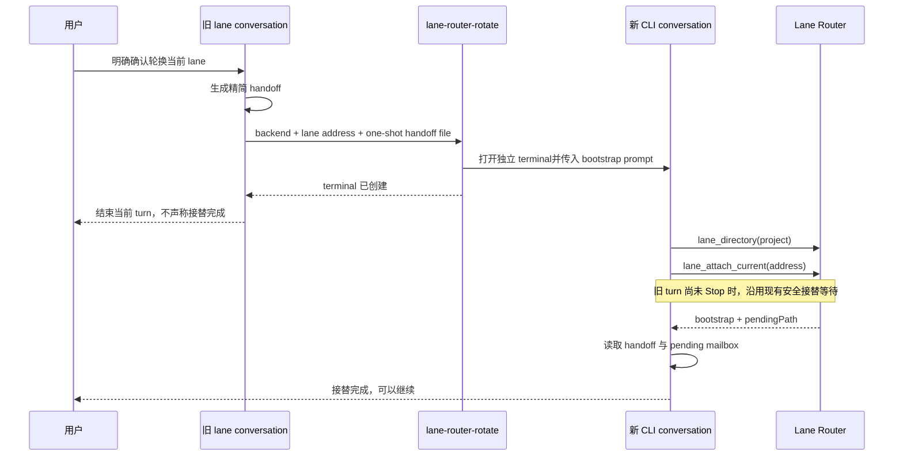

# 自动轮换 lane conversation 设计

**状态：** 2026-08-10 经用户批准，待实施。

**一句话结论：** 用户在旧 lane 中确认轮换后，旧 agent 调用一个薄的 `lane-router-rotate` launcher；launcher 打开新的独立 PowerShell terminal，并把精简 handoff 作为首条 prompt 交给 Codex 或 Claude。新 conversation 仍通过现有 `lane_attach_current` 完成安全接替。Router 不增加新工具、轮换状态或数据库字段；现有 Claude attach 只增加一项前置条件：当前 caller 的稳定 conversation identity 必须已经 join 完成。

## 术语表

| 术语 | 含义 |
|---|---|
| 旧 conversation | 当前拥有目标 lane、负责发起轮换的 Codex thread 或 Claude conversation。 |
| 新 conversation | launcher 新建、将接替同一 lane 的 conversation。 |
| handoff | 旧 conversation 生成的精简交接文本，只保留继续工作必需的稳定事实和未决事项。 |
| bootstrap prompt | launcher 生成的新 conversation 首条 prompt，包含固定接替步骤、目标 lane、工作目录和 handoff。 |
| 轮换 | 新 conversation 接替同一持久 lane；不是创建新 role，也不是复制完整对话历史。 |

## 一、问题与范围基线

### 1.1 用户要的结果

用户在旧 lane 中说“轮换当前 lane”并明确确认后，系统应自动打开新 terminal、启动对应 CLI 并完成接替。用户不再手动打开 terminal、复制 prompt、输入命令或重新注册 lane。旧 terminal 不自动关闭，用户确认新窗口正常后自行关闭。

### 1.2 当前流程

今天轮换需要用户完成四件机械工作：在正确 repo 打开 terminal、启动带 Router 接入的 CLI、把 lane 地址和角色说明复制给新 conversation、再次要求它 attach。每一步都已具备，但没有形成一个闭环入口。

### 1.3 最小可观测行为

1. 旧 agent 取得本次轮换的用户明确确认。
2. 新 terminal 自动出现，并在旧 conversation 的当前工作目录启动正确 backend。
3. 新 conversation 自动查询目录、接替目标 lane、读取 pending mailbox，并报告就绪。
4. terminal 创建、CLI 启动或 attach 调用之前发生错误时，旧 binding 不变。attach 请求一旦进入既有等待路径，则受第 6.2 节记载的已知缺陷约束。
5. 旧 terminal 保持打开，不由 Router 或 launcher 终止。

### 1.4 信任边界

不变：同一台可信个人开发机器。轮换 prompt 由已经绑定的旧 agent 在取得用户确认后生成。Router 仍不接收调用方提供的任意 conversation/thread ID，也不增加 token、grant 或鉴权协议。

## 二、用户流程



旧 agent 在 launcher 成功后必须结束当前 turn。这样 Claude 的 `Stop` 或 Codex 的 turn 完成事件可以让现有 `waitUntilReplaceable` 放行。launcher 返回成功只表示新 terminal 已创建，旧 agent不得把它描述成“轮换完成”。

## 三、公开命令

新增一个 npm bin：

```text
lane-router-rotate <codex|claude> <lane-address> --handoff-file <absolute-path>
```

契约：

- backend 必须显式为 `codex` 或 `claude`，不从不稳定的环境变量猜测。
- lane 地址必须通过现有地址解析规则。
- 工作目录继承调用命令时的 `process.cwd()`。
- handoff 从 `~/.lane-router/rotation-handoffs/<uuid>.md` 下的一次性 UTF-8 文件读取；路径必须是该目录内的绝对路径，空文件或非法 UTF-8 直接报错，不打开 terminal。
- 生成后的完整 bootstrap prompt 设一个保守的 Windows 长度上限；超限时要求旧 agent 缩短 handoff，而不是截断或让 `CreateProcess` 给出含糊错误。具体常数在实施计划中用 Windows command-line 与 environment-block 上限推导并由边界测试钉住，不做成配置项。
- launcher 在新 terminal 进程成功创建后删除 one-shot handoff 文件并退出 0；参数、文件读取、验证或进程创建失败时退出非零，保留文件并输出具体原因与路径。
- 命令不查询或修改 binding，不直接调用 Router attach，也不保存轮换记录。

旧 agent 是该命令的主要消费者。用户仍可手动调用它排查问题，但正常流程不要求用户输入命令。

## 四、backend 启动

### 4.1 Codex

`lane-router-codex` 从只接受空参数或 `resume <thread-id>`，扩展为同时接受一个显式 initial prompt：

```text
lane-router-codex [--prompt <initial-prompt>]
lane-router-codex resume <thread-id>
```

`--prompt` 与 `resume` 互斥，其他组合仍报 usage error。新 thread 继续由 stock Codex TUI 执行 `thread/start`；本地 adapter 继续只注入四项 dynamic tools 和 Router instructions。wrapper 把当前目录通过现有 `-C` 传给 Codex，并在 Codex option terminator `--` 之后传 initial prompt，避免 prompt 被解析成 option 或 `resume` 子命令；不预创建 thread，不改 resume 语义。

### 4.2 Claude

新 terminal 运行：

```text
claude --dangerously-load-development-channels server:lane -- <initial-prompt>
```

前提沿用现有安装：Lane Router MCP 已注册到 Claude user scope，`UserPromptSubmit` 与 `Stop` lifecycle hooks 已配置，组织策略允许 Channels，且用户已接受 development-channel warning。轮换命令不重复安装或修改 Claude 全局设置。

“旧 lane 能调用 Router tools”本身不足以证明这些前提成立。bootstrap 在 attach 前读取目标 lane 的 `reach`：Claude 目标必须仍由 Claude binding 持有、`reach.state` 为 `live`，且 `believedBusy` 为 `true`。这里的 true 证明旧 conversation 当前轮换 turn 的 `UserPromptSubmit` 已经到达 Router；若为 false，不能假设后续 `Stop` 能释放等待。`unconfirmed` 表示 lifecycle join 没有成立，`no_channel` 表示旧 Channel 不在当前 Router；任一条件不满足都停止 attach，并在新 terminal 中提示检查 hooks、Channel warning、组织策略和 Router discovery。

仅检查旧目标仍不够，因此现有 `lane_attach_current` 增加 Claude caller precondition，并且必须在创建 lane、修改角色说明、等待旧 binding 或写入新 binding **之前**执行：

- `resolveIdentity(context).source` 必须是 `joined`，不能是临时 `caller` identity；
- 当前 caller identity 对应的 channel 必须为 `live`；
- `believedBusy` 必须为 `true`。未绑定的新 conversation 不会收到 lane notification，所以这里的 true 只能来自当前 bootstrap turn 的 `UserPromptSubmit`，它证明本次 lifecycle 已经到达 Router。

任一条件不成立时，attach 返回明确的 Claude identity/lifecycle precondition error，且不得改变 lane、role 或 binding。Codex 使用权威 `threadId`，不走这项检查。实现可以扩展 backend 内部 identity-readiness 契约，但不新增公开工具参数或返回字段。

### 4.3 可见 terminal

V1 明确支持 Windows。进程拓扑固定为：旧 agent 的 shell → `lane-router-rotate` → 独立 PowerShell → 内部 terminal child → Codex/Claude CLI。

旧 agent 必须用文件编辑工具直接创建 one-shot handoff 文件，不能用 shell here-string、`echo` 或命令替换生成内容。shell 命令因此只包含固定 backend、lane 地址和一个由 launcher 约束到 handoff 根目录内的 ASCII UUID 路径；任意 Markdown/Unicode 都不会经过 shell 解释。

父 launcher 读完文件并生成最终 bootstrap prompt。它把 `{ backend, cwd, prompt }` 序列化到专用环境变量，再由一个隐藏的短命 PowerShell 调用 `Start-Process` 创建可见的独立 PowerShell，后者运行内部 terminal child。固定命令不含用户文本。父进程在启动前检查完整 environment block 与 prompt 的保守长度上限；超限直接失败，不打开 terminal。terminal child 读取后立刻从自身环境删除该变量，再以参数数组启动 Codex 或 Claude；不把 handoff 拼进 PowerShell command string。prompt 最终作为 CLI 参数出现，符合本设计的同机可信边界；长度已被父进程提前约束。

PowerShell 成功创建后，父 launcher 已经把 prompt 复制进 child environment，立即删除 one-shot handoff 文件不会丢失 payload。验证或 spawn 失败时文件保留，便于旧 agent 修正或重试；launcher 不扫描、不索引也不自动清理其他残留文件。

PowerShell 的启动命令只包含受信任的内部 child 路径；该路径按 PowerShell 参数规则编码，不能由 lane 地址或 handoff 影响。PowerShell 以调用时的 cwd 启动，terminal child 和 backend CLI 均显式继承同一 cwd。

terminal child 是内部实现，不注册第二个公开命令。它不常驻监督、不重试，也不关闭旧 terminal。新 CLI 退出后 PowerShell 窗口保持打开，使用户能看到失败原因。

2026-08-10 的首次真实 Codex 轮换暴露了一个 Windows 边界：Node 直接 `spawn` PowerShell 并设置 `detached: true` 会触发 `spawn` 事件，但该 PowerShell 随即退出，用户看不到窗口，Codex 也没有启动。因此，“收到 Node spawn 事件”不能作为“可见 terminal 已创建”的证据。相同环境下，`Start-Process -WindowStyle Normal` 产生了用户可见且持续存在的 PowerShell；实现据此改为上述两段启动。这个结论只约束 Windows terminal 创建，不外推成新的进程监督机制。

## 五、bootstrap prompt 与 handoff

bootstrap prompt 由固定模板和 handoff 组成。固定模板要求新 conversation：

1. 完整读取当前 repo 的 `AGENTS.md` 及本任务适用规则。
2. 调用 `lane_directory(project)`，核对目标 lane、现有 `role_description`、backend 和 `reach`；Claude 目标不为 `live` 时按第 4.2 节停止。
3. 明确说明本次轮换已由用户在旧 conversation 中批准，再调用 `lane_attach_current(address)`；省略 `role_description`，避免意外修改角色。
4. attach 成功后读取返回的 `pendingPath`，列出其中的 `.md` 文件以取得待处理 message ID，再逐一读取；attach 返回值不假定直接包含 ID 列表。
5. 恢复 handoff 中的已批准范围、实现状态、证据和未决问题。
6. 只报告“接替完成，可以继续”，不因为 bootstrap 自行推进新功能。

handoff 只包含：

- 当前目标和已批准范围；
- 关键设计结论与真实验证证据；
- repo、worktree、branch 和 commit；
- 已完成、未完成和下一决策点；
- pending 外部依赖或跨 lane 消息；
- 不得自行扩大的 transport、protocol、persistent state、public interface、安全边界或生命周期机制。

不复制完整 transcript，不把临时推理过程、重复讨论或已完成操作塞进 handoff。轮换的目的就是刷新 conversation context，而不是把旧 context 原样搬过去。

## 六、确认与失败语义

### 6.1 用户确认

创建新 terminal 和接替 lane 都是持久拓扑变化。旧 agent 必须先在普通对话中说明建议并取得用户明确确认，才能调用 `lane-router-rotate`。这条仍是 agent 侧规则，不增加 `--confirmed` 参数，也不新增 Router grant/token。

现有 attach instruction 增加一条窄例外：**只有** `lane-router-rotate` 生成的 bootstrap user prompt，才可以携带当前 binding 的旧 conversation 已取得的确认；它必须同时写明 source lane、完全相同的 target lane 地址和“只接替、不修改 `role_description`”。这份确认只授权这一次同地址 takeover，不授权创建别的 lane、改变角色说明或随后再次轮换。

这仍是同机可信环境中的 agent instruction，不是可验证的加密授权。新 conversation 收到 bootstrap 后不再要求用户重复同一确认；若地址不一致、目标 lane 不存在或 prompt 要求修改角色说明，必须停止并重新向用户确认。对应变更落在共享的 attach/Router instructions 文本中，不增加 `confirmed` 参数或 Router token。

### 6.2 失败保持旧 binding

| 失败点 | 行为 |
|---|---|
| 参数、lane 地址或 handoff 无效 | launcher 非零退出，不打开 terminal。 |
| terminal 进程创建失败 | launcher 返回原始错误；旧 conversation 继续拥有 lane。 |
| CLI/MCP/Channel 启动失败 | 新 terminal 保留错误输出；尚未发起 attach 时旧 binding 不变。 |
| 新 conversation 在 preflight 或 attach 前失败 | 旧 binding 不变；用户关闭新 terminal 后可重试。 |
| attach 等待旧 turn | 沿用现有 `waitUntilReplaceable`；旧 agent结束 turn 后放行。 |
| attach 前 lane 已被其他 conversation 接替 | 现有 generation/CAS 语义裁决；不得覆盖较新的 binding。 |

本设计不为轮换增加自动重试、deadline、后台队列或恢复状态。`waitUntilReplaceable` 调用方断开后仍可能继续等待并最终改写 binding，是现有已知缺陷；用户已在《让 Router 不随启动它的会话一起死》设计中明确决定本轮不修。因此，一旦新 conversation 已发出 attach，请求方随后崩溃或关闭时，**不能保证旧 binding 保持不变**：等待者仍可能在旧 conversation `Stop` 后完成替换。该风险不计入第 1.3 节的失败保持承诺，真实轮换验证必须专门观察它，文档不得声称已解决。

## 七、范围审计

Phase B 新增或扩大的产品面：公开命令 1 项、短生命周期进程 1 项、一次性文件面 1 项、既有 Codex launcher 参数面 1 项、Claude attach 前置行为 1 项、agent instructions 1 项。无新增 transport、Router protocol、durable product state、配置、信任边界、数据库或对话工具。

| 候选面 | 消费者与频率 | 需求依据 | 删除后果 | 已有替代 | 处置 | 收口条件 |
|---|---|---|---|---|---|---|
| `lane-router-rotate` | 旧 lane；低频 conversation 轮换 | 用户明确要求确认后自动打开 terminal并接替 | 用户继续手动开 terminal、复制 prompt 和注册 | 现有步骤只能手工串联 | Keep | —— |
| 可见 PowerShell terminal child | 同上；每次轮换一次 | 用户明确要求自动打开新 terminal，旧 terminal 自行关闭 | 新 CLI 无交互宿主，无法完成 TUI 流程 | 无 | Internalize | child 只承载一条 CLI，不监督、重试或关闭旧 terminal |
| `lane-router-codex --prompt <initial-prompt>` | Codex 轮换；每次一次 | 新 TUI 必须自动收到 bootstrap | 用户仍需粘贴 prompt | stock Codex 支持 prompt，但现有 wrapper 拒绝 | Merge 到现有 launcher | prompt 与 resume 参数矩阵由测试固定 |
| 固定 bootstrap template | 两个 backend；每次一次 | 自动 attach 与 handoff 恢复 | 新 conversation 只被打开，不会自动接替 | 手工 prompt | Internalize | 只覆盖接替和恢复，不触发新功能 |
| one-shot handoff file | 旧 agent；每次一次 | shell tool 没有独立 stdin 参数，任意 UTF-8 不能安全拼进命令 | 回到 here-string/命令行转义，自动化不可靠 | 无 | Keep | 成功创建 terminal 后立即删除；失败时保留并报告确切路径，不做索引或后台清理 |
| Claude attach identity precondition | 新 Claude conversation；每次 attach | 用户批准安全支持 Claude 自动轮换 | join 未完成时可能写入临时 MCP identity | 现有 join 提供证据，但 attach 尚未强制使用 | Merge 到现有 attach/backend 内部契约 | 任何 lane/role/binding mutation 之前验证；Codex 不受影响 |
| rotation confirmation instruction | 新 conversation；每次轮换一次 | 用户要求不在新窗口重复确认 | 删除后合规 agent 必须再次询问用户 | 旧 conversation 已取得的确认由 bootstrap 传递 | Merge 到现有 attach/Router instructions，且只授权同地址 takeover | 地址或角色不一致时失效并重新询问 |
| 第五项 `lane_rotate_current` tool | —— | 无；用户要求可由 launcher 满足 | 删除后全部流程仍成立 | `lane-router-rotate` | Delete | —— |
| 轮换 token/grant/数据库状态 | —— | 无；同机可信环境且确认规则已有 | 删除后全部流程仍成立 | bootstrap + 现有 attach | Delete | —— |
| 自动关闭旧 terminal | —— | 用户明确接受自行关闭 | 删除后接替仍完成 | 用户确认后关闭 | Delete | —— |
| 跨平台 terminal abstraction | —— | 当前真实环境只有 Windows | 删除后当前流程不受影响 | 明确 V1 Windows 支持 | Defer，不生成待办 | —— |

## 八、验收标准

1. 在已绑定 Codex lane 中确认轮换后，新 PowerShell terminal 自动出现，新 Codex conversation 使用旧 conversation 的 cwd，并自动接替同一 lane。
2. 在已绑定 Claude lane 中确认轮换后，新 PowerShell terminal 自动出现，新 Claude conversation 以 Channel 模式启动，并自动接替同一 lane。
3. 两端新 conversation 都不修改已有 `role_description`，接替后 generation 只增加一次。
4. 新 conversation attach 时旧 turn 尚未结束，接替等待；旧 turn 结束后接替完成。
5. handoff 与接替前已有 pending mailbox 都能被新 conversation 读取；已处理消息仍由新 generation 调用 `lane_ack`。
6. 新 terminal 创建失败、CLI 启动失败或 attach 前 preflight 失败时，旧 binding 保持有效；attach 已进入等待后调用方消失的既有缺陷不在此承诺内。
7. launcher 成功返回时只表示 terminal 已创建；用户只在新 conversation 报告 attach 成功后把轮换视为完成。
8. 旧 terminal 不被自动关闭或终止。
9. 不新增 Router 工具；SQLite schema、mailbox 文件格式和 transport 均无变化。Router core/backend 只增加已批准的 Claude attach identity precondition。

## 九、验证方法

自动测试：

- `lane-router-codex` 的空参数、`--prompt <initial-prompt>`、`resume <thread-id>` 和非法参数矩阵；断言 prompt 位于 Codex option terminator 后且只用于新 thread，resume 语义不变。
- `lane-router-rotate` 的 backend、lane 地址、handoff 根目录约束、缺失/空/非法 UTF-8 文件和 child spawn 失败；断言错误时不启动 terminal、不删除 handoff。
- handoff 成功路径断言文件在 terminal spawn 成功后删除；失败路径断言保留并返回确切路径。
- Codex/Claude 两种 backend 生成的 child 请求、cwd 和 bootstrap prompt；断言 Claude 与 Codex 都在 option terminator 后传 prompt，Codex 走 Router adapter，用户文本只经专用环境变量到 terminal child而不进入 PowerShell command string。
- prompt 与 environment block 的边界值；超限必须在创建 terminal 前给出明确错误，不截断。
- bootstrap 模板包含确认、directory、attach、pending 和“不推进新功能”约束。
- Claude bootstrap 在旧目标 `reach` 为 `unconfirmed`、`no_channel` 或 `believedBusy: false` 时停止 attach，在 `live + believedBusy: true` 时继续。
- Claude attach 在当前 caller identity 未 joined、当前 channel 非 live 或当前 `believedBusy` 非 true 时，于任何 mutation 前失败；三项满足时沿用现有 attach。Codex attach 行为不变。
- child spawn 成功后父 launcher 立即退出，不等待新 CLI 生命周期。

必须手工验证：

1. 在真实 Codex lane 中执行一次完整轮换，观察新 terminal、等待旧 turn、generation、cwd、pending 和 ack。
2. 在真实 Claude lane 中执行一次完整轮换，观察 Channel 启动、conversation identity join、等待旧 `Stop`、generation、pending 和 ack。
3. 人为让 backend CLI 命令不可用，确认新 terminal 保留错误，且在 attach 尚未发起时旧 binding 未改变。
4. 新 conversation 发出 attach 后立即关闭窗口，观察并如实记录既有 `waitUntilReplaceable` 缺陷；不得把结果计作本功能已解决。

真实手工验证完成前，只能声称 launcher 单元测试和进程创建通过，不能声称 Codex/Claude 自动轮换闭环已经通过。

## 十、明确不做

- 不增加第五项对话工具、Router RPC、HTTP 端点或数据库表。
- 不由 Router 创建、预注册或预绑定 conversation/thread。
- 不复制完整对话历史，不 fork 旧 thread。
- 不自动 compact，不自行判断何时轮换。
- 不自动关闭、kill 或复用旧 terminal。
- 不新增自动重试、deadline、轮换队列、状态页面或管理服务。
- 不在本轮修复 `waitUntilReplaceable` 调用方断开后仍可能完成接替的既有缺陷。
