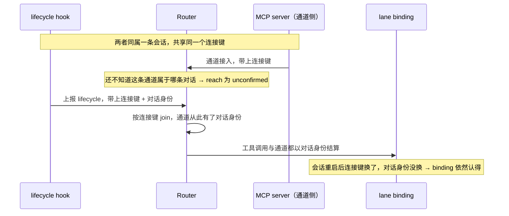

# 让 binding 认得住同一条对话 设计

**状态：** 2026-08-10 经用户批准并实施。实施中发现两处，已并入本稿第五节：连接键必须随通道消失（否则 pid 复用可以借尸还魂），以及 Router 重启后空闲会话的重新 join 窗口。

**一句话结论：** binding 现在存的是 MCP server 自己的 id，而那个 id 每次会话重启都换、而且跟 hook 上报的 id 根本不是一个。结果是每次重开都得重新 attach，且 lifecycle 永远匹配不上。修法是把「对话身份」提升为一个 backend 必须提供的概念，Claude 一侧用一个**只在会话内有效的连接键**把通道和 hook 接起来，从而拿到那个**跨重启不变**的会话 id 存进 binding。连接键是实现细节，不是身份本身。

## 术语表

| 术语 | 含义 |
|---|---|
| 对话身份 | 一条对话在整个生命周期内不变、且能把它跟别的对话区分开的标识。binding 存的应当是它。 |
| 连接键 | 只在一次会话内有效的值，用来把「同一条会话的两个上报方」认成一对。它**不进数据库**，会话一结束就作废。 |
| 通道侧 | MCP server 进程。它建立 WebSocket 通道、代理工具调用，但今天不知道自己属于哪条对话。 |
| lifecycle 侧 | `Stop` / `UserPromptSubmit` hook 进程。它知道对话身份，但不知道通道在哪。 |
| join | Router 把上面两者按连接键配成一对，从而知道「这条通道属于哪条对话」。 |

## 一、问题

`lane_attach_current` 把 lane 绑到 `CallerContext.conversationId`，而这个值来自 MCP server 启动时读的 `CLAUDE_CODE_SESSION_ID`（`lane-mcp-server.ts:89`）。今天实测下来，它既不持久、也不是这条对话的身份。

**已确认（同一条对话内两个 id 并存）：**

| 谁 | 值 |
|---|---|
| Bash 工具看到的 `CLAUDE_CODE_SESSION_ID` | `bb75097f…` |
| MCP server 报给 Router、写进 binding 的 | `ce334584…` |
| 承载这条对话的 `claude.exe`（`CLAUDE_PID`） | `13848` |

`ce334584` 是 15:06 重新 attach 后从 binding 里直接读到的，不是推断。

**已确认（hook 报的不是通道那个 id）：** lane 绑到 `ce334584` 之后，用户又发了一条消息、`UserPromptSubmit` hook 因此触发过，而 `reach.lastLifecycleAt` 仍然是 `null`。所以 hook 上报的 id 在 Router 那里没有通道。

**已确认（重启就换）：** 14:58 那次重启后，四条 lane 的 binding 全部指向重启前的 id，`reach` 一律 `no_channel`；四个新 MCP server 各自建了通道，却都在新 id 下。每条 lane 都必须重新 attach 才能重新收到消息。

后果两条，今天都付过代价：

1. **每次重开对话都要重新 attach**，generation 每次都跳，而这次跳并不对应任何真实的接替。
2. **lifecycle 永远匹配不上**：`reach` 停在 `unconfirmed`，Router 不知道对话忙不忙；第一条通知会把 `busy` 锁成 true 且再无 `Stop` 能解开，接替因此死锁；`Stop` 触发的积压补投整条哑掉。

第 2 条正是 2026-08-10 上午那次接替挂满五分钟的原因。

## 二、`CLAUDE_PID` 能干什么、不能干什么

它是承载这条对话的 `claude.exe` 的 pid（实测 13848，启动于 14:58:51；MCP server 61676 是它的直接子进程）。

| 性质 | 结论 |
|---|---|
| 会话内是否稳定 | **是**。claude.exe 活整条会话，MCP server 重启或重连都不改变它 |
| 跨会话重启是否稳定 | **否**。新的 claude.exe 就是新 pid（上一轮是 68260） |
| 是否唯一 | 活着的进程之间唯一，但**操作系统会复用已退出进程的 pid** |

所以它**不能**当对话身份——存进数据库的东西如果会被复用，迟早把两条无关的对话认成同一条。它只能当**连接键**：两个上报方同时活着的那一刻拿它配对，配完就不再需要它。这就是本设计的分层依据。

## 三、设计

### 3.1 core 只认「对话身份」，不认任何平台细节

`CallerContext` 今天携带的 `conversationId` 语义含糊——它实际是「调用方进程碰巧持有的那个 id」。改成明确的对话身份，并由 backend 负责产出：

- **core 的契约**：每次工具调用和每条通道都必须能解析出一个对话身份；binding 只存它。core 不知道它从哪来，也不知道任何平台用什么方式得到它。
- **Codex backend**：`threadId` 本来就是权威且跨重启不变的，直接作为对话身份，**不需要 join**。
- **Claude backend**：通道侧不知道对话身份，lifecycle 侧知道，所以需要一次 join。

这条分层就是本设计的要点：`CLAUDE_PID` 出现在且只出现在 Claude 适配层，作为 join 的键。core、数据库、四项工具里都不出现它。

### 3.2 Claude 一侧的 join

- **连接键怎么来。** 通道侧用 `process.env.CLAUDE_PID`，取不到时回落到 `process.ppid`——实测 MCP server 就是 `claude.exe` 的直接子进程，两者同值，所以这个回落不依赖任何环境变量的配合。lifecycle 侧用 `process.env.CLAUDE_PID`。
- **对话身份怎么来。** 只有 lifecycle 侧有，就是 hook 负载里的 `session_id`。join 完成之后，Router 才知道通道属于谁。
- **join 之前怎么办。** 通道接进来还没 join 时，它没有对话身份，`reach` 报 `unconfirmed`——跟今天的语义完全一致，不需要新状态。实际窗口很短：hook 在用户提交第一条消息时就触发，而工具调用只可能发生在那之后。
- **连接键不落盘。** 它只活在 Router 进程内存里，跟通道一起消失。pid 复用因此不构成风险：配对只发生在两个上报方同时在线的那一刻。

### 3.3 这解决了什么

| 今天 | 之后 |
|---|---|
| 会话重启 → binding 指向作废的 id → 必须重新 attach | 会话重启 → 对话身份没变 → binding 依然认得，**不必重新 attach** |
| hook 的上报永远匹配不上通道 | join 之后匹配得上，`reach` 能到 `live`，`busy` 能恢复，接替不再死锁，补投恢复 |
| 新开一条**真正的新对话** → 必须 attach | 不变，仍然需要 attach（这是对的） |

### 3.4 失败是看得见的，不是静默的

如果 join 因为任何原因没成（连接键在某一侧取不到、hook 没配、平台改了行为），后果是通道停在 `unconfirmed`——**正是上一份设计刚做出来的那个可见信号**，而不是又一次静默失灵。这一点让本设计不必在动手前就把平台行为猜准：猜错会立刻显形。

配套：`lane_attach_current` 返回的 bootstrap 里带上「本次解析到的对话身份」与「join 成没成」，这样一条对话在重开后可以自己核一眼，不必去查数据库。这也是你提到的那个「重开时检查一下自己的 ID」。

## 四、范围审计

Phase B 清单：内部协议 1 项（通道接入与 lifecycle 上报各多带一个连接键）、公开接口变更 1 项（bootstrap 增加身份与 join 结果）、持久状态语义变更 1 项（binding 里 `conversation_id` 的含义从「MCP server 的 id」变成「对话身份」）。无新增进程、命令、配置、数据表、信任边界。

| 候选面 | 消费者与频率 | 需求依据 | 删除后果 | 已有替代 | 处置 |
|---|---|---|---|---|---|
| 通道接入携带连接键 | Router；每条通道一次 | 用户原话「ID 不要直接 = CLAUDE_PID，要分层」；每次重开都要重新 attach 的实测 | 通道无从与 hook 配对，两条缺陷全部保留 | 无。通道侧没有别的途径知道对话身份 | Keep |
| lifecycle 上报携带连接键 | 同上；每个 turn 两次 | 同上 | 同上 | 无 | Keep |
| bootstrap 返回身份与 join 结果 | 重开后的对话，低频 | 用户原话「可以让每个对话重开时检查一下自己的 ID」 | 对话只能靠 `lane_directory` 的 `reach` 间接判断，看不到自己解析成了什么 | `reach.state` 能看出没 join，但看不出身份是什么 | Keep |
| `conversation_id` 语义变更 | binding 表 | 持久身份必须持久，pid 会被复用 | binding 继续存一个每次重启就作废的值 | 无 | Keep |
| 把 `CLAUDE_PID` 放进 core 或数据库 | —— | 无。它是平台细节且会被复用 | 删掉它，core 只认对话身份 | 适配层的连接键 | Delete |
| 让对话自己把 id 作为参数传进来 | —— | 无。V1 设计明写「对话不得提供任意 conversation/thread ID」 | 删掉它，join 由两个进程完成，不经过模型 | join | Delete |
| 为「未 join」新增一个 reach 状态 | —— | 无。`unconfirmed` 的现有语义正好覆盖 | 删掉它，语义不变 | `unconfirmed` | Delete |
| 给 join 加超时 / 重试 / 告警 | —— | 无真实失败 | 删掉它，没 join 成会显形为 `unconfirmed` | `reach` | Delete |
| 迁移历史 binding 的 id | —— | 无。旧 id 已经作废，重新 attach 一次即可 | 删掉它，各 lane 重开后 attach 一次就进入新语义 | 一次性重新 attach | Delete |

## 五、诚实边界

- **hook 上报的 `session_id` 就是那个跨重启不变的对话身份**——这一步是**强推断**，不是直接证据。支持它的：本对话跨过 14:58 那次重启后 `CLAUDE_CODE_SESSION_ID`、scratchpad 路径、transcript 文件名仍是 `bb75097f`；hook 代码把负载里的 `session_id` 原样上报。**没有**直接看到 hook 进程实际发出的那个值。实施第一步就会把它变成直接证据：join 成功后它会成为 binding 里的值，看一眼就知道。
- **hook 进程能否读到 `CLAUDE_PID` 未验证。** 已验证的是 Bash 工具能读到、且其值等于 MCP server 的父进程 pid。若 hook 侧取不到，join 不成，表现为 `reach` 停在 `unconfirmed`——可见、可诊断，不会静默。
- 本设计只覆盖 Claude 一侧的 join。Codex 的 `threadId` 已经满足对话身份的全部要求，不需要任何新机制。
- **实施中发现（已修正设计）：** 通道接入时**不得**沿用之前记住的连接键映射。初版实现这么做了，端到端冒烟当场抓到——一个复用了同一 pid 的新会话会在自己的 hook 报到之前就被当成前一条对话。定稿是：通道永远先以开启它的进程 id 登记，只有携带同一连接键的 lifecycle 上报才能把它认领过去；且**连接键随通道关闭一并作废**。
- **已知窗口（不打算工程化）：** Router 自己重启后，join 表是空的。此时**正在空闲、且自 Router 重启后没有跑过 turn** 的会话，其通道处于未 join 状态，叫不醒它——直到它下一次 turn 边界的 hook 上报。表现是 `reach` 为 `unconfirmed`（看得见），消息保持 pending 不丢，会话下次运行时补上。要消除这个窗口需要让 MCP server 在重连时自报身份，而那与「对话不得提供任意 conversation ID」相抵，属于另一次设计。

## 六、验收标准

1. 一条已 attach 的对话经历一次会话重启后，**不需要重新 attach**：`lane_directory` 仍显示原 generation，`reach` 能回到 `live`。
2. 重启后收到消息时，通知送达且 `reach.lastLifecycleAt` 随该对话的每个 turn 前进。
3. 对同一条 lane 的接替不再因为 `busy` 无法复位而挂起。
4. 新开一条真正的新对话仍然需要 attach，且 generation 正确递增。
5. 连接键不出现在数据库、四项工具的参数或返回值里；binding 存的是对话身份。
6. join 未完成时，通道报 `unconfirmed`，且不新增第五种 reach 状态。
7. Codex 一侧不引入 join，`threadId` 直接作为对话身份，行为不变。
8. `lane_attach_current` 的 bootstrap 能让一条对话看到自己解析到的身份与 join 结果。

## 七、验证方法

自动测试覆盖第 3、5、6、7、8 条，以及第 1、2 条的确定性部分：先让通道以连接键接入、断言 `unconfirmed`，再送一条带同一连接键与身份的 lifecycle、断言 join 后 `reach` 转 `live` 且 binding 按身份解析；连接键不同则不得 join。第 1 条的「跨重启」在测试里表现为「换一个连接键、身份不变，binding 仍解析到同一条 lane」。

必须手工的一条（进 `docs/manual-tests.md`）：真实重启一条已 attach 的会话，不做任何 attach，直接从另一条 lane 发消息，确认收得到、且 `reach` 为 `live`、generation 未变。这一条同时把第五节那个强推断变成直接证据。
