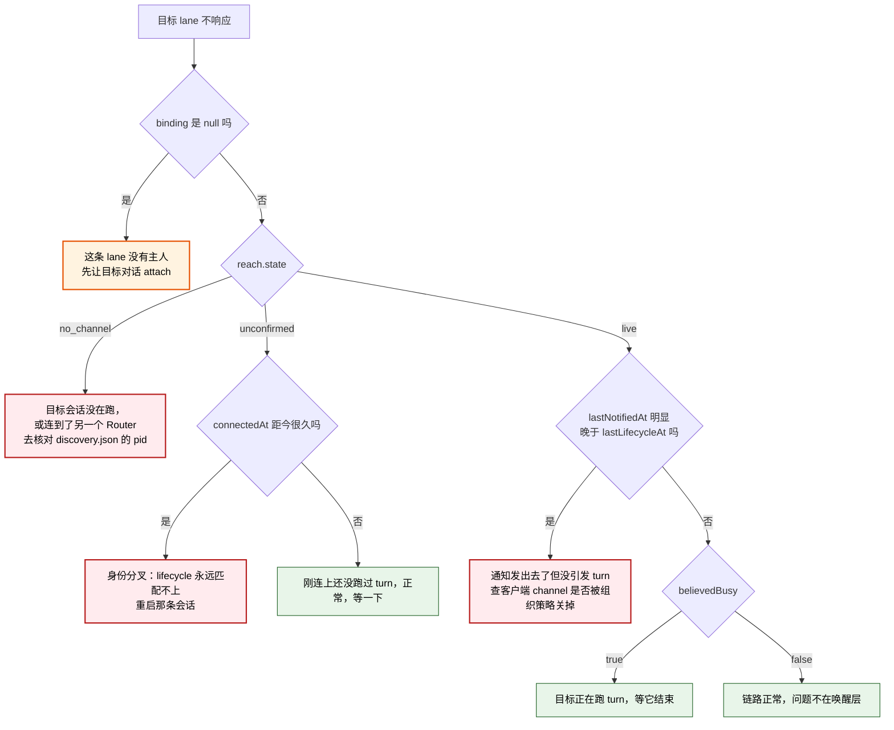

# 带原因的 lane 健康检查 设计

**状态：** 2026-08-10 草稿，待用户批准。批准前不得修改代码。

**一句话结论：** Router 目前把「我做了什么」和「对方收到了什么」混成同一个词 `delivered`，导致至少四种互不相同的失败在发送侧长得一模一样。本设计不新增工具、不新增端点、不新增数据表，只做三件事：把 `lane_directory` 的一个布尔字段拆成「谁拥有这条 lane」和「Router 现在还能不能够到它」，把 `notification_state` 从两态改成如实记录四种结果，以及删掉一处在发送之前就猜结果的代码。

## 术语表

| 术语 | 含义 |
|---|---|
| channel | Claude 一侧 MCP server 与 Router 之间那条 WebSocket 连接。Router 靠它把通知推给某条对话。 |
| lifecycle 事件 | Claude Code 的 `Stop` / `UserPromptSubmit` hook 上报给 Router 的信号，Router 靠它判断某条对话是不是正在跑 turn。 |
| channel 身份 | MCP server 进程启动时从 `CLAUDE_CODE_SESSION_ID` 读到的会话 id。binding 里存的就是它。 |
| lifecycle 身份 | hook 负载里的 `session_id`。正常情况下应当与 channel 身份相同。 |
| 身份分叉 | 上面两者不相等的状态。分叉后 Router 收到的 lifecycle 事件永远匹配不上任何一条 channel。 |
| 可达（reach） | Router 此刻能不能把一条通知送到某条 lane 的绑定对话，以及它凭什么这么认为。本设计新增的概念，不等于 binding 存在。 |
| 唤醒 | 通知真正让目标对话开出一个 turn。Claude 一侧 Router 无法观测这件事，只能观测自己有没有把帧写出去。 |

## 一、问题：四种原因，同一个表象

一条 lane 收不到消息时，发送方今天能看到的全部信息是 `lane_send` 的返回和 `lane_directory` 的 `bound` 字段。这两者都不区分下面四种原因：

| # | 原因 | Router 内部实际发生的事 | 发送侧看到 |
|---|---|---|---|
| 1 | 目标会话没有 WS 连接 | `connections.get()` 落空，什么都没发 | `bound: true`，`lane_send` 返回里 `notificationState: "pending"` |
| 2 | 连着，但 Router 从未收到过它的 lifecycle | 帧发出去了 | 同上 |
| 3 | 组织策略在客户端把通知丢了 | 帧发出去了，客户端静默丢弃 | 同上 |
| 4 | 目标连到了另一个 Router | 本 Router 视角等同于 #1 | 同上 |

三处独立的信息损失叠加成这个表象：

1. **`lane_send` 的返回是通知之前的快照。** `RouterCore.send` 先 `insertMessage` 拿到记录，再 `await pump.notifyLane(target)`，返回的是前者。所以返回里的 `notificationState` 恒为 `pending`，跟这次投递结果无关。本设计撰写当天实测：向 `mocap/hub` 发一条消息，目标在线且帧已写出，返回仍是 `notificationState: "pending"`。
2. **发送之前就按 `busy` 猜结果。** `local-server.ts:48` 在 `await sendWebSocket` 之前算好 `connection.busy ? "queued_next_turn" : "started_new_turn"`。这个 `busy` 是 Router 的**信念**，不是观测——下面第二节会说明它可以永久停在错误值上。
3. **两种结果被折成一种。** `claude-backend.ts:41-43` 把 `started_new_turn` 和 `queued_next_turn` 一起映射成 `delivered`。`NotificationPump.recordOutcome` 只在 `delivered` 时写 `notification_state='notified'`。于是「叫醒了」和「没叫醒但排队了」在数据库里没有区别，而「没连接」和「发送出错」也都留在 `pending`，同样没有区别。

`delivered` 这个词本身是问题的核心：Router 在 Claude 一侧**从来没有**关于接收方的证据。它只知道自己往一条打开的 socket 写了一帧。

### 1.1 第二类原因今天已经在本机发生

2026-08-10 接替 `lane-router/design` 时撞到一次，取证如下。

**已确认**（直接证据）：

- 上一代对话的 transcript 是 `5939dbce…`，但它自己那次 `lane_attach_current` 的返回里记着 `"conversationId":"31489ff7…"`。`31489ff7…` 在 `~/.claude/projects/` 下没有任何 transcript 文件。channel 身份与 lifecycle 身份已经分叉。
- Router 仍持有 `31489ff7…` 的活连接：`POST /claude/lifecycle` 对该 id 返回 `{"accepted":true}`，而对照组（全零 id）返回 `{"accepted":false}`。
- 卡点是 `busy` 停在 true：按该 id 报一次 `Stop` 之后，binding 立刻从 generation 1 换到 2。
- 我之前的四条 active binding（`mocap/hub`、`mocap/render`、`mocap/ui`、旧的 `lane-router/design`）的 conversationId 全都没有对应 transcript；三条 mocap 的 `~/.claude/session-env/<id>/` 目录都建于 10:24，正是 Router 启动那一分钟。作为对照，本对话的 id 有 transcript，两边一致。

**未验证的推断**（不作为设计依据）：分叉可能由「会话中途重连 MCP server」引入。没有复现过一次重连并观察进程环境，因此本设计不依赖这个成因，只依赖上面那条已确认的观测——**两个身份可以不相等**。

分叉造成的后果有三条，其中两条今天就在生效：

1. `reportLifecycle` 按 lifecycle 身份查连接表，查不到就返回 false。那条 channel 的 `busy` 再也回不到 false。
2. `busy` 一旦为真，`waitUntilReplaceable` 永远等下去，**接替死锁**。
3. `Stop` 触发的补投（`signal` → `onAttentionOpportunity` → 重扫 pending）整条哑掉。靠「上一轮结束后自动捡起积压」的路径没了，只剩新消息进来时那一次投递。

投递本身**不受影响**——WebSocket 帧仍然发给正确的那个进程。

### 1.2 `busy` 是怎么被永久锁住的

连接建立时 `busy` 是 false。把它置为 true 的只有两处：`reportLifecycle("UserPromptSubmit")`，以及 `ClaudeChannelHub.notify` 在发完帧之后的 `connection.busy = true`。身份分叉时前者永远不触发，所以**是第一次通知把它锁住的**，此后没有任何路径能清掉。

这一点决定了本设计的一条取舍（见第四节）：把「我发了一帧」当成「对方开了一个 turn」来记账，正是把一个可恢复的故障变成永久故障的那一步。

## 二、范围基线

按 `auditing-plan-scope` Phase A，先在不看候选方案的前提下记录基线。

**用户要的结果：** 消费侧 lane 在目标不响应时，能自己判断属于哪一类原因，而不必去读 Router 源码或手查 SQLite。

**当前用户流程：** `mocap/hub` 等消费侧 lane 向另一条 lane 发消息 → 目标不醒 → 需要决定是继续等、重发、去人工戳那个窗口，还是重启那条会话。今天做这个判断的成本，就是本文第 1.1 节那一整套取证动作。

**信任模型：** V1 设计《目标与边界》一节已定——同一台可信机器上的个人开发环境，不为跨机器或恶意本地进程设计。本设计不改动它。

**满足该流程的最小可观测行为：** 对每条 lane，回答两个今天被混在一起的问题——「这条 lane 有主人吗」和「Router 此刻还能不能够到那个主人」——并且对第二个问题给出 Router 凭什么这么说的依据。对每条消息，回答「这次通知到底做成了什么」。

这条基线不包含：自动恢复、重试策略、告警、阈值判定、管理台。V1《非目标与删除项》已经删掉其中数项，本设计不把它们请回来。

## 三、设计

### 3.1 `lane_directory` 区分所有权与可达性

`bound` 这个布尔值在同时回答两个问题，而它们恰好在故障时才分岔。拆开：

```jsonc
{
  "address": "mocap/render",
  "roleDescription": "...",
  "backend": "claude",
  "binding": { "generation": 3, "attachedAt": 1786328712950 },
  "reach": {
    "state": "unconfirmed",
    "connectedAt": 1786325104000,
    "lastLifecycleAt": null,
    "lastNotifiedAt": 1786333372527,
    "believedBusy": true
  }
}
```

- `binding` 为 `null` 表示这条 lane 当前没有主人；此时 `reach` 也是 `null`（没有对话可谈可达性）。
- `bound` 字段**移除**。保留它只会让旧读法继续误导。

`reach.state` 三取值：

| 取值 | 含义 | 区分掉的原因 |
|---|---|---|
| `live` | 通道打开，且 Router 至少观测到过一次该对话的 lifecycle 事件 | —— |
| `unconfirmed` | 通道打开，但 Router 从未观测到过它的 lifecycle 事件 | 第 2 类（含身份分叉） |
| `no_channel` | 没有打开的通道，什么都发不出去 | 第 1 类；从单个 Router 的视角，第 4 类也落在这里 |

四个佐证字段各自解决一个具体判断，都不可省：

| 字段 | 没有它就答不了的问题 |
|---|---|
| `connectedAt` | `unconfirmed` 到底是「刚连上还没跑过 turn」（良性，等一下就好）还是「连了很久从未跑过」（身份分叉，要重启会话） |
| `lastLifecycleAt` | 这条对话到底有没有在跑 turn。这是 Router 唯一一个关于接收方的真凭据 |
| `lastNotifiedAt` | 跟上一项相比就能回答**第 3 类原因**：通知一直在发出去，之后却从来没有 lifecycle 跟上，说明唤醒没有落地。这是 Router 在 Claude 一侧唯一能间接看到组织策略丢弃的办法 |
| `believedBusy` | 解释一次接替为什么在等。字段名如实说明它是信念而非观测——它正是 1.2 节那个会被锁住的标志位 |

判别路径：



一条硬约束：**`lane_directory` 必须保持为本地查询，不得为了填 `reach` 去做任何平台往返，也不得阻塞。** 这个工具正是在链路已经出问题时被调用的，它自己绝不能重蹈 `lane_attach_current` 那次挂五分钟的覆辙。所以 `reach` 只能由 Router 已经持有的进程内状态派生。

### 3.2 `reach` 的数据从哪来

全部在 `ClaudeChannelHub` 的连接表里就地增加，都是进程内状态，**不落盘**：

| 字段 | 写入时机 |
|---|---|
| `connectedAt` | `connect()` 建立连接时 |
| `lastLifecycleAt` | `reportLifecycle()` 匹配到连接时 |
| `lastNotifiedAt` | `notify()` 成功写出帧之后 |
| `believedBusy` | 沿用现有 `busy`，语义不变 |

Codex 一侧没有常驻的 per-thread 连接，它的状态来自 App Server。按上面那条硬约束，Codex backend 只用它**已经**掌握的本地信息回答：客户端断开就是 `no_channel`；客户端连着时，用已经观测到的线程活动（`turn/completed`、`thread/status/changed`）区分 `live` 与 `unconfirmed`。

> **实现期修正（2026-08-10）：** 本节初稿写的是「`unconfirmed` 对 Codex 不适用，因为线程状态由 App Server 权威给出」。这条理由站不住：权威状态**只在发起请求时**才拿得到，而上面那条硬约束禁止在这里发请求。所以「客户端连着」并不能证明那个线程还在，报 `live` 就是超出证据的断言。实现改成与 Claude 一侧同构——观测到过才算 `live`，这是更小的声明。
>
> 两处 Codex 侧确实填不出来的字段如实为 `null`：`connectedAt`（没有 per-thread 连接可计时）与 `believedBusy`（Codex backend 不保存忙闲信念，它在需要时去问）。这不是遗漏，是两个平台可观测能力不同。

### 3.3 `notification_state` 四态

现有取值 `pending | notified` 换成初始态 `pending` 加四种结果：

| 取值 | 含义 | Claude | Codex |
|---|---|---|---|
| `pending` | 尚未尝试（初始值） | ✓ | ✓ |
| `sent` | 通知已发往一条打开的通道 | 帧已写出 | `turn/start` 或 `turn/steer` 成功 |
| `deferred` | 目标正忙，本次刻意没有投递，等下一次机会 | 不产生 | 线程 active 且不允许 steer |
| `no_channel` | 没有可用通道，什么都没发 | 连接不存在或未打开 | 客户端未连接，或线程 `notLoaded` |
| `send_failed` | 发送尝试出错 | `sendWebSocket` 抛异常 | 请求抛异常且并非线程缺失 |

配套的三处改动：

1. `router/backend.ts` 的 `NotificationOutcome` 由 `delivered | deferred | offline` 改为 `sent | deferred | no_channel | send_failed`。这是 Router core 与 backend 之间的内部契约，不是对话可见的接口。
2. `ClaudeChannelHub.notify` **删掉发送前那行按 `busy` 猜结果的代码**。Claude 一侧无论对方忙不忙都会把帧写出去——客户端自己会排队——所以结果只有「写出去了」「没通道」「写失败」三种。猜出来的那个区分本来就没有依据，删掉它是净减法。
3. `NotificationPump.recordOutcome` 记录实际结果，而不再只在 `delivered` 时打一个标记。

**这组改动不改变通知的发送时机。** `notifyLane` 今天按 `state='pending'` 挑消息，与 `notification_state` 无关；改完仍然如此。也就是说 `notification_state` 是纯观测字段，动它不影响投递行为。这是本设计敢动这个列的前提。

用户原话是「落四态」。这里的读法是：**四种结果，外加初始的 `pending`**。原来被折掉的「叫醒了 / 只是排队了」这个区分没有以列值的形式回来，因为它在 Claude 一侧本就无法如实判定；它改由 `reach.lastNotifiedAt` 与 `reach.lastLifecycleAt` 的先后关系回答，那个答案有真凭据。如果这不是您要的读法，这是最便宜的纠正点。

### 3.4 数据库迁移

`notification_state` 的取值范围写在 `message` 表的 CHECK 约束里，SQLite 改不了 CHECK，只能重建表。因此 `ROUTER_SCHEMA_VERSION` 升到 2，`initializeRouterSchema` 增加一条 1 → 2 的迁移：建新表、拷数据、删旧表、改名、重建索引。

历史值的映射是精确的，不需要猜：旧的 `notified` 只在 `delivered` 时写入，而 `delivered` 的含义正是「帧已写出 / turn 已开」，即新的 `sent`。旧的 `pending` 保持 `pending`。没有任何一行需要被赋予一个它当时并不成立的含义。

## 四、范围审计

Phase B 清单——本设计新增或扩大的产品面：公开接口 1 项，持久状态 1 项。没有新进程、传输、协议、命令、配置、信任边界或生命周期机制。

Phase C 逐项：

| 候选面 | 消费者与频率 | 需求依据 | 删除后果 | 已有替代 | 处置 |
|---|---|---|---|---|---|
| `lane_directory` 返回里的 `reach` 对象 | 消费侧 lane（`mocap/*`）在目标不响应时；低频恢复路径 | 用户原话「现在『channel 不通』至少四种原因……前三种在发送侧全都显示 delivered」 | 四类原因仍然无法区分，判断成本回到 1.1 节那一整套手工取证 | 无。SQLite 里没有通道状态，`GET /health` 只报 Router 自身 | Keep |
| `lane_directory` 里 `bound` → `binding` | 同上 | 同上；`bound` 一个布尔在答两个问题 | 若只加 `reach` 而保留 `bound`，两个字段在故障时互相矛盾，旧读法继续误导 | 无 | Keep |
| `notification_state` 扩到四态 + schema v2 | 消费侧排查一条具体消息；低频 | 用户原话「notification_state 落四态」 | 「从未尝试」与「尝试过但没通道」仍然都是 `pending` | 无 | Keep |
| 删除发送前的 `busy` 猜测 | —— | 用户点名 `local-server.ts:48` | —— | —— | Delete（净减法） |
| 新增 `lane_health` 工具 | —— | 无。`lane_directory` 已经是「查看 lane 状态」这件事的入口 | 删掉它，`lane_directory` 加字段即可满足全部流程 | `lane_directory` | Delete |
| 新增 `GET /health/lanes` 端点 | 无当前消费者。想到的用途是人在 shell 里查 | 无。V1《非目标》已删除「面向用户的管理 CLI、`doctor`、`events`」 | 删掉它，消费侧走工具即可；工具走 RPC 通道，不受 channel 故障影响 | `lane_directory` | Delete |
| 「未匹配的 lifecycle 上报」计数器 | 消费侧；用于把 `unconfirmed` 的成因坐实为身份分叉 | 推断性证据（分叉成因未验证）。且它会把 `lane_directory` 的返回从数组改成对象 | 删掉它，`unconfirmed` + `connectedAt` 已足以给出同一个动作：重启那条会话 | `reach.state` + `connectedAt` | Defer |
| hook 在收到 `{"accepted":false}` 时向本对话注入告警 | 身份分叉的那条会话自己 | 同上，推断性 | 删掉它，分叉仍可由消费侧看见 | `reach.state` | Defer |
| Codex 侧完整的 per-thread 可达性记账 | 无。今天四类原因全部只在 Claude 一侧出现过 | 无真实失败 | 删掉它，Codex 用已有的本地信息回答，缺的填 `null` | `client.isConnected()` + 已订阅的通知 | Delete |
| `reach` 的阈值判定（多久没 lifecycle 算异常） | —— | 无。V1《非目标》已删除「可配置的 retry/deadline 参数面」 | 删掉它，返回原始时间戳由消费侧判断 | 时间戳字段 | Delete |

两条 `Defer` 只记录决定，不生成待办项、issue 或里程碑。它们的重新评估条件是：健康检查上线后，`unconfirmed` 在真实排查中仍然给不出可行动的结论。

## 五、留给用户的一个未决选择

**要不要同时停止在 `notify()` 之后把 `busy` 置为真？**

它不属于健康检查，是行为改动，所以本设计**不包含**它，只把它连同证据摆出来：

- 支持改：1.2 节已经确认，把 `busy` 从「可恢复的错判」变成「永久锁死」的正是这一行。身份分叉时 `busy` 本来是 false，是第一次通知锁住了它，接替才会死锁。去掉之后，`busy` 只反映观测到的 lifecycle 事件。
- 反对改：它是一道保守的护栏，防止通知刚发出、目标的 `UserPromptSubmit` 还没上报的那个窗口里发生接替。去掉会留下一个短暂的竞态窗口。
- 本设计的处理：先让它**可见**（`reach.believedBusy`），行为不动。看得见之后再决定改不改，成本更低。

顺带说明：接替死锁的另一半——`waitUntilReplaceable` 没有任何上界——见第七节，它属于第 (2) 份稿子的邻域，不在本稿范围内。

## 六、验收标准

1. `lane_directory` 对每条 lane 返回 `binding` 与 `reach`；不再返回 `bound`。无主 lane 的两个字段都是 `null`。
2. 通道打开但 Router 从未收到过该对话 lifecycle 事件时，`reach.state` 为 `unconfirmed`，且 `connectedAt` 非空、`lastLifecycleAt` 为空。
3. 通道不存在时，`reach.state` 为 `no_channel`，且该 lane 的消息 `notification_state` 落到 `no_channel` 而不是停在 `pending`。
4. 通知写出成功后，`notification_state` 为 `sent`，且 `reach.lastNotifiedAt` 被更新。
5. Codex 线程 active 且不允许 steer 时，`notification_state` 为 `deferred`。
6. `ClaudeChannelHub.notify` 中不再存在发送前按 `busy` 计算结果的代码路径；Claude 一侧对忙与不忙的目标返回同一个 `sent`。
7. `lane_directory` 在 Codex App Server 不可用时仍然立即返回，不发起任何平台往返。
8. 已有数据库从 version 1 迁移到 2 后，原 `notified` 行变成 `sent`，原 `pending` 行不变，消息条数不变。
9. `notification_state` 的取值变化不改变任何一条通知的发送时机：迁移前后 `notifyLane` 选中的消息集合相同。
10. 四项对话工具的数量和名称不变；没有新增 RPC 方法、HTTP 端点、命令行参数或配置项。

## 七、验证方法

自动测试能覆盖第 3、4、5、8、9、10 条，以及第 1、2、6、7 条的确定性部分：

- **迁移**：建一个 version 1 的库，塞入 `pending` 与 `notified` 两种行，跑迁移，逐行比对。条数不变是不变量，`notified → sent` 是精确映射，两者都可断言，不需要人工判读。
- **四态**：用现有的 fake backend 分别制造「通道打开」「通道缺失」「写出抛异常」「Codex active 不可 steer」四种情形，断言列值。
- **发送时机不变**：同一组 pending 消息，在 `notification_state` 取遍五种值的情况下，`notifyLane` 选中的集合必须完全相同。这是一条不依赖期望值表的不变量断言。
- **`lane_directory` 不阻塞**：注入一个永不返回的 Codex 客户端，断言 `lane_directory` 仍在毫秒级返回。

自动测试**覆盖不到**、必须进 `docs/manual-tests.md` 的：

| 用例 | 为什么机器测不了 | 怎么做 |
|---|---|---|
| 第 3 类原因（组织策略丢弃通知） | 需要真实 Claude 客户端与管理设置 | 临时移走 `C:\Program Files\ClaudeCode\managed-settings.json`（需管理员），重启目标会话，发一条消息，确认 `notification_state` 是 `sent` 而 `lastLifecycleAt` 始终不前进 |
| 第 2 类原因（身份分叉） | 需要真实的 MCP server 与 hook | 目标会话在跑期间重连 MCP server，再发消息，确认 `reach.state` 为 `unconfirmed` 且 `connectedAt` 远早于 `lastNotifiedAt` |
| 判别图整体走通 | 需要人按图做判断 | 对当前四条 lane 各跑一次 `lane_directory`，核对给出的原因与实际情况一致 |

关于第 2 类那条手工用例：它同时也是**验证 1.1 节那条推断**的机会。如果重连确实产生新的 channel 身份，推断就升级为确认，可以写进文档；在那之前，文档里只保留「两个身份可以不相等」这条已确认事实。

## 八、明确不做

- 不新增第五项对话工具，不新增 HTTP 端点，不新增命令行子命令。
- 不新增数据表；`message` 表除 `notification_state` 的取值范围外结构不变。
- 不引入阈值、告警、自动重试、自动恢复或 poison park。健康检查只报事实和时间戳，判断留给消费侧。
- 不改动信任边界：这些字段只在同机可信环境里暴露 Router 已经掌握的信息，不新增身份、凭据或鉴权。
- 不改动接替语义、`generation` 规则或 mailbox 文件格式。

## 九、本稿范围之外、但已确认的一个缺陷

接替时 `waitUntilReplaceable` 没有任何上界，而调用方这一侧有：2026-08-10 那次接替，客户端在约 300 秒后报 `fetch failed`（实测时长；归因到 Node 内置 HTTP 客户端的 headers 超时属推断，未单独验证），Router 侧的等待者却继续存活，四分半钟后被一次外部的 `Stop` 放行，**在没有任何调用方接收结果的情况下完成了 binding 替换**，把 generation 推到 2。

这违反 V1 设计《功能闭环包含最低失败语义》那条——一次已经向调用方报告为失败的操作，事后静默改写了持久状态。修法（给等待设上界、或让调用方放弃时撤销等待者）属于接替生命周期，不属于健康检查，因此不并进本稿。建议与第 (2) 份稿子（Router 随会话被杀）一起决定，两者都落在「接替与进程生命周期」这个邻域。
