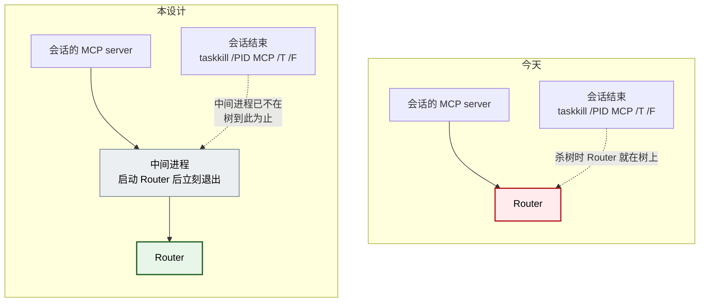

# 让 Router 不随启动它的会话一起死 设计

**状态：** 2026-08-10 经用户批准并实施。**第八节（`waitUntilReplaceable` 无上界）用户明确决定不做**，本次未实施，缺陷仍在。

**一句话结论：** Router 现在是某一条会话的 MCP server 的直接子进程，那条会话结束时被整棵树杀掉，于是所有 lane 一起失去 Router。修法是在中间插一个「生完就退」的进程，让 Router 在杀树发生时不在那棵树上。这一步本身很小；**真正要过稿的是它的代价**——`spawnRouter` 目前靠握着子进程的 stderr 管道直接上报启动失败，加了中间进程这条直连就断了，得换一条同样快的失败通道。

## 术语表

| 术语 | 含义 |
|---|---|
| 杀树 | Windows 的 `taskkill /PID <pid> /T /F`。它在**执行那一刻**按存活进程的父子关系现算一棵树，然后全部强杀。 |
| 中间进程 | 本设计新增的一次性进程。它只负责启动 Router，然后立刻退出，使 Router 在后续任何一次杀树中都不挂在被杀的那棵树上。 |
| 启动失败诊断 | `ensureRouter` 在 Router 起不来时给出**具体原因**而不是等满 15 秒报「没有就绪」的能力。`e957bef` 建立，`docs/manual-tests.md` 有对应用例。 |
| 孤儿 Router | 父进程已退出、自身仍在运行的 Router。Windows 不会给它换父亲，它的 ppid 字段仍指向那个已经消失的 pid。 |

## 一、问题

Router 由 `ensureRouter` 按需启动，而 `ensureRouter` 跑在每条会话自己的 MCP server 进程里。所以「谁先需要 Router，Router 就成了谁的子进程」。今天本机的实际状况：Router 的 pid 是 39104，它的 ppid 是 67664 —— 某一条 lane 的 MCP server。那条会话一结束，所有 lane 的 Router 就没了。

后果不是「消息丢失」（mailbox 是文件，pending 不会丢），而是：

- 任何一条 lane 收工，可能顺手带走全体的通知链路，直到下一次有人调用工具才重新拉起；
- Router 重启期间，正在等待的接替（`waitUntilReplaceable`）全部被丢弃；
- 每次重启都让所有 channel 重连一遍。`14cfdb2` 之前的 MCP server 没有重连能力，那时一次重启就是永久失联。

### 1.1 机制取证

**已确认（读发行二进制）：** Claude Code 的 CLI（`claude.exe`，2.1.226）里有一个日志名为 `killProcessTree` 的函数，它拼出 `%SYSTEMROOT%\System32\taskkill.exe`，参数是：

```js
spawn(n, ["/PID", String(e), "/T", "/F"], { cwd: void 0, stdio: "ignore", windowsHide: !0 })
```

失败时回落到 `process.kill(e)`。二进制里出现的 `CreateJobObject` 等符号全部位于 kernel32 的导入名表中（紧邻 `LoadLibraryW`、`CreateMutexW`、`CreateFileW`），**不是**把子进程装进 Job 对象的证据。这一点很关键：如果用的是带 kill-on-close 的 Job 对象，本设计的修法**不成立**——Job 会连孙进程一起收走，跟父进程还在不在无关。

**已确认（本机实测，三组对照各 3 次，结果全部可复现）：** 用一个长期存活的 node 进程模拟 Router，用 `taskkill /PID <root> /T /F` 模拟会话结束，三组的区别只有中间那一层：

| 组 | 结构 | 长期进程的下场 |
|---|---|---|
| 对照组 | root → 长期进程（`detached: true` + `unref()`，与今天的 `spawnRouter` 一致） | **被杀**（3/3） |
| 处理组 | root → 中间进程（生完即退）→ 长期进程 | **存活**（3/3） |
| 判别组 | root → 中间进程（**不退，继续活着**）→ 长期进程 | **被杀**（3/3） |

对照组复现了今天的缺陷，同时证明这套量法确实能杀掉东西——否则处理组的「存活」什么都证明不了。判别组把因果隔离出来：**起作用的是「中间进程在杀树发生时已经不在了」，不是「多了一层嵌套」。** 同时它也证明 `detached: true` 挡不住杀树（三组都用了它）。

**推断（未确认）：** 上面那个 `killProcessTree` 的遥测事件名是 `tengu_bash_tool_kill_error`，所以能确认的调用点是 Bash 工具的杀树路径；**MCP server 关闭是否走同一个 helper 没有证明**。函数名是通用的 `killProcessTree`，倾向于是同一条路径，但这只是倾向。第七节的验收用例是行为级的——直接结束一条会话看 Router 活不活——它不依赖这个推断，无论内部走哪条路都能给出答案。

## 二、范围基线

**用户要的结果：** Router 的存活不再取决于「哪条会话恰好第一个用到它」。

**当前用户流程：** 多条常驻 lane 共用一个 Router。任意一条会话结束、重启或崩溃，其余 lane 的消息通知必须继续工作。

**信任模型：** 不变——同机可信个人开发环境。本设计不引入权限提升：实测证明修法不需要管理员、不需要 WMI、不需要注册服务，而 V1《非目标与删除项》本来就删掉了 Windows 服务。

**满足该流程的最小可观测行为：** 结束启动了 Router 的那条会话之后，Router 仍在运行，其余 lane 的 `lane_send` 与通知照常。

**必须一并保住的既有行为：** `ensureRouter` 在 Router 起不来时快速给出具体原因。这不是新需求，是 `e957bef` 已经建立、`docs/manual-tests.md` 已经钉住的契约（实测 219ms 报出「Another Router process is already running」）。本设计的主要工作量在这里。

## 三、设计

### 3.1 插一个生完就退的中间进程



新增一个内部脚本 `dist/process/detach-router.js`。它做四件事，然后退出：截断启动日志、以 `detached` 方式启动 `main.js` 并把它的 stdio 指向该日志、把 Router 的 pid 打到自己的 stdout、`unref` 后退出。

三条硬约束，都由第 1.1 节的实测直接推出：

1. **它必须立刻退出。** 判别组证明中间进程只要还活着，Router 照样被杀。所以它不能等 Router 就绪、不能守护、不能重试。
2. **它不能变成常驻的监督进程。** 那正是判别组那一档。Router 起不来时的恢复由 `ensureRouter` 在下一次调用时完成，这条路径已经存在。
3. **不分平台，一律走中间进程。** 非 Windows 没有杀树问题，`detached` 本就够用；但加平台分支等于维护两条启动路径和两套失败语义，而收益是省掉一次约 50ms 的进程启动。V1《架构雏形只建立当前边界》不支持为此分叉。

### 3.2 启动失败诊断怎么活下来

这是本稿真正要过的部分。今天 `spawnRouter` 直接 `spawn(main.js, { stdio: ["ignore","ignore","pipe"] })`，握着 Router 的 stderr；`RouterStartAttempt.failure` 在子进程 `close` 时用累积的 stderr 文本兑现，`waitForRouter` 用 `Promise.race` 把它和轮询放在一起，所以失败在毫秒级就报出来，且带原文。

加了中间进程之后，这条直连断了：`ensureRouter` 的直接子进程变成中间进程，而中间进程**成功时也会立刻退出**——今天「子进程 close 即失败」的判据直接反转成误报。

改成两条各司其职的失败通道：

| 通道 | 覆盖什么 | 怎么实现 |
|---|---|---|
| 直接子进程 | 中间进程自己没起来 / 起来了但报错退出 | 保留对中间进程的 stdio 管道与 `error` 监听。**判据从「close」改成「非零退出码或 spawn 出错」**；退出码 0 是正常路径 |
| 启动日志 + Router pid | Router 起来了但在就绪前退出 | 中间进程把 Router 的 pid 写到自己的 stdout；`waitForRouter` 拿到 pid 后每轮轮询顺带用 `process.kill(pid, 0)` 检查存活。pid 没了而 discovery 仍未就绪 → 读日志，把内容作为失败原因抛出 |

启动日志固定放 `<dataRoot>/router-start.log`，由中间进程在启动 Router **之前**截断。固定路径是安全的：只有拿到 `startup.lock` 的那一个调用方才会启动 Router，已有的锁把并发收敛掉了。

**为什么要 pid 这一步握手，而不是「日志非空即失败」。** 后者更简单，但它把正确性押在「Router 成功时绝不往 stderr 写任何东西」这条不变量上——今天成立（`main.ts` 只在失败分支写 stderr），但任何一次未来的 `console.error` 都会让 `ensureRouter` 开始误报失败，而且是静默的。pid 握手多三行，换掉这条脆弱前提。

**日志文件不删。** Windows 上删一个别的进程正持有的文件会失败，而 Router 成功时会把这个 fd 持有到自己生命周期结束。改为每次启动截断：它因此永远只保存「最近一次 Router 启动」的 stderr，跨重启不累积。单次 Router 生命周期内它理论上可以增长，但今天 Router 只在致命启动失败时写 stderr，实际为空。

### 3.3 不做的

- 不注册 Windows 服务，不要求管理员，不用 WMI —— 实测证明都不需要，且 V1《非目标》已删除。
- 不加监督/守护进程，不加自动重启、退避或健康巡检。Router 没了的恢复路径已经存在：下一次 `ensureRouter` 就会拉起。
- 不加 `lane-router stop` / `restart` / `status` 之类的命令。V1《非目标》删除了面向用户的管理 CLI。
- 不改 `RuntimeLock`、`discovery.json` 的格式或单实例语义。
- 不让 Router 跨重启存活，不做开机自启。

## 四、范围审计

Phase B 清单：新增进程 1 项（中间进程），新增内部入口 1 项（`detach-router.js`），新增文件 1 项（启动日志），内部协议 1 项（中间进程 → 父进程的 pid 一行）。无新增传输、命令、配置、信任边界、公开接口。

| 候选面 | 消费者与频率 | 需求依据 | 删除后果 | 已有替代 | 处置 |
|---|---|---|---|---|---|
| 中间进程 | 所有 lane；每次冷启动 Router 时一次 | 用户原话「gap B：Router 随会话被杀」；本机现状 Router ppid = 某条会话的 MCP server | Router 继续随任意一条会话消失 | 无。`detached: true` 已在用且实测挡不住杀树 | Keep |
| `dist/process/detach-router.js` | 只被 `spawnRouter` 调用 | 同上；中间进程需要一个可执行体 | 只能改用 shell 拼接（`cmd /c start`），带来引号转义与平台分支 | 无 | Internalize（不作为命令行入口、不写进用户文档、无对外参数） |
| `<dataRoot>/router-start.log` | `ensureRouter` 在一次失败启动后读一次 | `e957bef` 建立、`docs/manual-tests.md` 钉住的启动失败诊断契约 | 失败只剩 15 秒后的「没有就绪」，丢掉已验收的诊断能力 | 无。stderr 直连正是被中间进程切断的东西 | Keep |
| 中间进程回报 Router pid（stdout 一行） | `ensureRouter`，仅在启动窗口内 | 同上：需要区分「还在启动」与「已经死了」 | 只能退回「日志非空即失败」，把正确性押在「成功时不写 stderr」这条会漂移的不变量上 | 无 | Keep |
| 常驻监督进程 / 自动重启 | —— | 无当前需求 | 删掉它，`ensureRouter` 的按需拉起已覆盖恢复 | `ensureRouter` | Delete（且判别组证明常驻中间进程会让修法失效） |
| Windows 服务 / 管理员 / WMI | —— | 无。实测不需要 | 删掉它，修法照样成立 | 中间进程 | Delete |
| 管理命令（stop / restart / status） | —— | 无。V1《非目标》已删除 | 删掉它，当前流程不需要 | —— | Delete |
| 平台分支（仅 Windows 用中间进程） | —— | 无。省一次进程启动 | 删掉它，代价是约 50ms 冷启动 | —— | Delete（两条启动路径的维护成本高于收益） |

## 五、已知残余风险

两条都不打算工程化，写下来是为了别装作不存在：

- **pid 复用。** 孤儿 Router 的 ppid 仍指向那个已消失的中间进程 pid。若该 pid 被系统复用给一个新进程，而那个新进程日后被杀树，Router 会被误伤。窗口极小，且后果是「Router 需要重新拉起」，不是数据损坏。
- **启动窗口。** 从 Router 被 spawn 到中间进程退出之间有一个很短的窗口，杀树若恰好落在里面，Router 仍会被带走。后果同样是下一次 `ensureRouter` 重新拉起。

## 六、验收标准

1. 结束启动了 Router 的那条会话之后，Router 进程仍在运行，其余 lane 的 `lane_send` 与通知不受影响。
2. Router 进程的 ppid 指向一个已经退出的中间进程，而不是任何一个存活的 MCP server。
3. 中间进程在 Router 启动后立刻退出，不常驻。
4. Router 起不来时，`ensureRouter` 仍在秒级抛出**带原文**的错误，而不是等满超时报「没有就绪」。既有手工用例（临时 `router.lock` 占用 → `Another Router process is already running`）继续通过。
5. 中间进程自身起不来或报错退出时，`ensureRouter` 抛出的错误包含中间进程的 stderr。
6. 中间进程以退出码 0 正常退出**不**被当成失败。
7. `router-start.log` 在每次启动时被截断，不跨重启累积。
8. 没有新增命令行入口、配置项、服务注册或权限要求；四项对话工具不变。

## 七、验证方法

自动测试能覆盖第 3、5、6、7 条，以及第 4 条的确定性部分。`ensureRouter` 已有 `options.start` 注入点，失败通道可以在不启动真进程的情况下测：

- 中间进程非零退出 + stderr → `ensureRouter` 抛出含该文本的错误；
- 中间进程退出码 0 → 不抛错，继续轮询；
- 给一个已经不存在的 Router pid + 一份有内容的启动日志 → 抛出日志内容，且**不等满超时**（断言耗时远小于 15 秒）；
- 启动日志被截断而不是追加。

另外可以完全自动地覆盖第 2、3 条的机制面：用真进程重跑第 1.1 节那三组对照，断言处理组存活、对照组与判别组被杀。这条不依赖 Claude Code，只依赖 Windows 的杀树语义，适合固化成回归测试。

**必须手工、且是决定性的一条**（进 `docs/manual-tests.md`）：

**目标：** 直接回答「结束一条会话，Router 活不活」，从而绕过第 1.1 节末尾那条未验证的推断——无论 Claude Code 内部走哪条关闭路径，这个用例都给出答案。

**步骤：**

1. 构建待验证提交，确认所有 Router 进程已停止（按 `discovery.json` 的 pid 核对后停止，不要硬编码历史 pid）。
2. 只开一条会话，调一次任意 lane 工具，让它冷启动 Router。
3. 记录 Router 的 pid 与 ppid，并确认那个 ppid 对应的进程**已经不存在**。
4. 另开一条会话并 attach 一条 lane，用它作为观察者。
5. 结束第 2 步那条会话。
6. 检查 Router 的 pid 是否仍在；从观察者那条会话发一条消息，确认通知链路照常。

**预期：** Router 存活，观察者发送成功。**若 Router 随会话消失，说明 MCP server 的关闭路径不是杀树**（例如用了带 kill-on-close 的 Job 对象），本设计的前提不成立——此时不要试图加中间进程的层数，那是判别组已经排除的方向，应当回来重新取证。

## 八、需要单独批准的一项（不属于本稿主体）

上一份稿子第九节记了一个已确认缺陷，我建议与本稿一起决定，但它是**独立的一项**：批准本稿主体不等于批准它。

**缺陷：** `waitUntilReplaceable` 没有上界，而调用方有。2026-08-10 那次接替，客户端约 300 秒后报 `fetch failed`，Router 侧的等待者继续存活，四分半钟后被一次外部的 `Stop` 放行，**在没有任何调用方接收结果的情况下**完成了 binding 替换，把 generation 推到 2。这违反 V1《功能闭环包含最低失败语义》里「不得静默破坏已承诺的持久状态」。

**建议的修法：把等待的寿命绑到调用方的寿命上，而不是加一个超时常数。** Router 的 HTTP 层已经持有 `IncomingMessage`；调用方断开时 `request` 会触发 `close`。把由此产生的取消信号传到 `waitUntilReplaceable`，调用方一旦放弃，等待者就结束，不再有「无人接收却改写状态」的结果。

**为什么不用超时常数：** V1《非目标》删除了「可配置的 retry/deadline 参数面」。一个写死的超时值仍然是一条需要挑数字的策略，而且挑多长都不对——它既不能保证短于调用方的放弃时间，也不能保证长过一次合理的长 turn。绑定调用方寿命不需要挑任何数字，且精确对应观测到的那次故障。

**代价：** `PlatformBackend.waitUntilReplaceable` 要多接一个取消信号参数，Claude 与 Codex 两侧的实现都要响应它。这是一次内部契约变更，不影响四项对话工具。

**若不批准：** 现状可用但会留着那个缺陷——接替在极端情况下仍可能在调用方看来失败之后才生效。这一点在身份分叉被修好之后出现概率显著下降，所以推迟是站得住的选择。
