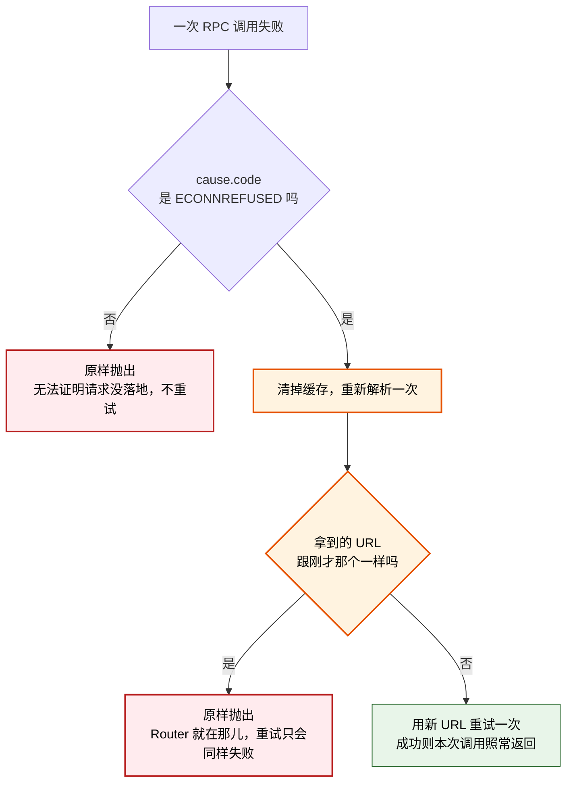

# Router 被换掉之后 RPC 的重新解析 设计

**状态：** 2026-08-12 用户批准并已实现。自动测试与变异检验已通过；第七节那条手工用例**尚未跑**，原因见 `docs/manual-tests.md` 同名小节——在它通过之前，本修复不得被称作真实链路已验证。

**一句话结论：** MCP server 进程里，通道拿到的是一个「去问现在的 Router 是谁」的解析器，而 RPC 客户端拿到的是启动那一刻的一个字符串；Router 一被换掉，同一个进程里通道跟了过去、RPC 留在原地。本设计把 RPC 侧改成与通道侧同构——传解析器而非字符串——并且**只在能证明请求从未送达时**才重新解析并重试一次。不新增工具、端点、数据表、配置项，也不给任何工具加幂等键。

## 术语表

| 术语 | 含义 |
|---|---|
| RPC 路径 | 对话调用四项 lane 工具时走的那条路：MCP server 用 HTTP POST 打 Router 的 `/rpc`。 |
| 通道 | MCP server 与 Router 之间那条 WebSocket。Router 靠它把通知推给某条对话。跟 RPC 路径同进程、不同连接。 |
| discovery | `~/.lane-router/discovery.json`，Router 启动时写下自己的 URL 与 `instanceId`。谁想找 Router 都读它。 |
| 解析器 | 形如 `() => Promise<string>` 的函数，每次调用都重新回答「现在的 Router 在哪」。通道侧现在拿到的就是它。 |
| 重新解析（rebind） | 发现手上的 URL 打不通之后，重新走一次 discovery 拿到当前 Router 的 URL。本设计新增的行为。 |
| 请求从未送达 | 可以断言这次调用的字节一个都没到过任何 Router 进程，因此 Router 不可能对它做过任何事。 |

## 一、问题：同一个进程里，一半跟过去了，一半没有

### 1.1 相隔两行的不对称

`src/mcp/lane-mcp-server.ts` 第 101–107 行：

```ts
const discovery = await ensureRouter();               // 101
const conversationId = process.env.CLAUDE_CODE_SESSION_ID ?? randomUUID();
const router = new LocalRouterClient(discovery.url);  // 103  ← 字符串
// Re-resolving through ensureRouter lets a reconnect find the replacement Router, whose port
// differs, and restart one that is gone entirely.
const joinKey = claudeJoinKey();
const channel = await connectClaudeChannel(async () => (await ensureRouter()).url, ...); // 107  ← 函数
```

- **RPC 侧**：`LocalRouterClient` 的构造签名是 `constructor(private readonly url: string)`，每次调用都 `fetch(\`${this.url}/rpc\`)`（`local-client.ts:17`）。进程启动那一刻 discovery 里写的是哪个端口，这条会话此后一辈子就打那个端口，**没有任何重新解析的路径**。
- **通道侧**：拿到的是解析器。每次断线重连都重新调 `ensureRouter()`（`local-client.ts:39`），重读 discovery，找到接替的 Router，甚至能把已经消失的 Router 重新拉起来。

于是 Router 一换端口：通道的 socket 断开 → 重连时调解析器 → 拿到新端口 → 通道恢复；RPC 客户端还攥着旧字符串 → 每次 fetch 都打到一个没人监听的端口 → `fetch failed`。**四项 lane 工具在这条会话里全部失效，而通道看起来一切正常。**

### 1.2 这个不对称是怎么进来的

`local-client.ts:52-54` 那条注释把失败模式讲反了：

> A Router dies with the session that started it, and its successor listens on a different port. Reconnecting through the resolver keeps this session reachable; **without it the channel stays silently dead while tool calls, which use the RPC path, keep working.**

写下这条注释时，Router 是**随启动它的会话一起死**的。那时候确实只有通道会掉队，RPC 那条路好好的——所以 107 行给了解析器，103 行没给（`14cfdb2` 只修了通道那一半）。

随后 `a2fa77d` 把 Router 改成孤儿进程、不再随调用方被杀。**失败模式就此翻转**：Router 现在可以在所有会话都活着的前提下被换掉，掉队的于是变成 RPC。注释还停在旧世界，它现在是反的。

这条注释值得单独记一笔：它当初正确，是**别处的一次改动让它变错**的，而它读起来仍然完全合理。

### 1.3 2026-08-12 的实测

当天 14:07:08 Router 被手动杀掉后重启，11 条会话全部存活。测得：

- 10 条 08-10 起的会话，`lane_directory` / `lane_send` / `lane_ack` 全部报 `fetch failed`。
- 其中 2 条（`mocap/hub`、`mocap/review`）的**通道**在 14:07:14 重连成功——比新 Router 启动只晚 6 秒；`lane_directory` 报出的 `reach.connectedAt` 就是这个时刻。同一批会话的 RPC 同时是死的。
- 恢复手段只有轮换：新进程重新走一次 `ensureRouter()`，拿到当前 URL。当天为此轮换了 11 条 lane。

**通道恢复而 RPC 不恢复**，这是 1.1 节那个不对称的直接观测，不是推断。

> 同一轮里还有一个**未解释**的观测：通道重连是永不放弃的（`scheduleReconnect` 延迟封顶 5 秒、无放弃分支），按理 10 条都该重连上，实际只有 2 条连上、8 条停在 `no_channel`。原因不明，且相关会话已关闭、证据不可复得。它属于通道侧，不影响本设计——本设计的依据是 RPC 侧的代码路径，与通道是否重连无关。下次 Router 重启是重新观察它的机会，届时先别关窗口。

## 二、范围基线

按 `auditing-plan-scope` Phase A，在不看候选方案的前提下记录基线。

**用户要的结果：** Router 被换掉之后，已经开着的会话不必轮换或重启就能继续用 lane 工具。

**当前用户流程：** 一条 lane 调 `lane_send` / `lane_ack` / `lane_directory` → Router 此前被替换过 → 报 `fetch failed` → 今天唯一的出路是轮换那条会话（2026-08-12 为此转了 11 条）。

**信任模型：** V1 设计《目标与边界》已定——同一台可信机器上的个人开发环境，不为跨机器或恶意本地进程设计。本设计不改动它。

**满足该流程的最小可观测行为：** 一次因为「手上的 URL 已经没有 Router 在听」而失败的工具调用，能自己找到当前的 Router 并完成，且**不改变任何一次调用的语义**。

这条基线**不包含**：通用重试、退避阶梯、超时策略、Router 变更的告警或通知、把当前 URL 暴露给对话、任何形式的幂等键。V1《非目标与删除项》已经删掉其中数项，本设计不把它们请回来。

## 三、设计

### 3.1 解析器代替字符串

`LocalRouterClient` 改成与通道侧同构，收一个解析器并缓存结果：

```ts
export class LocalRouterClient {
  private url: string | undefined;
  constructor(private readonly resolveUrl: () => Promise<string>) {}
}
```

调用点（`lane-mcp-server.ts:103`）随之变成：

```ts
const router = new LocalRouterClient(async () => (await ensureRouter()).url);
```

跟 107 行**逐字同形**。第 101 行的 `await ensureRouter()` 保留——它负责启动时就把 Router 拉起来，这个行为不变；只是它的返回值不再交给客户端。首次 RPC 会因此多走一次 discovery 健康探测，走的是本机回环且**每条会话只发生一次**（此后读缓存），不值得为它加第二个构造参数去优化。

**一处必须同时处理的递归风险：** `ensure-router.ts:78` 的健康探测自己就在用 `new LocalRouterClient(discovery.url)`。若它也换成解析器版本，就会变成 `ensureRouter → checkHealth → 客户端重新解析 → ensureRouter` 的自我调用。修法是**按角色拆开**，而不是加一个「这次别重绑」的开关：健康探测本来只需要一次不重绑的 `GET /health`，把它抽成一个独立函数即可。用结构排除递归，比用标志位排除更稳。

### 3.2 什么时候重新解析：只在能证明请求从未送达时

这是本设计的核心取舍。「打不通就重试」对 `lane_ack` 是**不安全**的——`router-core.ts:152` 的前置检查要求消息仍是 `pending`，一次已经成功但回程丢了响应的 ack，重试会撞上 `MESSAGE_NOT_OWNED`，把一次成功变成一次假失败。

但**我们要修的那个失败不是这一类**。2026-08-12 实测（对照组为当时活着的 Router，`GET /health` 返回 200）：

| 目标 | 结果 |
|---|---|
| 活着的 Router（对照组） | `status=200 ok=true` |
| 无人监听的端口 | `TypeError: fetch failed`，`cause.code = ECONNREFUSED` |

`ECONNREFUSED` 的含义是 TCP 连接在握手阶段就被拒绝——**请求字节一个都没发出去**，任何 Router 进程都不可能对它做过任何事。所以在这个条件下重试，对四项工具**全部安全**，不需要给谁加幂等。

判定路径：



三条约束：

1. **只认 `ECONNREFUSED`。** `ECONNRESET`、`UND_ERR_SOCKET` 这类是「连上了、之后断了」，请求可能已经被处理，一律不重试。
2. **只重试一次。** 不设退避阶梯。重新解析已经包含了「必要时启动一个新 Router」（`ensureRouter` 自带 15 秒上限），再叠一层重试只会让失败更慢地暴露。
3. **新旧 URL 相同就不重试。** 这说明 discovery 里的 Router 通过了健康探测、确实在那儿，那么这次 `ECONNREFUSED` 另有原因，掩盖它没有好处。

### 3.3 为什么不给 `lane_ack` 加幂等

设计初稿曾把「给 ack 做幂等」当成前置条件。按 Phase C 的删除测试重新量过之后，它出局：

- 它防的是「请求到了 Router、被处理了、响应在回程丢失」这一类失败。本项目**从未观测到过一次**。
- 把它删掉，第二节那条用户流程仍然完整满足——因为该流程里的失败是 `ECONNREFUSED`，而那恰恰证明请求没到过 Router。
- 真要做，材料是现成的：`message` 表已有 `ack_lane` 与 `ack_generation`，一次重放的 ack 完全可以凭「已 resolved 且就是本 lane 本代干的」判成幂等成功。**正因为便宜且随时能做，更没有理由现在做。**

这跟本项目此前对四条候选功能的处置同一条判据：先问「我们有没有它防的那个故障」。

## 四、范围审计

Phase B 清单——本设计新增或扩大的产品面：生命周期机制 1 项（失败后的重新解析）。**没有**新增进程、传输、协议、持久状态、公开接口、命令、配置或信任边界。

Phase C 逐项：

| 候选面 | 消费者与频率 | 需求依据 | 删除后果 | 已有替代 | 处置 |
|---|---|---|---|---|---|
| `LocalRouterClient` 收解析器而非字符串 | 全部四项工具，每次调用；正常路径 | 用户原话「Router 一换端口，那条会话的全部 lane 工具立刻失效」 | 会话仍然钉死在启动那刻的 URL，恢复手段只剩轮换 | 无。通道侧的解析器不覆盖 RPC 路径 | Keep |
| `ECONNREFUSED` 时重新解析并重试一次 | 同上；低频恢复路径 | 同上。仅有解析器而不在失败时触发，等于没修——缓存过的 URL 永远不会被重新求值 | 第一次调用之后行为跟今天完全一样 | 无 | Keep |
| 健康探测抽成不重绑的独立函数 | 仅 `ensureRouter` 内部 | 3.1 节的递归风险；是上一行的实现必需 | 上一行会自我调用 | 无 | Internalize（内部实现，不构成公开面） |
| 给 `lane_ack` 加幂等 | —— | 无。防的失败从未发生过 | 无当前流程失败（见 3.3） | `ECONNREFUSED` 已证明请求未送达 | Delete |
| 通用重试阶梯 / 退避 / 可配置超时 | —— | 无。V1《非目标》已删除「可配置的 retry/deadline 参数面」 | 无 | `ensureRouter` 自带 15 秒上限 | Delete |
| 把 `ECONNRESET` 等也判为可重试 | —— | 无。且无法证明请求未送达 | 无 | —— | Delete |
| Router 被替换时向对话注入告警 | —— | 无。修好之后这件事对使用者不可见，正是目的 | 无 | —— | Delete |
| `lane_directory` 报告本会话当前绑定的 Router URL | 排查用；debug-only | 无当前流程需要它。今天的诊断靠读 discovery.json 已经够 | 无 | `discovery.json` + `GET /health` | Defer |

那条 `Defer` 只记录决定，不生成待办项、issue 或里程碑。重新评估的条件是：修好之后仍然出现「RPC 打到了非预期的 Router」这类无法就地判断的情形。

## 五、曾经留给用户的选择（已裁定）

**要不要顺手把 `local-client.ts` 那条讲反了的注释改掉？**

它不属于行为改动，但也不是纯粹的措辞问题——那条注释会主动误导下一个读者，让人以为「RPC 路径一直好好的」。改它是净收益，代价是本次 diff 多一处与修复无关的改动，跟「一次提交一个主题」有轻微张力。

**2026-08-12 用户裁定：一起改。** 理由是它描述的正是本设计要修的那一行的对侧，读者会同时看到两处；分开提交反而让中间那个版本留着一条已知错误的注释。

## 六、验收标准

1. `LocalRouterClient` 的构造参数是解析器；源码中不存在把 URL 字符串直接交给它的调用点。
2. 一次因 `ECONNREFUSED` 失败的调用，在 discovery 已指向另一个 Router 时，重新解析并重试一次后返回正常结果；调用方看到的是成功，不是错误。
3. 非 `ECONNREFUSED` 的失败**不重试**：底层请求函数恰好被调用一次，错误原样抛给调用方。
4. 重新解析拿到与刚才相同的 URL 时不重试，原样抛出原错误。
5. 正常路径不产生额外往返：连续多次工具调用只解析一次（首次），此后走缓存。
6. `ensureRouter` 的健康探测不经过会重新解析的客户端；`ensureRouter → checkHealth → ensureRouter` 这条自我调用路径在代码里不存在。
7. 四项对话工具的名称、参数与返回结构不变；没有新增 RPC 方法、HTTP 端点、命令行参数、配置项或数据库列。
8. `lane_ack` 的前置条件不变——`router-core.ts` 中判定消息归属与 `pending` 的那段代码不被本设计改动。

## 七、验证方法

自动测试覆盖第 2–7 条：

- **错误形状本身要有一条测试。** 对一个真实的、无人监听的端口发一次请求，断言 `cause.code === "ECONNREFUSED"`。这条不用桩：整个重绑判据都架在这个取值上，而它来自 Node 内置客户端的实现细节。哪天 Node 改了它，**这条测试必须变红**，而不是让重绑功能静默失效。配一个对照组——对一个真实监听的端口发请求必须成功——否则「一律返回 ECONNREFUSED」的坏探测也能拿满分。
- **重绑成功**：客户端指向 URL A（无监听），解析器第二次返回 URL B（有监听），断言调用成功且底层请求函数被调用两次、第二次用的是 B。
- **不该重试的都不重试**：注入 `ECONNRESET`、HTTP 500、以及一个格式错误的响应体，各断言底层请求函数恰好被调用一次。这三条是本设计的「牙」——少了它们，实施成「打不通就重试」也能让上一条通过。
- **同一 URL 不重试**：解析器两次返回相同的 URL，断言只调用一次并抛出原错误。
- **正常路径零额外开销**：连续三次调用，断言解析器只被调用一次。
- **没有递归**：给 `ensureRouter` 注入一个计数用的健康探测，断言一次 `ensureRouter()` 里它被调用的次数有限且不随调用深度增长。

自动测试**覆盖不到**、必须进 `docs/manual-tests.md` 的只有一条，而它同时是本设计真正的验收测试：

| 用例 | 为什么机器测不了 | 怎么做 |
|---|---|---|
| Router 被换掉之后，已开着的会话不必轮换即可继续用 lane 工具 | 需要真实的 MCP server、真实的 Claude 会话，以及一次真实的 Router 替换 | 在一条已绑定 lane 的会话里先跑一次 `lane_directory` 确认正常；杀掉 Router 进程；在**同一条**会话里再跑一次 `lane_directory`——必须成功返回，且 `~/.lane-router/discovery.json` 里的端口已经与第一次不同 |

这条手工用例正是 2026-08-12 那次故障的最小复现。**改完必须真跑一次这个，不能只跑单元测试**——同一天已经有过一次教训：加完终端标题只跑了单元测试、没再跑一次真实轮换，结果被 Windows Terminal 的分号解析翻车（`29e8712`）。

## 八、明确不做

- 不新增对话工具、HTTP 端点、命令行子命令、配置项或数据表。
- 不给任何工具加幂等键，不改 `lane_ack` 的前置条件，不改 `request_key` 的去重语义。
- 不引入重试阶梯、退避、可配置超时、断路器或健康轮询。
- 不改动通道侧的任何行为——`connectClaudeChannel` 与它的重连逻辑原样保留。
- 不改动接替语义、`generation` 规则、通知投递时机或 mailbox 文件格式。
- 不试图让 Router 替换对使用者可见（告警、日志提示、状态字段）；修好之后它应当不可见。
