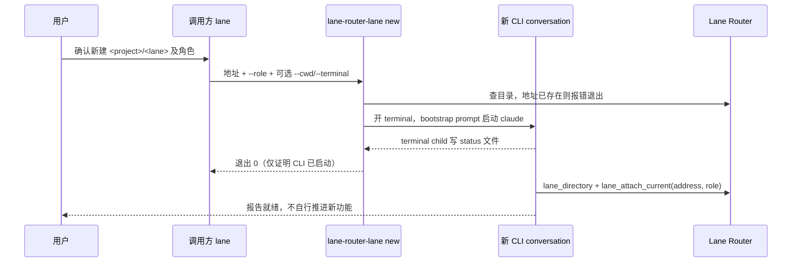
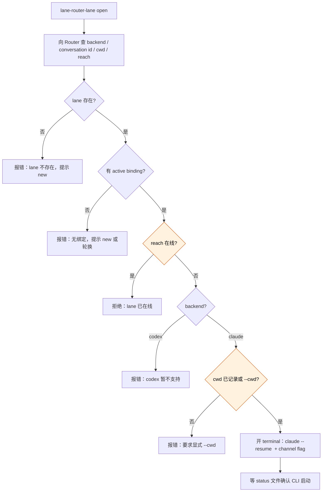

# 打开已有 lane / 新建 lane 的统一 CLI 设计

**状态：** 2026-08-18 经用户批准（Gate 1），待实施计划。

**一句话结论：** 新增一个 npm bin `lane-router-lane`，带 `new` 和 `open` 两个子命令。`new` 在选定 terminal 中启动带 channel 接入的新 Claude conversation，由 bootstrap prompt 指示它接入新 lane；`open` 向 Router 查出离线 lane 的 backend、conversation id 和记录的工作目录，在选定 terminal 中 resume 原 conversation——调用方完全不需要知道目标 lane 是什么 agent。V1 只支持 claude backend。三条开窗命令（`lane-router-lane new` / `lane-router-lane open` / `lane-router-rotate`）共用新的 `--terminal` 选项，默认 Windows Terminal。前置改动一条：让 Router 通过 lifecycle hook 记录每个 Claude conversation 的工作目录，否则 `open` 无从知道 resume 该在哪个目录运行。

## 术语表

| 术语 | 含义 |
|---|---|
| 窗口宿主 | 承载控制台程序窗口的一层：传统控制台（conhost）或 Windows Terminal。shell（cmd / powershell）跑在某个宿主里，自己没有窗口。 |
| terminal child | 新 terminal 里第一个运行的 Node 进程（现有 `rotation-terminal-child` 的泛化），负责真正启动 agent CLI 并把启动结果写回 status 文件。 |
| bootstrap prompt | 新 conversation 的首条 prompt。`new` 用它指示新对话接入新 lane；`open` 不注入 prompt。 |
| resume | 让 Claude Code 以 `--resume <session-id>` 恢复既有 conversation；必须在该 conversation 原来的工作目录运行。 |

## 一、问题与范围基线

### 1.1 用户要的结果

任何一条 lane 收到用户"打开某已有 lane / 新建某 lane"的指令时，只需要调用一个命令，不必自己探究怎么开窗口、目标是什么 agent、该带哪些 flag。窗口用什么 terminal 打开可选，默认 Windows Terminal。本期只需要 claude backend；codex 留待后续。

### 1.2 当前流程

新建 lane 今天需要用户手动完成：打开 terminal、切到项目目录、运行带 channel flag 的 `claude`、把地址和角色说明口述给新对话、要求它 attach。打开一条离线 lane 更难：用户或 agent 要自己找到那条 lane 绑定的 session id 和原工作目录，手工拼 `claude --resume`。这些机械步骤 `lane-router-rotate` 已经为"轮换"场景解决过一遍，但"新建"和"恢复"两个动作没有入口。

### 1.3 最小可观测行为

`new`：

1. 调用方传入 lane 地址和角色说明，命令在选定 terminal 中开出可见窗口。
2. 窗口内 claude 以 channel 接入方式启动，首条 prompt 指示它查目录、以该角色接入目标 lane、报告就绪。
3. 命令只在 terminal child 报告 CLI 真正启动后才退出 0；窗口开了但 CLI 没起来算失败。

`open`：

1. 调用方只传 lane 地址，命令自行向 Router 查出 backend、conversation id、记录的工作目录和 reach 状态。
2. 目标离线时，窗口内以 `claude --resume <id>` 加 channel flag 在原工作目录恢复该 conversation；channel 重连后 Router 自动重发 pending 通知（`NotificationPump.onAttentionOpportunity` 现有行为）。
3. 目标在线时拒绝并说明；lane 无 binding 时拒绝并提示走新建或轮换。
4. 同样以 status 文件确认 CLI 真启动。

### 1.4 信任边界

不变：同一台可信个人开发机器。新命令不引入 token、鉴权或远程访问；Router 新增的查询端点只绑定 loopback，与 `/claude/lifecycle` 同级，不进入对话工具面。创建 lane 仍然是拓扑变更：调用方 conversation 必须先在对话中取得用户明确确认再调命令，命令本身不加机械式 confirm 参数——与 `lane_attach_current` 的既有政策一致。

## 二、用户流程

`new` 的时序：



`open` 的分支判定：



## 三、公开命令

```text
lane-router-lane new  <project>/<lane> --role "<角色说明>" [--backend claude] [--cwd <dir>] [--terminal <wt|powershell|cmd>]
lane-router-lane open <project>/<lane> [--cwd <dir>] [--terminal <wt|powershell|cmd>]
```

契约：

- lane 地址走现有 `parseLaneAddress` 校验。
- `new`：`--role` 必填非空；`--cwd` 默认调用命令时的 `process.cwd()`；`--backend` 默认 `claude`，传 `codex` 报"暂不支持"退出非零。地址已存在时报错并提示用 `open`。
- `open`：backend 来自 binding 记录，不接受调用方指定；`--cwd` 仅作 Router 没有记录时的兜底，显式传入时以它为准。
- 两个子命令都继承 rotate 的验证纪律：`Start-Process` 成功不算成功，等 terminal child 写 status 文件确认 CLI 真启动后才退出 0；超时或 child 报错则退出非零并给出具体原因。
- 失败路径不改变 Router 状态：`new` 失败不留下 lane 记录（lane 由新 conversation attach 时才创建），`open` 失败不动 binding。

### `--terminal` 语义（同时加到 `lane-router-rotate`）

| 取值 | 行为 |
|---|---|
| `wt`（默认） | 强制经 `wt.exe` 开 Windows Terminal 窗口，窗口内由 powershell 拉起 terminal child（不可见实现细节）。默认模式下 wt 缺失回退 `powershell`；**显式**传 `wt` 而 wt 缺失则报错。 |
| `powershell` | `Start-Process powershell` 启动，窗口宿主由系统默认决定（Win10 默认传统控制台；配置过 console delegation 的机器是 Windows Terminal）。 |
| `cmd` | 同上，shell 换成 cmd（child 启动命令用 cmd 语法拼写）。 |

不提供默认值配置文件；flag 即全部配置面。

### `new` 的 bootstrap prompt

仿 rotation 措辞："This is an approved creation of the new lane `<address>`"，指示新对话：完整读取仓库 AGENTS.md 及适用指引；调用 `lane_directory` 确认地址未被占用；调用 `lane_attach_current`，带 `<address>` 和给定 `role_description`；报告就绪，不自行推进新功能。prompt 长度沿用 rotate 的 24 000 字符上限。

## 四、内部改动

### 4.1 记录 Claude conversation 的工作目录

官方 sessions 文档明说 `claude --resume <session-id>` 可以从任意目录运行（会跨项目搜索 session），所以 cwd 的必要性不在"找到 session"，而在让 lane 于原项目上下文中恢复——project settings、CLAUDE.md、project MCP 配置和 hooks 都挂在目录上，换目录 resume 得到的是一个上下文错位的 conversation。Router 今天不知道任何 conversation 的 cwd（binding 的 `startup_json` 恒为 `{}`，lifecycle hook 不转发 cwd）。改动链三步：

1. **hook 转发**：`lifecycle-hook` 把 Claude Code hook payload 里的 `cwd` 字段一并 POST 到 `/claude/lifecycle`（该字段是文档记载的 hook 输入；实施第一步用真实 payload 核实）。
2. **持久化**：schema 升 v3，`binding` 表加 nullable `cwd` 列（SQLite 纯 `ADD COLUMN`，无表重建）。lifecycle 报告携带 cwd 且该 conversation 有 active binding 时更新该列；conversation 尚未 attach 时忽略。attach 那个 turn 结束时的 `Stop` 事件即完成首次记录，所以任何在本功能上线后 attach 过的 lane 都有 cwd。
3. **查询端点**：Router 本地 HTTP server 新增一个 loopback 查询端点（与 `/claude/lifecycle` 同级的内部接口，不是 MCP 工具，不扩 `lane_directory` 的对话可见面），按地址返回 backend、conversation id、cwd、generation 和 reach。`lane-router-lane` 经 `ensure-router` + discovery 访问它。

### 4.2 spawn 机械件抽共享模块

`rotation-launcher` 里的 terminal 创建（PowerShell `Start-Process`、wt 探测、vendor 环境剥离 `withoutVendorSessionIdentity`、`CLAUDE_EXE` 解析、status 文件等待、窗口标题）抽成共享模块，三条命令共用；`--terminal` 分支在这一层实现。`rotation-terminal-child` 泛化为按请求模式构建 CLI 参数：prompt 模式（rotate / new：`claude --dangerously-load-development-channels server:lane -- <prompt>`）和 resume 模式（open：`claude --resume <id> --dangerously-load-development-channels server:lane`，无 prompt）。rotate 的现有行为除新增 `--terminal` 外不变。

## 五、边界与错误语义

| 情形 | 行为 |
|---|---|
| `new` 且地址已存在 | 报错，提示用 `open` |
| `open` 且 lane 不存在 | 报错，提示用 `new` |
| `open` 且 lane 无 active binding | 报错，提示走轮换流程接管；**不**自动升级成接替（接替有 handoff 闭环，不该被"打开"顺手触发）。不提示 `new`——lane 已存在，`new` 会因地址占用而拒绝 |
| `open` 且 reach 在线（channel 连接打开） | 拒绝："lane 已在线" |
| `open` 且 backend 是 codex / `new --backend codex` | 报错："codex 暂不支持"（`lane-router-codex resume` 可手动使用） |
| `open` 且 Router 无 cwd 记录、未传 `--cwd` | 报错，要求显式 `--cwd` |
| 显式 `--terminal wt` 而 wt 缺失 | 报错；默认模式下静默回退 `powershell` |
| Router 未运行 | 沿用 `ensure-router` 现有语义按需拉起 |

## 六、验证策略

- **自动测试**：参数解析与错误路径；三档 terminal 各自的启动命令拼写（含 cmd 语法分支）；terminal child 两种模式的 CLI 参数构建；schema v2→v3 迁移与 cwd 更新时机（有/无 active binding）；查询端点的存在/离线/在线/无绑定分支；spawn 用注入的 fake，沿用现有 rotation 测试形态。
- **手工测试**（补进 `docs/manual-tests.md`）：真机三档 `--terminal` 各开一次窗；`new` 全流程（窗口出现 → attach 成功 → 目录可见新 lane）；`open` 全流程（关掉 lane terminal → open → 原 conversation 恢复 → 向它发消息验证通知送达）；在线 lane 被拒绝。

### 真机验证点（设计假设，实施期逐条核销）

1. Claude Code hook payload 确实携带 `cwd` 字段。——已核销（2026-08-18 真机抓取：UserPromptSubmit 与 Stop payload 均带 `cwd`，值为会话启动目录）。
2. `--resume` 与 `--dangerously-load-development-channels` 可组合使用。——文档未明说互斥，真机待验。
3. `--resume` 默认保留原 session id。——文档面已核销（`--fork-session` 帮助原文 "create a new session ID instead of reusing the original"，官方 sessions 文档同述）；真机端到端仍在 Task 5 验证。
4. resume 后 channel 重连、pending 通知自动下发的端到端行为。——真机待验。

## 七、范围审计

基线：§1.1 的用户原话（统一命令、抹平 agent、terminal 可选默认 wt、先只支持 claude）。

| 候选面 | 消费者与频率 | 依据 | 删除后果 | 既有替代 | 处置 |
|---|---|---|---|---|---|
| `lane-router-lane new` 子命令 | 各 lane 收到用户指令时，低频正常路径 | 用户原话"新建 lane 的工具" | "叫 lane 开新 lane"流程失败，agent 得自行拼 spawn | 手动开 terminal + 口述 attach（正是要消除的） | Keep |
| `lane-router-lane open` 子命令 | 同上 | 用户原话"打开已有 lane" | 流程失败 | 手工找 session id + `claude --resume` | Keep |
| `--terminal` 选项（lane 两个子命令） | 用户偏好，每次调用可选 | 用户原话"所有窗口可以选用什么开，默认 windows terminal" | 无法选宿主 | 无（rotate 现为硬编码 wt→powershell 回退） | Keep |
| `--terminal` 加到 `lane-router-rotate` | 同上 | 同上（"所有窗口"） | rotate 的窗口不可选 | 硬编码行为 | Keep |
| Router resume 查询端点 | 仅 `lane-router-lane open`，每次 open 一次 | 由"打开已有 lane"推导：backend/conversation id/cwd/reach 只有 Router 持有 | open 无法解析目标；直接读 SQLite 会破坏 Router 对状态的所有权 | `lane_directory`（缺 conversation id 和 cwd；扩它会把内部信息暴露给全部对话调用方） | Internalize（loopback 内部端点，不进工具面） |
| binding `cwd` 列（schema v3） | resume 查询端点；每次 lifecycle 报告写入 | 由 resume 必须在原目录运行推导 | open 每次都要人工传 `--cwd` | `--cwd` flag（保留为兜底）；反查 `~/.claude/projects` 会话文件（依赖 vendor 未文档格式，弃） | Keep |
| lifecycle payload `cwd` 字段 | hook → Router，每次 lifecycle 事件 | 同上；hook 输入文档记载含 cwd | Router 无 cwd 来源 | 无可靠替代 | Keep |
| codex 支持（new/open） | 暂无 | 用户明确"先只支持 claude" | 无 | `lane-router-codex resume` 手动可用 | Defer（用户明确延后） |
| MCP 工具形态（lane_open / lane_new） | — | 用户已选 CLI | 无 | CLI | Delete |
| terminal 默认值配置文件 | — | 无；用户只要默认 wt，flag 足够 | 无 | flag | Delete |
| `open` 自动升级接替（无 binding 时开新 conversation 接管） | — | 无；用户确认拒绝语义 | 无——拒绝正是期望行为 | 轮换流程 | Delete |

## 八、范围外

- codex backend 的 `new`/`open`（Defer，见审计表）。
- lane 的关闭、删除、改名——不属于"打开/新建"。
- `open` 对 binding 已失效 conversation 的自动接替。
- 通知、mailbox、attach 语义的任何改变。
