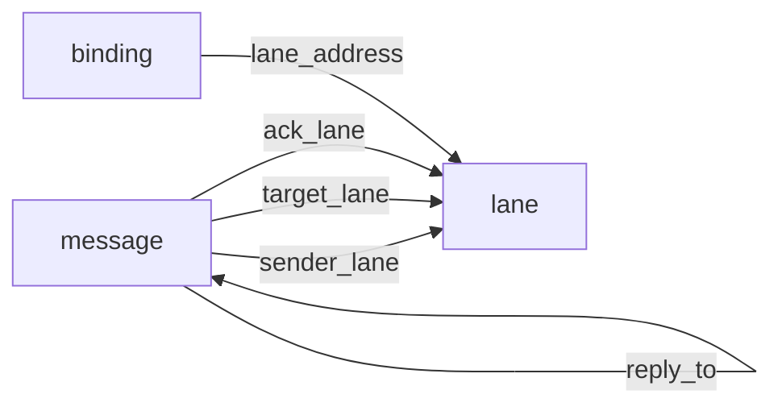
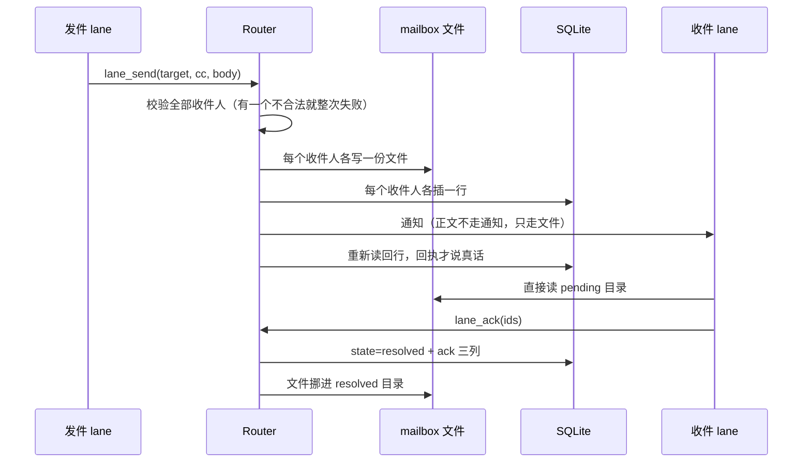
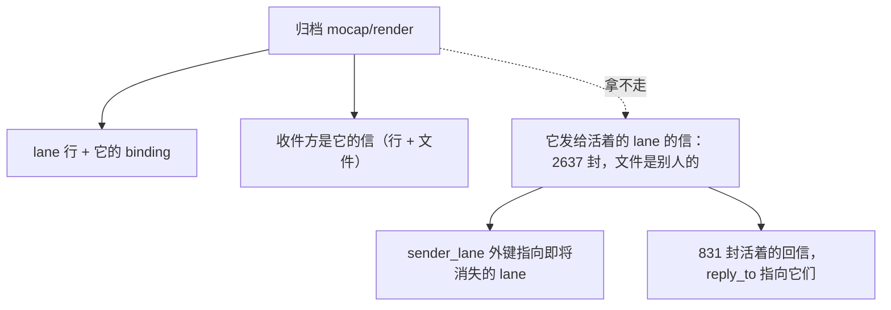

# 存储结构复看：三张表、五条外键、两处双写

**状态：** 2026-08-31 归档改造之前的一次结构复看。**目的是在动手之前找出除已知问题之外的设计缺陷**，用户审阅后裁定第七节第 2 条。数字全部量自本机当前的库（4637 封消息、25 条 lane、其中 5 条已归档）。

## 一、结论

把归档做成「挪表」，会被**两族外键**挡住，不是一族：

- **指向 `lane` 的四条**——消息的收发双方与 ack 方、binding 的归属。已知。
- **消息指向消息的一条**（`reply_to`）——**本次新发现**。实测 **831 封**活着的 lane 的信，回复的是发给已归档 lane 的信。挪走被回复的那封，这 831 封就悬空。

两族病因相同：**这些字段记录的是「当时发生了什么」，却被声明成「现在指向谁」。** 历史事实不该阻止实体退场。

### 一处必须先更正的旧表述

[`2026-08-27-lane-retirement.md`](2026-08-27-lane-retirement.md) 第一节写「硬删被存储结构堵死」。**那句话不对。**

外键没有禁止删除，它禁止的是**「删掉 lane 但留着引用它的消息」**。「消息必须留在活表里」是**设计时自己加的约束**，不是数据库的约束。把自己这一层的决定报成了下层的能力边界，然后为了绕开它造了个标记位 `retired_at`——后面所有的别扭（每处读都要过滤、多一个反向动词 `unretire`、名字被永久占住）**都是那个标记位派生出来的**。

## 二、`lane`

**身份就是地址本身**（`address TEXT PRIMARY KEY`）。没有代理 id，所以「换个名字」和「换一条 lane」在存储里是同一件事——这是名字无法复用的根源。

| 列 | 说明 | 归档时的影响 |
|---|---|---|
| `address` | 主键，形如 `mocap/render` | ⛔ 被 4 条外键引用 |
| `project` | 地址前半段，冗余存一份便于按项目查 | — |
| `role_description` | 角色说明，非空 | 跟着挪走 |
| `model` | 声明的模型，可空，**不校验取值**（有意，见模型稿） | 跟着挪走 |
| `retired_at` | 软删标记，v5 加的 | ⚠️ 本次删掉 |

## 三、`binding`

每次轮换产生新的一代，旧的置为**失效**而不是删除。三个部分唯一索引撑住核心不变量：

| 约束 | 保证什么 |
|---|---|
| `binding_active_lane_idx` | 一条 lane 至多一个活跃 binding |
| `binding_active_conversation_idx` | 一个对话至多持有一条 lane |
| `binding_lane_generation_idx` | 同一条 lane 的代号不重复 |
| `startup_json` | ⚠️ **无结构的 JSON 文本**，schema 管不到里面 |

## 四、`message`

正文**不在库里**，在文件里；库里只有 SHA-256 与相对路径。`request_key` 唯一，是重放幂等的凭据；抄送时按收件人派生成 `<key>#<lane>`，所以一次调用产生 N 行。

| 列 | 它其实是什么 | 被声明成什么 |
|---|---|---|
| `sender_lane` | 当时是谁发的（历史事实） | ⛔ 外键 RESTRICT |
| `target_lane` | 当时发给谁（历史事实） | ⛔ 外键 RESTRICT |
| `ack_lane` | 谁处理的（历史事实） | ⛔ 外键 RESTRICT |
| `reply_to` | 它回复的那封（历史事实） | ⛔ 外键 RESTRICT |
| `relative_path` | 正文文件在哪 | 唯一，且 ack 时会被改写 |
| `state` | `pending` / `resolved` | 与 ack 三列由 CHECK 绑死 |

**第二列与第三列的错位，就是整份改造要处理的东西。**

## 五、五条外键

五条全部是 `ON DELETE RESTRICT`。归档一条 lane 要挪走它的行，五条全会拦。

## 六、数据流

### 6.1 一封信的一生（唯一真正有先后的流程）

两个要点：**正文从不进通知**，只在文件里；**抄送是 N 份独立的信**，各自 ack，不是一份共享的。

### 6.2 边路：attach 与轮换

新对话认领一条 lane 时，旧 binding 置为失效、代号加一。**关闭窗口不触发这件事**——全库只有归档会主动失效 binding（`router-core.ts:251` 是 `deactivateBinding` 的唯一调用点）。所以**关掉的窗口重开得来，归档掉的回不来**。

### 6.3 边路：`reconcile` —— 文件与库互为权威，方向相反

启动时对账，两个方向的判据是反的：

- **文件在、库里没有** ⇒ 当作孤儿，**重新插进库里**；
- **库里有、文件不在** ⇒ **抛错**，判定为损坏。

⚠️ **这条直接决定归档怎么做。** 只把行挪走、文件留着 ⇒ 下次对账把它们**原样捞回来**，归档被静默撤销；而重插时 `sender_lane` 外键指向已删的 lane，又会当场抛损坏错误。

⇒ **文件必须跟行一起挪。**

## 七、「这条 lane 的数据」到底是哪些

消息文件住在**收件方**的目录里：`mailboxes/<project>/<lane>/pending/<id>.md`，其中的 lane 是 **target**。所以 `mocap/render` 发给 `mocap/hub` 的信，文件在 **hub** 的目录里——**归档 render 拿不走它们，那不是它的东西。**

| 对已归档的那 5 条而言 | 封数 | 归档时怎么办 |
|---|---|---|
| 两端都已归档 | 858 | 行与文件一起挪走 |
| **一端归档、一端还活着** | **2637** | ⚠️ 文件属于活着的那端，留在原地 |
| 与它们无关 | 1149 | 不动 |

2637 是受影响消息里的**大多数**，不是边角情况。而「留在原地」跟 `sender_lane` 的外键正面冲突——那条 lane 要消失了。

⇒ 解不是绕开外键，是**承认那几个字段不是引用**：把 `sender_lane`、`target_lane`、`ack_lane`、`reply_to` 改成**普通文本**。`binding.lane_address` **保留**外键——binding 确实属于一条活着的 lane，归档时跟着走。

改完之后名字当场空出来，**不需要主键改名，也不需要代理 id**。「名字无法复用」本来就是标记位派生出来的伪问题。

## 八、其余可能有问题的地方

按「有多确定它是问题」排，不按严重程度。都还没动。

1. **`reply_to` 悬空之后怎么读。** 改成文本后，831 封回信的 `reply_to` 指向已挪走的信。这是**诚实的**（它回复的那封确实归档了），但读取方要能分清「指向的信不存在」与「本来就没有 reply_to」。⛔ 要处理。
2. **归档后同名新建，历史里两条 lane 分不开。** 旧信的 `sender_lane` 还写着 `mocap/render`，新建的也叫这个，看板时间线会把两条的历史混成一条。挪走的行可在归档表里加时间后缀区分，**但活着那端手里的 2637 封改不了**（那是别人的历史，不该动）。⚠️ **需用户裁定。**
3. **`relative_path` 唯一，且 ack 时会被改写。** 路径既是身份的一部分、又随状态变化（`pending/` → `resolved/`）。挪表时要一并改写；改了库没改文件、或反过来，都会被下次对账判成损坏。⚠️ 要小心。
4. **`binding.startup_json` 是无结构文本。** schema 管不到里面。`cwd` 一度存在这里、后来提升成独立列，旧行仍靠它兜底。里面还有什么、会不会漂移，库本身说不出来。⚠️ 值得查一遍。
5. **没有按时间的索引。** 唯一的消息索引是 `(target_lane, state, created_at, id)`。看板要「最近 N 封」，走全表按 `created_at` 倒序。4637 行不成问题，涨上去要留意。🟢 暂时不用管。
6. **对账两个方向不对称，是有意的但很脆。** 文件多了就补进库、库多了就报损坏。这让「手工删一个文件」变成不可恢复的损坏错误，而「手工塞一个文件」会被静默接受成一封真信。⚠️ 是设计选择，但值得复看。

## 九、对改造的影响

- 已发给实现 lane 的改名任务**作废**——它建立在「保留标记位」的前提上，那个前提没了。
- 新的改造是一次**建表重建**：去掉四条历史字段的外键、删掉 `retired_at`、加归档表与归档目录、归档时**行与文件一起挪**。
- 第八节第 2 条需用户裁定，其余按本文判断执行。
