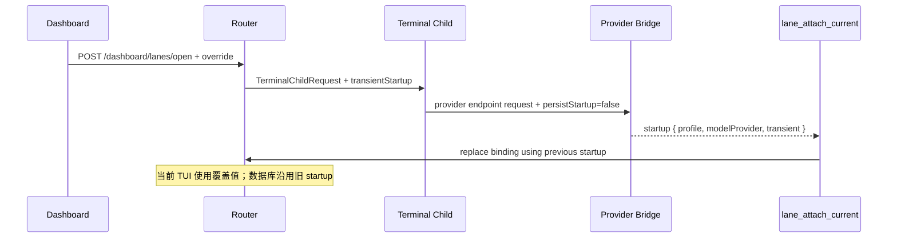

# 由看板恢复 lane 并临时覆盖启动模型 设计稿

**状态：** 设计稿，用户已确认两个关键决策：看板走 Router 自伺服路线；`model`、`profile`、`modelProvider` 覆盖只影响本次打开，不写回 lane 或 binding。本文取代 [`2026-08-31-router-served-dashboard.md`](2026-08-31-router-served-dashboard.md) 中“看板永远只读”这一条；该文的其他边界不变。

## 术语表

| 词 | 含义 |
|---|---|
| 恢复 | 用已有 conversation/session id 重新打开一条 lane，而不是新建对话 |
| 一次性覆盖 | 只写进本次 terminal 启动请求的 `model`、`profile`、`modelProvider` |
| 注册模型 | `lane.model` 字段，表示这条 role lane 声明的长期模型 |
| startup 元数据 | Codex binding 里保存的 `profile` 与 `modelProvider`，供下次恢复沿用 |
| action token | Router 本次进程生命周期内生成的随机值，供看板页面发起打开动作 |

## 一、问题

现在批量恢复只有一个入口：`scripts/open-project-lanes.mjs <project>`。它一次只接受一个项目；要恢复多个项目，用户要运行多次。也没有办法在恢复前临时换模型或 provider。用户经常需要成组恢复多个项目的 lane，并让某次打开临时走 `glm-5.3` / `ZAI` 这类模型与 provider 的组合，而不改变 lane 注册的模型。

最小目标有三个：

1. 在浏览器页面里一次选择多个项目的 lane，点击一次按钮后逐条恢复。
2. 打开前可以选择本次 `model`、`profile`、`modelProvider` 覆盖。
3. 覆盖只作用于本次启动；下次正常恢复回到 `lane.model` 与原 binding startup 元数据。

## 二、选型

| 方案 | 结果 | 理由 |
|---|---|---|
| 扩展现有 Router dashboard，加一个受保护的打开动作 | 采用 | Router 已经知道 lane、binding、restorePresence，也已经拥有可见 terminal 启动机械件；不新增进程或端口 |
| 另起一个本地 launcher 服务 | 不采用 | 多一个进程生命周期和端口发现问题，还要复制 Router 的状态读取与安全边界 |
| 浏览器 custom protocol 直接调用 `wt.exe` | 不采用 | 浏览器会弹系统确认，无法可靠汇总逐 lane 结果，也绕开 Router 的 ownership 与恢复语义 |

浏览器页面本身不获得启动本地程序的权限。页面只向同一个 Router 发 HTTP 请求；启动 Windows Terminal 的仍然是 Router 进程。

## 三、设计

### 3.1 页面交互

`/dashboard` 保留现有只读快照，并在其上增加一个“恢复 lane”区域：

1. lane 按项目分组，组头提供全选；单条 lane 仍可单独勾选。
2. 默认只勾选 `restorePresence=offline` 且有 active binding 的 lane；在线 lane 显示为可跳过，不自动勾选。
3. 覆盖输入分为三栏：`model`、Codex `profile`、Codex `modelProvider`。三栏留空表示不覆盖，分别沿用 `lane.model` 与 binding startup 元数据。
4. `profile` 与 `modelProvider` 可以只填一项：
   - 只填 `profile`：按现有 Codex profile 配置解析 provider。
   - 只填 `modelProvider`：显式指定 provider。
   - 两项都填：显式 provider 优先，用来表达模型与 provider 必须成对出现的场景。
5. 从 profile 选择模型时，页面同时填写对应 provider。从模型菜单直接切换时，如果模型只对应一个 profile，页面采用该 profile；否则清空 profile 并显式填写基础 Codex provider。不能只改模型字符串而让 `thread/resume` 沿用上一次的 provider。
6. 如果选择了 Claude lane，同时填写 `profile` 或 `modelProvider`，页面在提交前报错；请求端也会独立拒绝，避免绕过页面造成半个批次被打开。
7. 点击“打开选中 lane”后，页面逐项目展示结果：已请求打开、跳过、失败。按钮文案用“已请求打开”，不用“已打开”；`launch_requested` 仍是弱声明，窗口是否真的起来要看状态与用户观察。

选择多个项目时，terminal 分组沿用现有规则：同一个项目的 lane 进同一个 Windows Terminal 窗口，不同项目各一个窗口。

### 3.2 HTTP 接口

新增一个可选注入的 endpoint：

```http
POST /dashboard/lanes/open
```

请求形状：

```json
{
  "addresses": ["company-plugin/coordinator-architecture"],
  "override": {
    "model": "glm-5.3",
    "profile": "glm",
    "modelProvider": "ZAI"
  },
  "actionToken": "router-process-random-token"
}
```

`override` 三个字段都可省略；`addresses` 必须是非空数组，重复地址会被去重。地址必须已经存在且有 active binding；不存在的地址返回 `400`，并且不启动任何 lane。

响应逐条返回：

```json
{
  "results": [
    { "address": "company-plugin/coordinator-architecture", "status": "launch_requested" },
    { "address": "lane-router/impl", "status": "skipped_online" }
  ]
}
```

状态集合沿用 `ConversationRestorer`：`launch_requested`、`skipped_online`、`skipped_launching`、`failed`。不新增恢复语义。

这个 endpoint 不加入 `LANE_TOOL_NAMES`，也不暴露给 lane 对话；它只属于浏览器看板。

### 3.3 请求边界与 CSRF

现有看板没有写操作，因此可以不做鉴权。加入打开动作后，必须防止外部网页向 `127.0.0.1:<port>` 发起跨站请求。请求要同时满足四个条件：

1. `Origin` 等于当前 Router 的 `http://127.0.0.1:<port>`；
2. 携带 `X-Lane-Router-Action: open` 自定义头；
3. `Content-Type` 是 `application/json`；
4. `actionToken` 与 `/dashboard/state` 本次快照中的 token 一致。

token 在 Router 进程启动时生成，只存在内存里；Router 重启后旋转。外部网页读不到同源看板响应，也发不出不带 CORS 预检的自定义头，因此无法拿到或猜中 token。这个边界不改变既有威胁模型：同一个本机进程如果本来就是不可信的，它可以读取本地文件并直接调用现有 CLI；本设计不试图防御本机恶意进程。

### 3.4 一次性覆盖的传递

`ConversationRestorer.restore` 增加一个可选 `override` 参数，并只在构造 `TerminalChildRequest` 时改变三个字段：

- `model` 覆盖 `lane.model`；
- `profile` 覆盖 binding 的 `startup.profile`；
- `modelProvider` 覆盖 binding 的 `startup.modelProvider`。

它不调用 `updateLaneModel`，也不改数据库中的 binding startup。模型覆盖天然是一次性的，因为 `lane.model` 仍是下次恢复的来源。

provider 与 profile 的难点在 Codex attach：provider bridge 会观察本次启动的 `profile/modelProvider`，`lane_attach_current` 目前会把它写进新 binding。为保持一次性，引入进程内标记：



实现要点：

1. provider endpoint 请求携带 `persistStartup: false`；
2. `CodexTuiBridge` 把 `transient: true` 放进本次 runtime 的 startup 元数据；
3. `RouterCore.attachCurrent` 看到 transient startup 时，用被替换 binding 的旧 `startup` 写入新 binding；没有旧值时写 `{}`；
4. transient 标记只存在 Router 内存，不进 SQLite schema；
5. 后续如果同一 conversation 用非覆盖方式重新 attach，仍按现有规则持久化它自己报告的 startup。

这样一次 GLM 打开会实际使用 `glm-5.3` / `glm` / `ZAI`，但关闭后正常恢复仍回到旧模型与旧 provider。

## 四、范围审计

| 候选面 | 消费者与频率 | 需求依据 | 删除后果 | 现有替代 | 处置 | 关闭条件 |
|---|---|---|---|---|---|---|
| `POST /dashboard/lanes/open` | 用户恢复正常路径，低频 | 用户要求网页一次打开多个项目 | 只能继续逐项目跑 CLI | `scripts/open-project-lanes.mjs` | 保留 | 无 |
| 看板打开按钮与多项目选择 | 用户恢复正常路径，低频 | 用户要求网页点击打开 | 看板仍只能看 | 桌面批量脚本 | 合并进现有 `/dashboard` | 无 |
| action token 与同源校验 | 看板写动作，每次点击 | 新 HTTP 写动作需要挡跨站请求 | 恶意网页可尝试向 loopback 发 POST | 无 | 保留 | 无 |
| `ConversationRestorer.restore` 覆盖参数 | Router 内部，低频 | 用户要求一次性模型/provider | 无法临时换模型 | 修改 lane 注册，违背需求 | 内部化 | 无 |
| transient startup 标记 | Router 内存，低频 | 用户确认 provider 也必须一次性 | provider/profile 会被写入后续 binding | 无 | 内部化 | 无 |
| 新 SQLite 字段或 schema migration | 无 | 无 | 无 | 现有 `lane.model` 与 binding startup | 删除 | 无 |
| 鉴权体系 | 无 | 无 | 无 | action token 只挡跨站浏览器请求 | 删除 | 无 |
| 模型/provider 目录配置 | 无 | 无 | 无 | Codex 自己的配置与错误信息 | 删除 | 无 |
| 新 CLI bin | 无 | 无 | 无 | 现有页面与 CLI 已覆盖 | 删除 | 无 |

## 五、验证

自动测试覆盖：

1. 页面按项目渲染 lane，多项目选择生成去重地址列表；
2. 缺 token、错 token、错 `Origin`、缺自定义头、非 JSON 请求都返回 `403` 或 `400`，且不调用 launcher；
3. 地址不存在、数组为空、Claude lane 携带 provider/profile 时整批拒绝，不产生部分启动；
4. 在线、启动保留期、离线 lane 分别返回 `skipped_online`、`skipped_launching`、`launch_requested`；
5. `ConversationRestorer` 在有覆盖时传给 terminal child 的请求含覆盖值，数据库中的 `lane.model` 与 binding startup 不变；
6. transient Codex startup attach 后，新 binding 沿用旧 startup；非 transient 行为保持现状；
7. dashboard 继续自包含，不引用外部资源；
8. 现有 `LANE_TOOL_NAMES` 不变。
9. 先选 `glm` profile，再从模型菜单改选一个不属于该 profile 的 GPT 模型时，请求显式携带基础 provider，不再保留 `ZAI`。

真机验收使用隔离 `LANE_ROUTER_DATA_ROOT` 和一次性 Codex 测试 lane：

1. 注册一条有旧模型与旧 provider 的 lane，关闭后从看板用 GLM 组合恢复；
2. 观察 Windows Terminal 命令行含 `--profile glm --model glm-5.3`，Router provider bridge 为 `ZAI`；
3. 等 attach 完成后检查 `lane.model` 与 binding startup 仍为旧值；
4. 关闭该 lane，再不看板覆盖地恢复一次，确认回到旧模型与旧 provider；
5. 选择两个项目的一次性打开请求，确认各自项目窗口与逐 lane 结果汇总正确。
6. 关闭测试 lane，再选 `glm` profile 后从模型菜单切到 `gpt-6-astra`；确认请求与恢复后的 thread 都是 `modelProvider=openai`，而不是 `ZAI`。

不在本设计内：修改模型目录、永久切换模型、自动关闭在线 lane、远程访问、账号体系、恢复失败自动重试。
